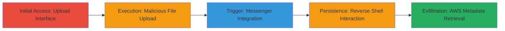

---
tags:
  - rce
  - imagetragick
  - file-upload
  - reverse-shell
  - aws-metadata
type: attack_chain
tools:
  - '[[tools/netcat]]'
tactics:
  - '[[Initial Access]]'
  - '[[Execution]]'
  - '[[Collection]]'
verified: false
platforms:
  - Web
  - AWS
  - Linux
submitted: true
complexity: medium
created_at: '2023-10-01T00:00:00Z'
procedures:
  - '[[procedures/Access-Image-Upload-Interface]]'
  - '[[procedures/Upload-Malicious-PostScript-File]]'
  - '[[procedures/Trigger-Shell-via-Messenger-Integration]]'
  - '[[procedures/Interact-with-Reverse-Shell]]'
  - '[[procedures/Exfiltrate-AWS-IAM-Credentials]]'
step_count: 5
techniques:
  - '[[Exploit Public-Facing Application]]'
  - '[[Unix Shell]]'
  - '[[Cloud Instance Metadata API]]'
updated_at: '2025-12-14T17:24:15.410Z'
description: >-
  Multi-stage attack exploiting lack of file type validation in image uploads to
  achieve remote code execution on a Shopify Kit EC2 instance, followed by AWS
  IAM credential exfiltration.
skill_level: intermediate
impact_level: high
id: 9fd76201-e6c4-4a24-b9a4-579ab7947d9b
validated: true
mitre_tactics:
  - '[[Initial Access]]'
  - '[[Execution]]'
  - '[[Collection]]'
mitre_techniques:
  - '[[Exploit Public-Facing Application]]'
  - '[[Unix Shell]]'
  - '[[Cloud Instance Metadata API]]'
---
# RCE via ImageTragick in Bulk Customer Update Image Upload

Multi-stage attack chain demonstrating remote code execution through a vulnerable image upload feature on kitcrm.com, exploiting ImageMagick's Ghostscript integration to spawn a reverse shell and exfiltrate AWS credentials.

## Chain Metrics Dashboard

| Metric | Value |
|--------|-------|
| Chain Status | Unverified |
| Total Steps | 5 |
| Execution Time | ~10 minutes |
| Skill Level | Intermediate |
| Complexity | Medium |
| Impact Level | High |

## Attack Flow Visualization



## Prerequisites & Requirements

### Required Tools

- [[tools/netcat]]

### Target Environment

- Web application on Ruby on Rails (kitcrm.com)
- AWS EC2 instance with ImageMagick and Ghostscript
- Ports: 8080 (for reverse shell listener)
- Services: AWS IAM, EC2, potential S3 access

### Initial Access Requirements

- Access to seller onboarding page (no authentication specified, assumed public or low-priv)
- Network access to upload endpoint
- Attacker-controlled server for netcat listener

## Detailed Attack Procedures

### Step 1: Access Image Upload Interface
procedure: [[procedures/Access-Image-Upload-Interface]]

**Objective**: Navigate to the vulnerable upload endpoint to prepare for exploitation.

**Instructions**: Open a browser and go to the seller onboarding page for bulk customer updates.

**Expected Output**: Upload interface for priority product images.

**Success Indicators**:
- Page loads successfully at https://kitcrm.com/seller/onboarding/1
- Upload form visible

### Step 2: Upload Malicious PostScript File
procedure: [[procedures/Upload-Malicious-PostScript-File]]

**Objective**: Disguise and upload a PostScript payload exploiting ImageTragick to establish a reverse shell.

**Instructions**: Prepare the PostScript payload using [[commands/postscript-python-reverse-shell]] and upload it as an image file via the form. Start a netcat listener in advance with [[commands/netcat-listen-8080]]:

```bash
nc -lvp 8080
```

**Expected Output**: File upload succeeds without validation errors.

**Success Indicators**:
- File accepted by server
- No immediate rejection

### Step 3: Trigger Shell via Messenger Integration
procedure: [[procedures/Trigger-Shell-via-Messenger-Integration]]

**Objective**: Activate image processing by integrating with Facebook Messenger to process the uploaded file.

**Instructions**: Connect the Kit application to Facebook Messenger and send a command via the interface to trigger ImageMagick processing of the malicious file.

**Expected Output**: Server initiates processing, leading to payload execution.

**Success Indicators**:
- Messenger integration completes
- Incoming connection to netcat listener

### Step 4: Interact with Reverse Shell
procedure: [[procedures/Interact-with-Reverse-Shell]]

**Objective**: Explore the compromised server environment via the established shell.

**Instructions**: Once connected, execute basic reconnaissance commands like [[commands/whoami-shell]], [[commands/ls-directory]], and [[commands/cat-readme-md]]:

```bash
whoami
ls
cat README.md
```

**Expected Output**: User 'deploy', directory listing including Rails files, README confirming Shopify infrastructure.

**Success Indicators**:
- Shell prompt appears (IP 52.38.69.6 connects)
- Commands execute successfully
- Internal repo details revealed

### Step 5: Exfiltrate AWS IAM Credentials
procedure: [[procedures/Exfiltrate-AWS-IAM-Credentials]]

**Objective**: Retrieve sensitive AWS credentials from instance metadata.

**Instructions**: From the shell, use [[commands/curl-aws-iam-roles]] to list roles, then [[commands/curl-aws-iam-credentials]] for specific role details:

```bash
curl http://169.254.169.254/latest/meta-data/iam/security-credentials/
curl http://169.254.169.254/latest/meta-data/iam/security-credentials/[redacted-role]
```

**Expected Output**: JSON with AccessKeyId, SecretAccessKey, Token.

**Success Indicators**:
- Role names retrieved
- Full credentials exfiltrated
- Potential S3 access validated

## Attack Chain Summary

### Key Achievements

1. Achieved RCE on isolated EC2 instance via file upload vuln
2. Confirmed internal Shopify infrastructure access
3. Exfiltrated AWS IAM credentials for further compromise

## Technique & Tactic Coverage

### MITRE ATT&CK Techniques

- [[Exploit Public-Facing Application]]
- [[Unix Shell]]
- [[Cloud Instance Metadata API]]

### MITRE ATT&CK Tactics

- [[Initial Access]]
- [[Execution]]
- [[Collection]]

---

*Last updated: 2023-10-01T00:00:00Z*
