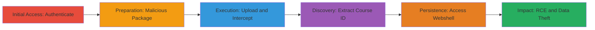

---
tags:
  - rce
  - webshell
  - file-upload
  - scorm
  - asp.net
  - iis
  - improper-access-control
type: attack_chain
tools:
  - '[[tools/Burp-Suite]]'
tactics:
  - '[[Initial Access]]'
  - '[[Execution]]'
verified: false
platforms:
  - Web
  - Windows
submitted: true
complexity: medium
created_at: '2023-10-01T00:00:00Z'
procedures:
  - '[[procedures/Authenticate-to-Courseware-Application]]'
  - '[[procedures/Prepare-Malicious-SCORM-Package]]'
  - '[[procedures/Initiate-SCORM-Package-Upload]]'
  - '[[procedures/Forward-Upload-Request-with-Burp-Suite]]'
  - '[[procedures/Intercept-and-Process-Metadata-Edit-Request]]'
  - '[[procedures/Extract-Course-ID-from-Response]]'
  - '[[procedures/Access-Deployed-ASPS-Webshell]]'
step_count: 7
techniques:
  - '[[Exploit Public-Facing Application]]'
  - '[[Windows Command Shell]]'
updated_at: '2025-12-14T17:29:44.644Z'
description: >-
  Multi-stage attack exploiting improper access control in SCORM upload to
  deploy an ASPX webshell for remote command execution on a military server.
skill_level: intermediate
impact_level: high
id: dc73f69b-4241-498a-8a28-2fe2313c70d6
validated: true
mitre_tactics:
  - '[[Initial Access]]'
  - '[[Execution]]'
mitre_techniques:
  - '[[Exploit Public-Facing Application]]'
  - '[[Windows Command Shell]]'
---
# RCE via Malicious SCORM Package Upload in Courseware Management

Multi-stage attack chain demonstrating exploitation of improper access control in the SCORM course package upload functionality, allowing authenticated users to upload and extract malicious ZIP packages containing ASPX webshells, leading to remote command execution on the server.

## Chain Metrics Dashboard

| Metric | Value |
|--------|-------|
| Chain Status | Unverified |
| Total Steps | 7 |
| Execution Time | ~10 minutes |
| Skill Level | Intermediate |
| Complexity | Medium |
| Impact Level | High |

## Attack Flow Visualization

## Prerequisites & Requirements

### Required Tools

- [[tools/Burp-Suite]]

### Target Environment

- Web platform running ASP.NET on IIS
- SCORM e-learning services enabled
- Authenticated access to course management endpoints

### Initial Access Requirements

- Valid credentials for any authenticated user
- Direct network access to the target URL (e.g., https://█████████/)
- No prior elevated privileges needed

## Detailed Attack Procedures

### Step 1: Authenticate to the Application
procedure: [[procedures/Authenticate-to-Courseware-Application]]

**Objective**: Gain authenticated access to the courseware management interface.

**Instructions**: Visit the login page and provide credentials to establish a session.

**Expected Output**: Successful login redirect to the dashboard.

**Success Indicators**:
- Session cookies set
- Access to management URLs granted

### Step 2: Prepare the Malicious SCORM Package
procedure: [[procedures/Prepare-Malicious-SCORM-Package]]

**Objective**: Create or obtain a SCORM ZIP with embedded ASPX webshell.

**Instructions**: Download the pre-crafted malicious ZIP file containing the shell referenced in imsmanifest.xml.

**Expected Output**: Valid SCORM ZIP ready for upload.

**Success Indicators**:
- ZIP structure validated (contains imsmanifest.xml and shared/cdlcdlcdl.aspx)
- Shell embeds command like [[commands/whoami]]

### Step 3: Initiate the SCORM Package Upload
procedure: [[procedures/Initiate-SCORM-Package-Upload]]

**Objective**: Start the upload process while intercepting with Burp Suite.

**Instructions**: Navigate to the upload endpoint and select the ZIP file, enabling interception in Burp Repeater.

**Expected Output**: POST request captured in Burp.

**Success Indicators**:
- Upload form accessible
- Request intercepted successfully

### Step 4: Forward the Upload Request
procedure: [[procedures/Forward-Upload-Request-with-Burp-Suite]]

**Objective**: Submit the malicious ZIP for server-side extraction.

**Instructions**: Forward the intercepted POST request in Burp to process the upload.

**Expected Output**: Server response indicating successful upload.

**Success Indicators**:
- ZIP extracted to server directory
- No validation errors

### Step 5: Intercept and Process the Metadata Edit Request
procedure: [[procedures/Intercept-and-Process-Metadata-Edit-Request]]

**Objective**: Handle the follow-up metadata request to continue the workflow.

**Instructions**: Intercept the POST to scorm2004editmetadata.aspx and forward the response.

**Expected Output**: Metadata edit response containing course details.

**Success Indicators**:
- Request/response cycle completed
- Course ID embedded in response

### Step 6: Extract the Course ID
procedure: [[procedures/Extract-Course-ID-from-Response]]

**Objective**: Identify the generated course ID for shell access.

**Instructions**: Search the HTML response for 'strCourseId' value.

**Expected Output**: Course ID like F6BAC72B45D64B34ACB662BB001D8523.

**Success Indicators**:
- Unique ID extracted
- Matches NavigatingURL attribute

### Step 7: Access the Deployed Webshell
procedure: [[procedures/Access-Deployed-ASPS-Webshell]]

**Objective**: Trigger the webshell for command execution.

**Instructions**: Visit the shell URL with the extracted course ID to execute commands.

**Expected Output**: Command output displayed, e.g., server user identity.

**Success Indicators**:
- Webshell loads without errors
- RCE confirmed via [[commands/whoami]] output

## Attack Chain Summary

### Key Achievements

1. Bypassed access controls to upload executable files
2. Deployed persistent ASPX webshell via SCORM extraction
3. Achieved RCE on military server, enabling data theft and pivoting

## Technique & Tactic Coverage

### MITRE ATT&CK Techniques

- [[Exploit Public-Facing Application]]
- [[Windows Command Shell]]

### MITRE ATT&CK Tactics

- [[Initial Access]]
- [[Execution]]

---
*Last updated: 2023-10-01T00:00:00Z*
