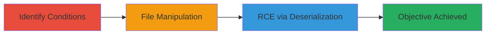

---
tags:
  - tomcat
  - rce
  - deserialization
  - file-upload
  - partial-put
  - cve-2025-24813
type: attack_chain
tools: []
tactics:
  - '[[Initial Access]]'
  - '[[Execution]]'
verified: false
platforms:
  - Web
  - Java
submitted: true
complexity: medium
created_at: '2023-10-01T00:00:00Z'
procedures:
  - '[[procedures/Identify-Tomcat-Exploitation-Conditions]]'
  - '[[procedures/Exploit-Partial-PUT-for-File-Manipulation]]'
  - '[[procedures/Achieve-RCE-via-Session-Deserialization]]'
step_count: 3
techniques:
  - '[[Exploit Public-Facing Application]]'
  - '[[Exploitation for Client Execution]]'
updated_at: '2025-12-14T17:25:17.496Z'
description: >-
  Multi-stage attack exploiting CVE-2025-24813 in Apache Tomcat 9.0.98 to
  manipulate temporary files via partial PUT, enabling information disclosure,
  file injection, and remote code execution through deserialization of session
  files.
skill_level: intermediate
impact_level: high
id: 5e2829b1-18e0-4a84-8c93-35e96fad192d
validated: true
mitre_tactics:
  - '[[Initial Access]]'
  - '[[Execution]]'
mitre_techniques:
  - '[[Exploit Public-Facing Application]]'
  - '[[Exploitation for Client Execution]]'
---
# RCE via Partial PUT Manipulation in Tomcat Default Servlet Leading to Session Deserialization

Multi-stage attack chain demonstrating exploitation of CVE-2025-24813 in Apache Tomcat 9.0.98, where the Default Servlet with writes enabled and partial PUT support allows attackers to replace path separators with dots in temporary file names, enabling path traversal-like manipulation to view, inject, or overwrite security-sensitive files. This can lead to information disclosure and, if combined with file-based session persistence and a vulnerable deserialization library, remote code execution with potential privilege escalation.

## Chain Metrics Dashboard

| Metric | Value |
|--------|-------|
| Chain Status | Unverified |
| Total Steps | 3 |
| Execution Time | ~10 minutes |
| Skill Level | Intermediate |
| Complexity | Medium |
| Impact Level | High |

## Attack Flow Visualization



## Prerequisites & Requirements

### Required Tools

- None specific; uses standard HTTP clients like curl.

### Target Environment

- Apache Tomcat 9.0.98 with Default Servlet writes enabled (readonly=false) and partial PUT support.
- Java-based web application using file-based session persistence in the default work directory.
- Presence of a deserialization-vulnerable library (e.g., Commons Collections).
- Required services/ports: HTTP/HTTPS on port 8080 or similar.
- Network access requirements: Direct access to the Tomcat server over the network.

### Initial Access Requirements

- No credentials required if the servlet allows unauthenticated PUT requests.
- Network position: External or internal attacker with reachability to the web server.
- Prior access needed: None, but knowledge of upload paths and sensitive file locations.

## Detailed Attack Procedures

### Step 1: Identify Exploitation Conditions
procedure: [[procedures/Identify-Tomcat-Exploitation-Conditions]]

**Objective**: Verify if the Tomcat instance has the Default Servlet configured with writes enabled and partial PUT support, and identify overlapping public/sensitive upload paths.

**Instructions**: Probe the server configuration indirectly by attempting a standard PUT request and analyzing responses. Use [[commands/curl-check-servlet-config]] to test write permissions:

```bash
curl -X PUT -T testfile.txt http://target:8080/upload/testfile.txt
```

If successful, check for partial PUT support by sending a ranged request with [[commands/curl-partial-put-test]]:

```bash
curl -X PUT --header "Content-Range: bytes 0-0/10" -d "test" http://target:8080/upload/testfile.txt
```

**Expected Output**: HTTP 200 or 201 for successful write/partial PUT; error if disabled.

**Success Indicators**:
- Write-enabled response without 403/405 errors.
- Partial PUT accepted, indicating temporary file handling.

### Step 2: Exploit Partial PUT for File Manipulation
procedure: [[procedures/Exploit-Partial-PUT-for-File-Manipulation]]

**Objective**: Manipulate temporary files by replacing '/' with '.' in paths to view or inject content into sensitive files in overlapping directories.

**Instructions**: Craft a partial PUT request targeting a sensitive file path, e.g., to read or overwrite a file in a subdirectory. Use [[commands/curl-path-traversal-put]] to inject or read:

```bash
curl -X PUT --header "Content-Range: bytes 0-99/100" -d "malicious content" http://target:8080/public/upload/../../sensitive/file.txt
```

Tomcat replaces '/' with '.', creating temp files like 'public.upload...sensitive.file.txt'. Follow up with a GET to retrieve manipulated content using [[commands/curl-retrieve-temp-file]]:

```bash
curl http://target:8080/public/upload/temp/public.upload...sensitive.file.txt
```

**Expected Output**: Injected or disclosed file content in response body.

**Success Indicators**:
- Sensitive file content disclosed or overwritten.
- No access denied errors on temp file paths.

### Step 3: Achieve RCE via Session Deserialization
procedure: [[procedures/Achieve-RCE-via-Session-Deserialization]]

**Objective**: Inject malicious serialized data into session files in the default persistence directory to trigger deserialization and execute system commands.

**Instructions**: Target session files (e.g., SESS.<hash>.ser) by manipulating paths to the work/Catalina/localhost/<app>/SESSIONS directory. Use [[commands/curl-session-injection-put]] to inject a deserialization payload:

```bash
curl -X PUT --header "Content-Range: bytes 0-999/1000" -d "<serialized malicious payload>" http://target:8080/public/upload/../../work/Catalina/localhost/app/SESS.hash.ser
```

Trigger deserialization by accessing the application to load the session, then verify RCE with a command like whoami using [[commands/curl-trigger-session]]:

```bash
curl http://target:8080/app/session-trigger
```

**Expected Output**: Command execution output, e.g., reverse shell or logged commands.

**Success Indicators**:
- Deserialization gadget triggered, leading to command execution.
- Privilege escalation if session runs as higher-priv user.

## Attack Chain Summary

### Key Achievements

1. Confirmed exploitable configuration in Tomcat Default Servlet.
2. Manipulated files for disclosure and injection across directory boundaries.
3. Achieved RCE through deserialization of tampered session files.

## Technique & Tactic Coverage

### MITRE ATT&CK Techniques

- [[Exploit Public-Facing Application]] Exploit Public-Facing Application
- [[Exploitation for Client Execution]] Exploitation for Client Execution

### MITRE ATT&CK Tactics

- [[Initial Access]] Initial Access
- [[Execution]] Execution

---
*Last updated: 2023-10-01T00:00:00Z*
