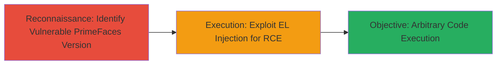

---
tags:
  - rce
  - primefaces
  - jsf
  - java
  - web
  - dod
type: attack_chain
tools:
  - '[[tools/primefaces-py]]'
tactics:
  - '[[Execution]]'
verified: false
platforms:
  - Web
  - Java
submitted: true
complexity: medium
created_at: '2023-10-01T00:00:00Z'
procedures:
  - '[[procedures/Exploit-PrimeFaces-RCE-via-EL-Injection]]'
step_count: 1
techniques:
  - '[[Exploit Public-Facing Application]]'
  - '[[Command-Line Interface]]'
updated_at: '2025-12-14T17:23:31.168Z'
description: >-
  Attack chain exploiting CVE-2017-1000486 in PrimeFaces 5.3.6 to achieve remote
  code execution on a U.S. Department of Defense web application.
skill_level: intermediate
impact_level: high
id: f3987ff1-038f-4605-9edf-3e6302f0a107
validated: true
mitre_tactics:
  - '[[Execution]]'
mitre_techniques:
  - '[[Exploit Public-Facing Application]]'
  - '[[Command-Line Interface]]'
---
---

# RCE via PrimeFaces EL Parser Injection on DoD Website

Multi-stage attack chain demonstrating a complete attack workflow exploiting a weak encryption flaw in PrimeFaces EL parser for remote code execution on a DoD website.

## Chain Metrics Dashboard

| Metric | Value |
|--------|-------|
| Chain Status | Unverified |
| Total Steps | 1 |
| Execution Time | ~5 minutes |
| Skill Level | Intermediate |
| Complexity | Medium |
| Impact Level | High |

## Attack Flow Visualization



## Prerequisites & Requirements

### Required Tools

- [[tools/primefaces-py]]

### Target Environment

- Target OS/Platform: Web application running Java with JSF
- Required services/ports: HTTP/HTTPS on port 80/443
- Network access requirements: Direct internet access to the target DoD website

### Initial Access Requirements

- Credential requirements: None (public-facing application)
- Network position: External attacker with internet connectivity
- Prior access needed: None

## Detailed Attack Procedures

### Step 1: Exploit RCE Vulnerability
procedure: [[procedures/Exploit-PrimeFaces-RCE-via-EL-Injection]]

**Objective**: Leverage the weak encryption in PrimeFaces 5.3.6 EL parser to inject and execute arbitrary commands on the server, demonstrating RCE with a simple command like 'whoami'.

**Instructions**: Identify the target URL of the vulnerable DoD website. Download and run the primefaces.py exploit script from GitHub, providing the target URL and a payload command such as 'whoami' to verify execution.

First, clone or download the exploit script:

```bash
git clone https://github.com/pimps/CVE-2017-1000486.git
cd CVE-2017-1000486
```

Then execute the script against the target:

```bash
python primefaces.py -u "https://target-dod-website.com" -c "whoami"
```

**Expected Output**: The output of the 'whoami' command from the server, such as the username of the web server process (e.g., 'tomcat' or 'www-data'), confirming successful RCE.

**Success Indicators**:
- Exploit script completes without errors
- Command output is returned from the target server
- No firewall or WAF blocks the request

## Attack Chain Summary

### Key Achievements

1. Identified outdated PrimeFaces 5.3.6 version vulnerable to CVE-2017-1000486
2. Executed arbitrary command via EL injection, achieving RCE
3. Demonstrated critical impact on CIA triad by compromising server control

## Technique & Tactic Coverage

### MITRE ATT&CK Techniques

- [[Exploit Public-Facing Application]]
- [[Command-Line Interface]]

### MITRE ATT&CK Tactics

- [[Execution]]

---

*Last updated: 2023-10-01T00:00:00Z*
