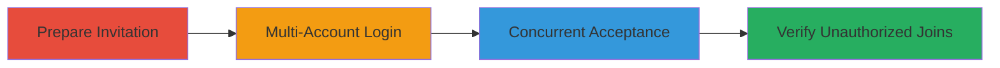

# Race Condition Exploitation Allowing Multiple Unauthorized Team Joins via Invitation Token Reuse

Multi-stage attack chain demonstrating exploitation of a race condition in the invitation acceptance process on a web platform like HackerOne, where concurrent requests allow multiple accounts to consume the same invitation token before it is deleted.

## Chain Metrics Dashboard

| Metric | Value |
|--------|-------|
| Chain Status | Unverified |
| Total Steps | 4 |
| Execution Time | ~5 minutes |
| Skill Level | Intermediate |
| Complexity | Medium |
| Impact Level | High |

## Attack Flow Visualization

## Prerequisites & Requirements

### Required Tools

- [[tools/Web-Browser]]

### Target Environment

- Web platform with team invitation system (e.g., HackerOne)
- Access to create or obtain an invitation token
- SQL database backend for token storage

### Initial Access Requirements

- Valid user account to create invitation
- Multiple test accounts for exploitation
- No special privileges beyond basic user access

## Detailed Attack Procedures

### Step 1: Prepare Invitation
procedure: [[procedures/Prepare-Invitation-for-Race-Condition-Test]]

**Objective**: Set up a test invitation token that can be targeted for concurrent acceptance.

**Instructions**: Navigate to the team management section and create a new invitation for a test team, such as 'test22', ensuring the token is generated and ready for use.

**Expected Output**: Invitation link or token visible, confirming it's active.

**Success Indicators**:
- Invitation created successfully
- Token available for sharing or direct use

### Step 2: Multi-Account Login
procedure: [[procedures/Log-In-with-Multiple-Accounts-in-Separate-Browsers]]

**Objective**: Establish sessions for two distinct accounts to simulate concurrent actions.

**Instructions**: Open two separate browser windows or incognito sessions. In the first, log in with Account A; in the second, log in with Account B. Ensure both are authenticated on the target platform.

**Expected Output**: Both sessions show logged-in status with respective account details.

**Success Indicators**:
- Both accounts authenticated without issues
- No session conflicts observed

### Step 3: Concurrent Acceptance
procedure: [[procedures/Simulate-Concurrent-Invitation-Acceptance]]

**Objective**: Exploit the race condition by rapidly submitting acceptance requests from both sessions, allowing token reuse before deletion.

**Instructions**: In both browser sessions, navigate to the invitation link simultaneously or in quick succession. Click the 'Accept Invitation' button as fast as possible to trigger parallel requests to the acceptance endpoint.

**Expected Output**: Both requests process without errors, as the token lookup occurs before deletion in the race window.

**Success Indicators**:
- No 'token already used' errors in either session
- Acceptance confirmations appear in both

### Step 4: Verify Unauthorized Joins
procedure: [[procedures/Verify-Multiple-Team-Joins]]

**Objective**: Confirm the exploitation by checking team membership and related artifacts.

**Instructions**: Check the team member list in the admin view; observe the member count increase (e.g., from 2 to 4). Review email notifications for both accounts, noting identical receipt times.

**Expected Output**: Both accounts listed as members; emails sent with same timestamp.

**Success Indicators**:
- Unauthorized account joined the team
- Member count reflects multiple joins from one token

## Attack Chain Summary

### Key Achievements

1. Successful creation of a reusable invitation token via race condition
2. Unauthorized access granted to multiple accounts
3. Demonstrated potential for administrative confusion and chained attacks

## Technique & Tactic Coverage

### MITRE ATT&CK Techniques

- [[Exploit Public-Facing Application]]

### MITRE ATT&CK Tactics

- [[Initial Access]]

---
*Last updated: 2023-10-01T00:00:00Z*
