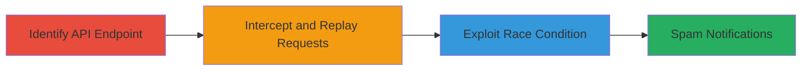

# Race Condition Exploitation in 'This Rocks' Button for Notification Spam on Social Club

Multi-stage attack chain demonstrating a complete attack workflow exploiting a race condition to bypass one-time invocation limits on the 'This Rocks' button, resulting in notification spam.

## Chain Metrics Dashboard

| Metric | Value |
|--------|-------|
| Chain Status | Unverified |
| Total Steps | 3 |
| Execution Time | ~5 minutes |
| Skill Level | Intermediate |
| Complexity | Medium |
| Impact Level | Medium |

## Attack Flow Visualization



## Prerequisites & Requirements

### Required Tools

- [[tools/curl]]
- [[tools/Burp-Suite]]

### Target Environment

- Web platform
- Access to Rockstar Games' Social Club site
- Valid user session (authenticated account)

### Initial Access Requirements

- Authenticated browser session on Social Club
- Network access to the site (no special ports required)
- Prior knowledge of a target post or user to 'rock'

## Detailed Attack Procedures

### Step 1: Identify API Endpoint
procedure: [[procedures/Identify-This-Rocks-API-Endpoint]]

**Objective**: Locate the API endpoint triggered by the 'This Rocks' button to understand the one-time invocation mechanism.

**Instructions**: Navigate to a post on Social Club and inspect the network traffic while clicking the 'This Rocks' button using browser developer tools. Identify the POST request to the API endpoint, typically something like `/api/v1/rocks/create` with parameters for user and item ID.

**Expected Output**: API endpoint URL and request payload details, confirming it's designed for single invocation per user per item.

**Success Indicators**:
- Endpoint identified with authentication headers
- Request format noted (e.g., JSON payload with item ID)

### Step 2: Intercept and Replay Requests with Burp Suite
procedure: [[procedures/Intercept-and-Replay-Requests-with-Burp-Suite]]

**Objective**: Use a proxy to capture and replay the API request multiple times rapidly to test for race condition.

**Instructions**: Configure your browser to proxy through Burp Suite. Click the 'This Rocks' button to capture the request. In Burp's Repeater, modify and send the request 5-10 times in quick succession, observing if multiple successes occur despite the limit.

**Expected Output**: Multiple 200 OK responses indicating successful 'rocks' beyond the intended limit.

**Success Indicators**:
- Requests succeed concurrently without rate limiting
- No error messages for duplicate invocations

### Step 3: Exploit Race Condition with Curl
procedure: [[procedures/Exploit-Race-Condition-with-Curl]]

**Objective**: Automate rapid API invocations using curl to spam notifications for a targeted user.

**Instructions**: Use [[commands/curl-invoke-this-rocks]] to send repeated requests to the endpoint with the target item ID. Run in a loop, e.g., for i in {1..50}; do curl ...; done, to flood the notifications.

```bash
for i in {1..50}; do curl -X POST -H "Authorization: Bearer [token]" -d '{"item_id": "target_id"}' https://socialclub.rockstargames.com/api/v1/rocks/create; done
```

**Expected Output**: Series of successful responses, each generating a notification in the target's inbox.

**Success Indicators**:
- Target's notifications filled with repeated 'rock' alerts
- No server-side blocking after initial successes

## Attack Chain Summary

### Key Achievements

1. Bypassed one-time invocation limit via race condition
2. Successfully spammed notifications, degrading user experience
3. Demonstrated improper synchronization in API handling

## Technique & Tactic Coverage

### MITRE ATT&CK Techniques

- [[Exploit Public-Facing Application]] Exploit Public-Facing Application
- [[Network Denial of Service]] Network Denial of Service

### MITRE ATT&CK Tactics

- [[Execution]] Execution
- [[Impact]] Impact

---
*Last updated: 2023-10-01T00:00:00Z*
