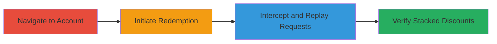

# Race Condition Exploitation in Instacart Promo Code Redemption for Stacked Discounts

Multi-stage attack chain demonstrating exploitation of a race condition in Instacart's authenticated promo code redemption system to apply the same coupon multiple times, resulting in stacked discounts and excessive savings.

## Chain Metrics Dashboard

| Metric | Value |
|--------|-------|
| Chain Status | Unverified |
| Total Steps | 4 |
| Execution Time | ~5 minutes |
| Skill Level | Intermediate |
| Complexity | Medium |
| Impact Level | High |

## Attack Flow Visualization

## Prerequisites & Requirements

### Required Tools

- [[tools/HTTP-Proxy]]

### Target Environment

- Web platform (Instacart web application)
- Authenticated user account with access to promo codes section
- Valid promo code (e.g., new user or specific offer like 'dallas20')

### Initial Access Requirements

- Valid Instacart user credentials
- Browser with proxy interception capability
- No special network access beyond standard internet

## Detailed Attack Procedures

### Step 1: Navigate to Promo Codes Section
procedure: [[procedures/Exploit-Race-Condition-in-Promo-Redemption]]

**Objective**: Access the authenticated account area to reach the promo code redemption feature.

**Instructions**: Log in to the Instacart account using valid credentials, then visit the user's account page and select the 'Promo Codes' feature.

**Expected Output**: Promo codes interface loaded, displaying available codes or redemption option.

**Success Indicators**:
- Account dashboard accessible
- 'Promo Codes' section visible

### Step 2: Initiate Promo Code Redemption
procedure: [[procedures/Exploit-Race-Condition-in-Promo-Redemption]]

**Objective**: Start the redemption process for a single promo code to capture the underlying HTTP request.

**Instructions**: In the promo codes section, select 'Redeem Promo Code', enter a valid code such as 'dallas20', and submit to trigger the redemption request.

**Expected Output**: Initial redemption attempt processed, with the HTTP request sent to the backend.

**Success Indicators**:
- Redemption form submitted
- Single discount applied initially

### Step 3: Intercept and Replay Redemption Request
procedure: [[procedures/Exploit-Race-Condition-in-Promo-Redemption]]

**Objective**: Capture the redemption HTTP request and replay it multiple times concurrently to exploit the race condition.

**Instructions**: Configure an HTTP proxy to intercept the request during submission. Once captured, forward or replay the request simultaneously multiple times (e.g., 2-5 concurrent instances) to bypass single-use checks due to lack of synchronization.

**Expected Output**: Multiple identical requests processed by the backend, each applying the discount.

**Success Indicators**:
- Concurrent requests sent without errors
- Backend accepts duplicates

### Step 4: Verify Multiple Redemptions
procedure: [[procedures/Exploit-Race-Condition-in-Promo-Redemption]]

**Objective**: Confirm the exploitation by checking for stacked discounts in the account or cart.

**Instructions**: After replaying, refresh the promo codes or cart section to observe the applied discounts. For example, a $15.81 coupon redeemed twice should show ~$31.63 total savings.

**Expected Output**: Stacked discounts visible, such as double or multiple applications of the same code.

**Success Indicators**:
- Excessive savings applied (e.g., $50 off from multiple new user coupons)
- Order total reduced beyond intended limits

## Attack Chain Summary

### Key Achievements

1. Successful navigation and initiation of promo redemption
2. Exploitation of race condition via concurrent request replay
3. Verification of stacked discounts leading to unauthorized savings

## Technique & Tactic Coverage

### MITRE ATT&CK Techniques

- [[Exploit Public-Facing Application]]

### MITRE ATT&CK Tactics

- [[Execution]]

---

*Last updated: 2023-10-01T00:00:00Z*
