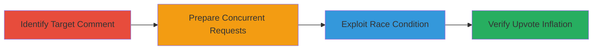

---
tags:
  - race-condition
  - business-logic
  - web
  - upvotes
  - manipulation
  - restaurant-review
type: attack_chain
tools: []
tactics:
  - '[[Impact]]'
verified: false
platforms:
  - Web
submitted: true
complexity: medium
created_at: '2023-10-05T12:00:00Z'
procedures:
  - '[[procedures/Exploit-Race-Condition-in-Comments-Likes]]'
step_count: 3
techniques:
  - '[[Data Manipulation]]'
  - '[[Stored Data Manipulation]]'
  - '[[Exploit Public-Facing Application]]'
updated_at: '2025-12-14T17:24:22.855Z'
description: >-
  A multi-step attack exploiting a race condition in the restaurant review
  comments likes feature to artificially inflate upvotes and manipulate review
  popularity.
skill_level: intermediate
impact_level: high
id: 5273eba9-dd4a-4583-9632-f8a3e0324d3c
validated: true
mitre_tactics:
  - '[[Impact]]'
mitre_techniques:
  - '[[Data Manipulation]]'
  - '[[Stored Data Manipulation]]'
  - '[[Exploit Public-Facing Application]]'
---
# Race Condition Exploitation in User Comments Likes to Inflate Upvotes

Multi-stage attack chain demonstrating exploitation of a race condition in the user comments likes feature of a restaurant review section to artificially inflate upvotes and manipulate review visibility.

## Chain Metrics Dashboard

| Metric | Value |
|--------|-------|
| Chain Status | Unverified |
| Total Steps | 3 |
| Execution Time | ~5 minutes |
| Skill Level | Intermediate |
| Complexity | Medium |
| Impact Level | High |

## Attack Flow Visualization



## Prerequisites & Requirements

### Required Tools

- Browser developer tools or scripting environment for concurrent requests

### Target Environment

- Web platform with restaurant review section
- Access to user comments likes/upvotes feature
- No special ports or services required beyond standard HTTP/HTTPS

### Initial Access Requirements

- Valid user account on the platform
- Network access to the web application
- No prior privileged access needed

## Detailed Attack Procedures

### Step 1: Identify Target Comment

procedure: [[procedures/Exploit-Race-Condition-in-Comments-Likes]]

**Objective**: Locate a specific user comment in the restaurant review section to target for upvote inflation.

**Instructions**: Navigate to the restaurant review page using a web browser. Browse the comments section and select a comment ID or URL parameter that can be used in like requests. Note the comment identifier for use in subsequent requests.

**Expected Output**: A specific comment URL or ID, e.g., `/reviews/comment/123/like`.

**Success Indicators**:
- Comment identified and accessible
- Like button or endpoint confirmed

### Step 2: Prepare Concurrent Requests

procedure: [[procedures/Exploit-Race-Condition-in-Comments-Likes]]

**Objective**: Set up multiple concurrent HTTP requests to the like endpoint to trigger the race condition.

**Instructions**: Use a tool like Apache Bench (ab) or a scripting language to simulate multiple simultaneous like requests. For example, prepare a command to send 10 concurrent requests to the like endpoint without proper synchronization.

Execute [[commands/concurrent-like-requests]] to simulate the race:

```bash
ab -n 10 -c 10 -p postdata.txt -T application/x-www-form-urlencoded https://target.com/reviews/comment/123/like
```

Where `postdata.txt` contains the like payload, e.g., `action=like&comment_id=123`.

**Expected Output**: Multiple requests processed, potentially bypassing rate limits.

**Success Indicators**:
- Requests sent concurrently
- No immediate rate limit errors

### Step 3: Verify Upvote Inflation

procedure: [[procedures/Exploit-Race-Condition-in-Comments-Likes]]

**Objective**: Confirm that the upvotes have been artificially inflated beyond the intended limit.

**Instructions**: Refresh the comments page or query the upvote count via the API or UI. Compare the displayed upvote count against the number of unique requests sent.

Use browser dev tools or a GET request to check: [[commands/check-upvote-count]]

```bash
curl -X GET https://target.com/reviews/comment/123
```

Look for the upvote field in the response JSON or HTML.

**Expected Output**: Upvote count higher than the number of actual likes, e.g., 10+ upvotes from 10 concurrent requests instead of 1.

**Success Indicators**:
- Inflated upvote count observed
- Review popularity manipulated (e.g., comment ranks higher)

## Attack Chain Summary

### Key Achievements

1. Successful exploitation of race condition to bypass like synchronization
2. Artificial inflation of upvotes on targeted comments
3. Potential manipulation of overall review scores and visibility

## Technique & Tactic Coverage

### MITRE ATT&CK Techniques

- [[Data Manipulation]] Data Manipulation
- [[Stored Data Manipulation]] Stored Data Manipulation
- [[Exploit Public-Facing Application]] Exploit Public-Facing Application

### MITRE ATT&CK Tactics

- [[Impact]] Impact

---
*Last updated: 2023-10-05T12:00:00Z*
