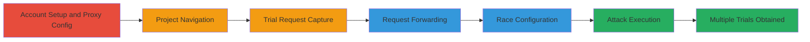

# Race Condition Exploitation in Weblate Trial Signup for Multiple Free Trials

Multi-stage attack chain demonstrating exploitation of a race condition in Weblate's hosted platform trial signup process, allowing multiple concurrent requests to bypass rate limiting and obtain unauthorized free trials.

## Chain Metrics Dashboard

| Metric | Value |
|--------|-------|
| Chain Status | Unverified |
| Total Steps | 6 |
| Execution Time | ~10 minutes |
| Skill Level | Intermediate |
| Complexity | Medium |
| Impact Level | High |

## Attack Flow Visualization

## Prerequisites & Requirements

### Required Tools

- [[tools/Burp-Suite]]
- [[tools/Turbo-Intruder]]

### Target Environment

- Web platform: hosted.weblate.org
- Required services/ports: HTTPS (443)
- Network access requirements: Internet access to the target site

### Initial Access Requirements

- No prior credentials needed; new account registration
- Browser configured for proxy interception
- No special network position required

## Detailed Attack Procedures

### Step 1: Account Setup and Proxy Configuration
procedure: [[procedures/Setup-Account-and-Configure-Burp-Suite-Proxy]]

**Objective**: Establish a new user account and prepare traffic interception for the trial request.

**Instructions**: Register a new account on the target platform and set up the proxy tool to monitor browser traffic.

**Expected Output**: Successful account creation and proxy configuration confirmed by intercepted non-trial traffic.

**Success Indicators**:
- Account registered at https://hosted.weblate.org/
- Burp Suite proxy active and intercepting browser requests

### Step 2: Navigate to Add New Translation Project
procedure: [[procedures/Navigate-to-Add-New-Translation-Project]]

**Objective**: Position the application state to trigger the trial signup flow.

**Instructions**: Use the browser to access the project creation interface, preparing for the trial activation.

**Expected Output**: Project addition interface loaded, ready for trial initiation.

**Success Indicators**:
- '+' icon clicked and 'add a new translation project' selected
- No errors in navigation

### Step 3: Capture Trial Request
procedure: [[procedures/Capture-Trial-Request-with-Burp-Suite]]

**Objective**: Intercept the initial trial activation request for modification and replay.

**Instructions**: Enable interception and trigger the trial button to capture the POST request.

**Expected Output**: POST request to /trial/ endpoint captured in Burp Suite.

**Success Indicators**:
- Intercept turned on
- Request details visible, including headers and body for the trial POST

### Step 4: Forward Request to Intruder Tool
procedure: [[procedures/Forward-Request-to-Turbo-Intruder]]

**Objective**: Prepare the captured request for high-speed concurrent replay.

**Instructions**: Send the intercepted request directly to the extension for race exploitation.

**Expected Output**: Request loaded in Turbo Intruder interface.

**Success Indicators**:
- Forward action completed from Burp to Turbo Intruder
- No request errors during transfer

### Step 5: Configure for Race Attack
procedure: [[procedures/Configure-Turbo-Intruder-for-Race-Attack]]

**Objective**: Set up the tool to send rapid concurrent requests exploiting the race condition.

**Instructions**: Add a test header and load the race configuration script.

**Expected Output**: Turbo Intruder configured with race.py and ready to execute.

**Success Indicators**:
- 'Test: %s' header added
- race.py configuration selected

### Step 6: Execute the Race Attack
procedure: [[procedures/Execute-Race-Attack-to-Obtain-Multiple-Trials]]

**Objective**: Send concurrent requests to activate multiple trials simultaneously.

**Instructions**: Run the attack script to flood the endpoint with identical requests.

**Expected Output**: Multiple (e.g., 6) successful trial activations, each granting 50,000 string limits and language allowances.

**Success Indicators**:
- Attack execution completes without errors
- Dashboard shows exceeded limits (e.g., 300,000 strings, >100 languages)
- Financial impact: Unauthorized extended free usage

## Attack Chain Summary

### Key Achievements

1. Bypassed single-trial limit via concurrent requests
2. Obtained 6 trials instead of 1, amplifying resource limits
3. Demonstrated business logic flaw leading to company financial loss

## Technique & Tactic Coverage

### MITRE ATT&CK Techniques

- [[Exploit Public-Facing Application]]

### MITRE ATT&CK Tactics

- [[Initial Access]]

---

*Last updated: 2024-01-01T00:00:00Z*
