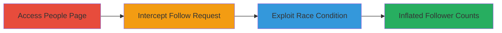

---
tags:
  - race-condition
  - web-vulnerability
  - follower-inflation
  - judge-me
type: attack_chain
tools:
  - '[[tools/Burp-Suite]]'
  - '[[tools/Turbo-Intruder]]'
tactics:
  - '[[Initial Access]]'
commands: []
platforms:
  - Web
complexity: medium
procedures:
  - '[[procedures/Access-Judge.me-People-Page]]'
  - '[[procedures/Intercept-Follow-Request-with-Burp-Suite]]'
  - '[[procedures/Exploit-Race-Condition-with-Turbo-Intruder]]'
step_count: 3
techniques:
  - '[[Exploit Public-Facing Application]]'
description: >-
  A multi-step attack exploiting a race condition in Judge.me's follow/like
  functionality to artificially inflate user follower counts by sending
  concurrent requests without proper synchronization.
skill_level: intermediate
impact_level: high
id: 6bf50e41-934a-446b-8aa2-d28adbd7b6fb
created_at: '2025-12-14T17:24:19.345Z'
updated_at: '2025-12-14T17:24:19.345Z'
verified: false
validated: true
submitted: true
mitre_tactics:
  - '[[Initial Access]]'
mitre_techniques:
  - '[[Exploit Public-Facing Application]]'
---
# Race Condition Exploitation to Inflate Follower Counts on Judge.me

## Overview

This attack chain demonstrates how to exploit a race condition in the follow/like functionality on Judge.me's people page. The vulnerability allows concurrent follow requests from the same user to be processed without synchronization, leading to multiple fake follows and artificially inflated follower counts. This misleads users about popularity metrics and can be used for social engineering or reputation manipulation. The attack requires intercepting a legitimate follow request and replaying it rapidly using specialized tools.

## Chain Metrics Dashboard

| Metric | Value |
|--------|-------|
| Chain Status | Unverified |
| Total Steps | 3 |
| Execution Time | ~5 minutes |
| Skill Level | Intermediate |
| Complexity | Medium |
| Impact Level | High |

## Attack Flow Visualization

## Prerequisites & Requirements

### Required Tools

- [[tools/Burp-Suite]]
- [[tools/Turbo-Intruder]]

### Target Environment

- Web platform
- Access to https://judge.me/people
- No specific services/ports beyond standard HTTPS (443)

### Initial Access Requirements

- Valid user account on Judge.me (anonymous access may suffice for public pages)
- Network access to the internet
- No prior privileged access needed

## Detailed Attack Procedures

### Step 1: Access Judge.me People Page
procedure: [[procedures/Access-Judge.me-People-Page]]

**Objective**: Navigate to the target page to access user profiles and the follow functionality.

**Instructions**: Open a web browser and directly visit the people page to locate a target user's profile.

**Expected Output**: The people page loads, displaying user profiles with follow/like buttons.

**Success Indicators**:
- Page loads successfully without errors
- Follow/like buttons are visible on user profiles

### Step 2: Intercept Follow Request with Burp Suite
procedure: [[procedures/Intercept-Follow-Request-with-Burp-Suite]]

**Objective**: Capture the HTTP request generated by a legitimate follow action to analyze and prepare for replay.

**Instructions**: Configure Burp Suite as a proxy, perform a follow action on a target user, and intercept the outgoing POST request.

**Expected Output**: The intercepted HTTP POST request to the follow endpoint is captured in Burp Suite.

**Success Indicators**:
- Request details (headers, body) are visible in Burp
- Follow action appears to succeed on the UI

### Step 3: Exploit Race Condition with Turbo Intruder
procedure: [[procedures/Exploit-Race-Condition-with-Turbo-Intruder]]

**Objective**: Send multiple concurrent follow requests rapidly to bypass deduplication and register fake follows.

**Instructions**: Forward the intercepted request to Turbo Intruder, load the race.py script, and execute to flood the endpoint with concurrent requests.

**Expected Output**: Multiple follow actions are registered, increasing the target's follower count beyond one.

**Success Indicators**:
- Target's follower count inflates (e.g., +5 from one user)
- No error responses indicating deduplication

## Attack Chain Summary

### Key Achievements

1. Successful access to the vulnerable follow endpoint
2. Interception and analysis of the follow request
3. Exploitation of race condition to create multiple fake follows

## Technique & Tactic Coverage

### MITRE ATT&CK Techniques

- [[Exploit Public-Facing Application]]

### MITRE ATT&CK Tactics

- [[Initial Access]]

---
*Last updated: 2023-10-01*
