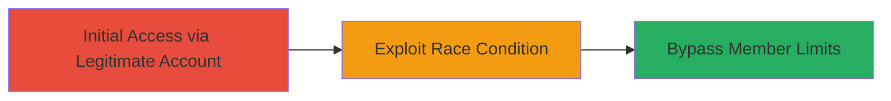

# Race Condition in Enjin Project Team Invitation to Bypass Member Limits

Multi-stage attack chain demonstrating a complete attack workflow exploiting a race condition in the Enjin platform's invitation system.

## Chain Metrics Dashboard

| Metric | Value |
|--------|-------|
| Chain Status | Unverified |
| Total Steps | 1 |
| Execution Time | ~5 minutes |
| Skill Level | Intermediate |
| Complexity | Medium |
| Impact Level | High |

## Attack Flow Visualization



## Prerequisites & Requirements

### Required Tools

- Web browser or proxy tool like Burp Suite for request manipulation

### Target Environment

- Enjin platform web application
- Active user account with invitation privileges
- Subscription plan with defined member limits

### Initial Access Requirements

- Valid Enjin account credentials
- Network access to Enjin web services
- No prior elevated access needed, but authenticated session required

## Detailed Attack Procedures

### Step 1: Exploit Invitation Race Condition
procedure: [[procedures/Exploit-Enjin-Invitation-Race-Condition]]

**Objective**: Send multiple simultaneous invitation requests to bypass the plan's maximum member limit check, allowing addition of excess team members.

**Instructions**: Authenticate to the Enjin platform and navigate to the project team invitation interface. Use a tool to generate and send parallel HTTP requests for invitations to multiple email addresses or users. For example, prepare a list of target emails and use parallel curl requests to submit invitations concurrently, racing past the server's limit enforcement.

First, authenticate and obtain the session cookie or token. Then, execute parallel invitations using [[commands/curl-parallel-invitations]]:

```bash
# Prepare emails list
cat emails.txt | xargs -n1 -P10 curl -X POST 'https://platform.enjin.io/api/invite' -H 'Authorization: Bearer YOUR_TOKEN' -d '{"email":"EMAIL_HERE","project_id":PROJECT_ID}'
```

Monitor the responses to confirm multiple successful invitations beyond the limit.

**Expected Output**: Multiple 200 OK responses indicating successful invitations, with team member count exceeding plan limits.

**Success Indicators**:
- Invitation confirmations for more members than allowed by plan
- Updated team roster shows excess members
- No error for limit exceeded

## Attack Chain Summary

### Key Achievements

1. Bypassed subscription plan member limits via race condition
2. Enabled unauthorized addition of team members
3. Potential for resource overuse and unauthorized access escalation

## Technique & Tactic Coverage

### MITRE ATT&CK Techniques

- [[Exploit Public-Facing Application]]

### MITRE ATT&CK Tactics

- [[Initial Access]]

---
*Last updated: 2023-10-01T00:00:00Z*
