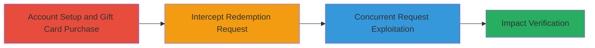

---
tags:
  - race-condition
  - web
  - business-logic
  - unauthorized-access
type: attack_chain
tools:
  - '[[tools/Burp-Suite-Pro]]'
  - '[[tools/Turbo-Intruder]]'
tactics:
  - '[[Initial Access]]'
verified: false
platforms:
  - Web
submitted: true
complexity: medium
created_at: '2023-10-01T00:00:00Z'
procedures:
  - '[[procedures/Setup-Reverb-Account-and-Purchase-Gift-Card]]'
  - '[[procedures/Intercept-Redemption-Request-with-Burp-Suite]]'
  - '[[procedures/Exploit-Race-Condition-with-Turbo-Intruder]]'
  - '[[procedures/Verify-Multiple-Redemption-Impact]]'
step_count: 4
techniques:
  - '[[Exploit Public-Facing Application]]'
updated_at: '2025-12-14T17:24:22.991Z'
description: >-
  Exploits a race condition in the Reverb.com gift card redemption endpoint to
  redeem the same token multiple times concurrently, resulting in unauthorized
  credits.
skill_level: intermediate
impact_level: high
id: 3f80b9b6-9700-44d3-aea4-84eb6bf981db
validated: true
mitre_tactics:
  - '[[Initial Access]]'
mitre_techniques:
  - '[[Exploit Public-Facing Application]]'
---
# Race Condition in Reverb Gift Card Redemption Allowing Multiple Unauthorized Redemptions

Multi-stage attack chain demonstrating exploitation of a race condition in Reverb.com's gift card redemption process to achieve multiple redemptions of the same token, leading to free credits.

## Chain Metrics Dashboard

| Metric | Value |
|--------|-------|
| Chain Status | Unverified |
| Total Steps | 4 |
| Execution Time | ~5 minutes |
| Skill Level | Intermediate |
| Complexity | Medium |
| Impact Level | High |

## Attack Flow Visualization

## Prerequisites & Requirements

### Required Tools

- [[tools/Burp-Suite-Pro]]
- [[tools/Turbo-Intruder]]

### Target Environment

- Web platform: Reverb.com sandbox (https://sandbox.reverb.com)
- Required services/ports: HTTPS (443)
- Network access requirements: Direct internet access to Reverb.com

### Initial Access Requirements

- Valid Reverb account credentials
- Network position: External attacker with authenticated access
- Prior access needed: None, but authentication required for redemption

## Detailed Attack Procedures

### Step 1: Account Setup and Gift Card Purchase
procedure: [[procedures/Setup-Reverb-Account-and-Purchase-Gift-Card]]

**Objective**: Establish authenticated access and obtain a redeemable gift card token.

**Instructions**: Log in to the Reverb sandbox environment and complete a gift card purchase to generate a redemption token.

**Expected Output**: Valid gift card token ready for redemption.

**Success Indicators**:
- Successful login confirmed by account dashboard access
- Gift card purchase completed with token received

### Step 2: Intercept Redemption Request
procedure: [[procedures/Intercept-Redemption-Request-with-Burp-Suite]]

**Objective**: Capture the redemption POST request for modification and replay.

**Instructions**: Use Burp Suite to proxy and intercept the redemption request while attempting to redeem the gift card.

**Expected Output**: Intercepted HTTP POST request to /<lang>/redeem with token parameter.

**Success Indicators**:
- Request intercepted showing parameters like token=<GIFT_CARD_TOKEN>
- CSRF authenticity_token captured

### Step 3: Exploit Race Condition
procedure: [[procedures/Exploit-Race-Condition-with-Turbo-Intruder]]

**Objective**: Send multiple concurrent redemption requests to bypass synchronization checks.

**Instructions**: Forward the intercepted request to Turbo Intruder, configure the payload script, add required headers, and execute the attack to send 30 concurrent requests.

**Expected Output**: Multiple 200 OK responses from the server indicating successful redemptions.

**Success Indicators**:
- Turbo Intruder reports concurrent requests sent
- Server responds with success for multiple requests before token invalidation

### Step 4: Verify Impact
procedure: [[procedures/Verify-Multiple-Redemption-Impact]]

**Objective**: Confirm unauthorized credit addition to the account balance.

**Instructions**: Check the account's Reverb bucks balance post-exploitation to validate multiple redemptions.

**Expected Output**: Account balance increased by multiples of the gift card value (e.g., $175 from $25 card).

**Success Indicators**:
- Balance reflects unauthorized credits
- Ability to make free purchases using excess credits

## Attack Chain Summary

### Key Achievements

1. Successful authentication and gift card acquisition
2. Interception and concurrent replay of redemption requests exploiting race condition
3. Multiple successful redemptions leading to free credits
4. Verified financial impact on the platform

## Technique & Tactic Coverage

### MITRE ATT&CK Techniques

- [[Exploit Public-Facing Application]]

### MITRE ATT&CK Tactics

- [[Initial Access]]

---

*Last updated: 2023-10-01T00:00:00Z*
