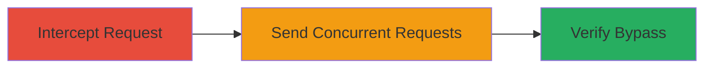

# Race Condition in Shopify Location Creation to Bypass Billing Limits

Multi-stage attack chain demonstrating exploitation of a race condition in Shopify's store location management to bypass billing-enforced limits on the number of locations.

## Chain Metrics Dashboard

| Metric | Value |
|--------|-------|
| Chain Status | Unverified |
| Total Steps | 3 |
| Execution Time | ~5 minutes |
| Skill Level | Intermediate |
| Complexity | Medium |
| Impact Level | High |

## Attack Flow Visualization

## Prerequisites & Requirements

### Required Tools

- [[tools/Burp-Suite]]

### Target Environment

- Shopify merchant dashboard (web platform)
- Active Shopify account with location creation permissions
- Network access to Shopify API endpoints

### Initial Access Requirements

- Valid Shopify merchant credentials
- Browser or proxy tool for HTTP interception
- No prior elevated access needed beyond standard merchant role

## Detailed Attack Procedures

### Step 1: Intercept Location Creation Request
procedure: [[procedures/Intercept-Shopify-Location-Creation-Request]]

**Objective**: Capture the HTTP request used to create a new store location for later replay.

**Instructions**: Configure a proxy tool like Burp Suite to intercept traffic from the Shopify dashboard. Navigate to the store locations section and attempt to create a new location to capture the POST request to the creation endpoint.

**Expected Output**: Intercepted HTTP POST request containing location creation payload, including headers like Authorization and JSON body with location details.

**Success Indicators**:
- Request captured successfully in proxy tool
- Request details match Shopify API format (e.g., endpoint like /admin/api/locations.json)

### Step 2: Send Concurrent Location Creation Requests
procedure: [[procedures/Send-Concurrent-Location-Creation-Requests]]

**Objective**: Exploit the race condition by sending multiple identical requests simultaneously to bypass the billing plan's location limit checks.

**Instructions**: Using the intercepted request, replay it multiple times (e.g., 10-15 instances) in parallel via the proxy tool or scripting with tools like curl in a loop or parallel execution. Target sending them within milliseconds to overwhelm the non-atomic check-and-create process.

**Expected Output**: Multiple successful 200 OK responses from the API, indicating locations were created without triggering the limit enforcement.

**Success Indicators**:
- API responses confirm creation of locations beyond the plan limit (e.g., 12 instead of 4)
- No error messages about exceeding limits

### Step 3: Verify Bypassed Location Limits
procedure: [[procedures/Verify-Bypassed-Location-Limits]]

**Objective**: Confirm the exploitation success by checking the updated location count in the dashboard or via API query.

**Instructions**: Refresh the Shopify store locations dashboard or query the API endpoint for locations (GET /admin/api/locations.json) to list all created locations and verify the count exceeds the billing plan allowance.

**Expected Output**: Dashboard or API response displaying more locations than permitted, such as 12 active locations on a plan limited to 4.

**Success Indicators**:
- Location count in dashboard/API exceeds plan limits
- All created locations are functional and editable

## Attack Chain Summary

### Key Achievements

1. Successfully intercepted and replayed location creation requests
2. Bypassed billing plan restrictions via race condition exploitation
3. Gained unauthorized access to premium location features without additional costs

## Technique & Tactic Coverage

### MITRE ATT&CK Techniques

- [[Exploit Public-Facing Application]]

### MITRE ATT&CK Tactics

- [[Initial Access]]

---
*Last updated: 2023-10-01T00:00:00Z*
