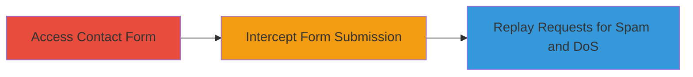

---
tags:
  - rate-limit-bypass
  - dos
  - spam
  - web
  - django
type: attack_chain
tools:
  - '[[tools/Burp-Suite]]'
  - '[[tools/Burp-Intruder]]'
tactics:
  - '[[Initial Access]]'
  - '[[Impact]]'
verified: false
platforms:
  - Web
submitted: true
complexity: medium
created_at: '2024-10-01T12:00:00Z'
procedures:
  - '[[procedures/Access-Weblate-Contact-Form]]'
  - '[[procedures/Intercept-and-Submit-Contact-Form-Request]]'
  - '[[procedures/Replay-Requests-with-Burp-Intruder]]'
step_count: 3
techniques:
  - '[[Exploit Public-Facing Application]]'
  - '[[Network Denial of Service]]'
updated_at: '2025-12-14T17:32:01.891Z'
description: >-
  Multi-stage exploitation of missing rate limiting on Weblate's contact form
  API to spam emails and perform a denial-of-service attack.
skill_level: intermediate
impact_level: high
id: 97e062f3-75fd-43a1-9c2a-8d2214712aea
validated: true
mitre_tactics:
  - '[[Initial Access]]'
  - '[[Impact]]'
mitre_techniques:
  - '[[Exploit Public-Facing Application]]'
  - '[[Network Denial of Service]]'
---
# Rate Limit Bypass on Weblate Contact Form for Email Spam and DoS

The vulnerability in Weblate's demo subdomain allowed unlimited submissions to the contact form API endpoint due to missing rate limiting. Attackers could visit the contact page, submit a form, intercept the POST request using Burp Suite, and replay it multiple times via Burp Intruder to spam emails and potentially cause a denial-of-service by overwhelming the server.

## Chain Metrics Dashboard

| Metric | Value |
|--------|-------|
| Chain Status | Unverified |
| Total Steps | 3 |
| Execution Time | ~5 minutes |
| Skill Level | Intermediate |
| Complexity | Medium |
| Impact Level | High |

## Attack Flow Visualization

## Prerequisites & Requirements

### Required Tools

- [[tools/Burp-Suite]]
- [[tools/Burp-Intruder]]

### Target Environment

- Web platform with Django-based application (e.g., Weblate demo)
- Accessible contact form endpoint (POST /contact/)
- No authentication required

### Initial Access Requirements

- Direct network access to the target URL (https://demo.weblate.org)
- No credentials needed
- Proxy setup for request interception

## Detailed Attack Procedures

### Step 1: Access Contact Form
procedure: [[procedures/Access-Weblate-Contact-Form]]

**Objective**: Load the contact form page to prepare for submission and interception.

**Instructions**: Navigate to the contact form URL in a browser configured with Burp Suite as a proxy. The form loads at https://demo.weblate.org/contact/?t=reg.

**Expected Output**: Contact form page displays with fields for email, message, etc.

**Success Indicators**:
- Page loads successfully without errors
- Form fields are visible and interactable

### Step 2: Intercept and Submit Contact Form Request
procedure: [[procedures/Intercept-and-Submit-Contact-Form-Request]]

**Objective**: Submit a single form request and capture it for replay, confirming the endpoint accepts submissions without immediate restrictions.

**Instructions**: Fill the form with sample data (e.g., email=asd@yahoo.com, subject=Test, message=Test spam) and submit. Ensure Burp Suite intercepts the POST request to /contact/ with headers like csrfmiddlewaretoken and Content-Type: application/x-www-form-urlencoded.

**Expected Output**: Request intercepted in Burp, showing successful POST with form data.

**Success Indicators**:
- Request captured with 200 OK response
- Email potentially sent (check server logs if accessible)

### Step 3: Replay Requests for Spam and DoS
procedure: [[procedures/Replay-Requests-with-Burp-Intruder]]

**Objective**: Automate repeated submissions to exploit the lack of rate limiting, causing email spam and server overload.

**Instructions**: Send the intercepted request to Burp Intruder, configure it to replay the POST multiple times (e.g., 100+ iterations) without modifying payload positions. Start the attack to flood the /contact/ endpoint.

**Expected Output**: Multiple successful responses (200 OK) indicating unlimited submissions, leading to spam emails and potential server strain.

**Success Indicators**:
- High volume of requests processed without blocking
- Server response times degrade or errors occur due to overload

## Attack Chain Summary

### Key Achievements

1. Identified and accessed vulnerable contact form endpoint
2. Intercepted and confirmed submission mechanism
3. Exploited rate limit absence to spam and DoS

## Technique & Tactic Coverage

### MITRE ATT&CK Techniques

- [[Exploit Public-Facing Application]] Exploit Public-Facing Application
- [[Network Denial of Service]] Network Denial of Service

### MITRE ATT&CK Tactics

- [[Initial Access]] Initial Access
- [[Impact]] Impact

---

*Last updated: 2024-10-01T12:00:00Z*
