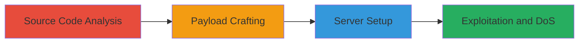

# ReDoS Denial of Service in WEBrick HTTP Digest Authentication

Multi-stage attack chain demonstrating exploitation of a Regular Expression Denial of Service (ReDoS) vulnerability in Ruby's WEBrick::HTTPAuth::DigestAuth class, leading to server CPU exhaustion and denial of service.

## Chain Metrics Dashboard

| Metric | Value |
|--------|-------|
| Chain Status | Unverified |
| Total Steps | 4 |
| Execution Time | ~10 minutes |
| Skill Level | Intermediate |
| Complexity | Medium |
| Impact Level | High |

## Attack Flow Visualization



## Prerequisites & Requirements

### Required Tools

- [[tools/Ruby]]
- [[tools/WEBrick]]
- [[tools/curl]]
- [[tools/time]]

### Target Environment

- Ruby environment with WEBrick (version 1.4.2 or similar, Ruby 2.5.5)
- Local network access to port 8000
- No external dependencies beyond standard Ruby libraries

### Initial Access Requirements

- Local machine with Ruby installed
- Administrative access not required; runs as standard user
- Prior knowledge of Ruby and regex patterns

## Detailed Attack Procedures

### Step 1: Source Code Analysis
procedure: [[procedures/Analyze-WEBrick-DigestAuth-Source-for-ReDoS]]

**Objective**: Identify the vulnerable regex in WEBrick's DigestAuth implementation to understand the ReDoS attack vector.

**Instructions**: Review the source code of the split_param_value method in lib/webrick/httpauth/digestauth.rb. Focus on line 295 where the regex pattern is defined. Use a text editor or GitHub to examine the pattern ^\s*([\w-.*\%!"+)=\s*"((.|\[^"])*"\s*,? which is prone to catastrophic backtracking due to nested quantifiers.

**Expected Output**: Identification of the regex vulnerability, noting potential for exponential backtracking on inputs with repeated backslash-b patterns.

**Success Indicators**:
- Regex pattern confirmed as vulnerable
- Backtracking risks documented

### Step 2: Payload Crafting
procedure: [[procedures/Craft-ReDoS-Payload-for-Authorization-Header]]

**Objective**: Create a malicious string that triggers catastrophic backtracking in the vulnerable regex.

**Instructions**: Construct a long repeated string of \b characters for the Authorization header, such as a="\b\b\b\b\b\b\b\b\b\b\b\b\b\b\b\b\b\b\b\b\b\b\b\b\b\b\b\b\b\b\b\b\b\b\b\b\b\b\b\b\b\b\b". This payload exploits the alternation and quantifiers in the regex to cause excessive CPU usage.

**Expected Output**: A crafted header string ready for use in HTTP requests.

**Success Indicators**:
- Payload string generated
- Theoretical backtracking confirmed via regex testing tools if available

### Step 3: Server Setup
procedure: [[procedures/Configure-Vulnerable-WEBrick-Server-with-Digest-Auth]]

**Objective**: Deploy a test WEBrick server configured with Digest authentication to reproduce the vulnerability.

**Instructions**: Write a Ruby script to start WEBrick on port 8000 with DigestAuth enabled. Use Htpasswd or similar for user database. Example script:

```ruby
require 'webrick'
require 'webrick/httpauth/digestauth'

server = WEBrick::HTTPServer.new(Port: 8000)
server.realm = 'DigestAuth example realm'
server.users = WEBrick::HTTPAuth::DigestAuth.make_passwd('user', 'password')

server.mount_proc('/', WEBrick::HTTPAuth::DigestAuth.new(server)) do |req, res|
  res.body = 'Hello, Digest Auth!'
end

trap('INT') { server.shutdown }
server.start
```
Run the script with `ruby server.rb`.

**Expected Output**: Server listening on http://localhost:8000, responding to valid Digest auth requests.

**Success Indicators**:
- Server starts without errors
- Basic auth requests succeed

### Step 4: Exploitation and DoS
procedure: [[procedures/Trigger-ReDoS-DoS-Using-Curl]]

**Objective**: Send the crafted payload to the server, triggering ReDoS and measuring the impact.

**Instructions**: Use [[commands/curl-exploit-webrick-redos]] to send a HEAD request with the malicious Authorization header to http://localhost:8000. Prefix with [[tools/time]] to measure delay.

```bash
time curl -I --header 'Authorization: Digest a="\b\b\b\b\b\b\b\b\b\b\b\b\b\b\b\b\b\b\b\b\b\b\b\b\b\b\b' http://localhost:8000
```

**Expected Output**: HTTP 400 Bad Request response after significant delay (e.g., 9+ seconds), with high CPU usage on the server.

**Success Indicators**:
- Response time exceeds several seconds
- Server CPU spikes to 100%

## Attack Chain Summary

### Key Achievements

1. Identified ReDoS vulnerability in WEBrick DigestAuth regex
2. Crafted payload to exploit catastrophic backtracking
3. Set up vulnerable server for reproduction
4. Demonstrated DoS impact with measurable delays

## Technique & Tactic Coverage

### MITRE ATT&CK Techniques

- [[Exploit Public-Facing Application]]
- [[Endpoint Denial of Service]]

### MITRE ATT&CK Tactics

- [[Initial Access]]
- [[Impact]]

---
*Last updated: 2023-10-01T00:00:00Z*
