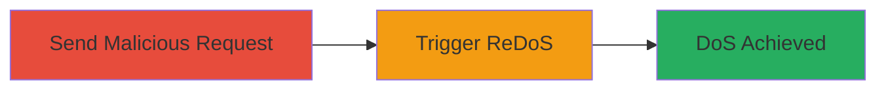

---
id: ac-redos-rack-range-dos
name: ReDoS Denial of Service via Malicious HTTP Range Header in Rack
type: attack_chain
description: A denial of service attack exploiting a Regular Expression Denial of Service (ReDoS) vulnerability in Rack's HTTP Range header parsing, leading to high CPU usage and potential service disruption in Ruby on Rails applications.
verified: false
submitted: false
step_count: 1
created_at: 2024-01-01T00:00:00Z
updated_at: 2024-01-01T00:00:00Z
procedures: [[procedures/Exploit-ReDoS-in-Rack-Range-Header-Parsing]]
techniques: [[Exploit Public-Facing Application]], [[Network Denial of Service]]
tactics: [[Initial Access]], [[Impact]]
tags: redos, dos, rack, ruby, rails, web
platforms: Web, Ruby
tools: []
---

# ReDoS Denial of Service via Malicious HTTP Range Header in Rack

Multi-stage attack chain demonstrating a complete attack workflow targeting the ReDoS vulnerability (CVE-2022-44570) in Rack's Range header parsing.

## Chain Metrics Dashboard

| Metric | Value |
|--------|-------|
| Chain Status | Unverified |
| Total Steps | 1 |
| Execution Time | ~1 minute |
| Skill Level | Intermediate |
| Complexity | Medium |
| Impact Level | High |

## Attack Flow Visualization



## Prerequisites & Requirements

### Required Tools

- None (uses standard HTTP client like curl)

### Target Environment

- Ruby on Rails application using Rack versions >=1.5.0
- Web server handling HTTP Range requests (e.g., file serving or streaming)
- Vulnerable to unauthenticated requests

### Initial Access Requirements

- Network access to the target web application
- No credentials required (unauthenticated attack)
- Prior access not needed; public-facing endpoint

## Detailed Attack Procedures

### Step 1: Trigger ReDoS with Crafted Range Header
procedure: [[procedures/Exploit-ReDoS-in-Rack-Range-Header-Parsing]]

**Objective**: Send a specially crafted HTTP request with a malicious Range header to exploit the vulnerable regex in Rack, causing catastrophic backtracking and excessive CPU usage leading to denial of service.

**Instructions**: Use [[commands/curl-send-malicious-range-header]] to send a GET request to a Range-handling endpoint with a payload designed to trigger exponential backtracking in the parsing regex. Example payload for the Range header: `bytes=0-18446744073709551615, 0-1, 0-18446744073709551615` (adjust based on specific vulnerable patterns identified in Rack code).

```bash
curl -H "Range: bytes=0-18446744073709551615, 0-1, 0-18446744073709551615" http://target-app.com/files/largefile
```

Monitor server CPU usage during the request to confirm the backtracking effect.

**Expected Output**: The request hangs or takes excessively long (seconds to minutes), with server CPU spiking to 100% due to regex backtracking.

**Success Indicators**:
- Server response delayed or timed out
- High CPU consumption observed on the target server
- Application logs show parsing errors or timeouts in Rack middleware

## Attack Chain Summary

### Key Achievements

1. Successful exploitation of ReDoS in Rack's Range header parser
2. Achievement of unauthenticated denial of service
3. Demonstration of impact on Ruby on Rails file serving endpoints

## Technique & Tactic Coverage

### MITRE ATT&CK Techniques

- [[Exploit Public-Facing Application]] Exploit Public-Facing Application
- [[Network Denial of Service]] Network Denial of Service

### MITRE ATT&CK Tactics

- [[Initial Access]] Initial Access
- [[Impact]] Impact

---
*Last updated: 2024-01-01T00:00:00Z*
