# Reconnaissance and Vulnerability Discovery in Zomato Leading to IDOR and Sensitive User Data Exposure

Multi-stage attack chain demonstrating reconnaissance on Zomato's infrastructure, including IP resolution, port scanning, subdomain enumeration, GitHub vulnerability scanning, and exploitation of IDOR for unauthorized access to user card details and balances. The chain uncovers multiple vulnerabilities (XSS, CSRF, DLL hijacking, public disclosures) with potential for information theft, session hijacking, and server compromise. The report was closed as not applicable, but the techniques highlight common web and repo security issues.

## Chain Metrics Dashboard

| Metric | Value |
|--------|-------|
| Chain Status | Unverified |
| Total Steps | 9 |
| Execution Time | ~60 minutes |
| Skill Level | Intermediate |
| Complexity | Medium |
| Impact Level | High |

## Attack Flow Visualization

```mermaid
graph LR
    A[Initial Access: IP Discovery] --> B[Discovery: Network Scanning]
    B --> C[Discovery: Subdomain Enumeration]
    C --> D[Discovery: GitHub Repo Analysis]
    D --> E[Discovery: Exposed Services]
    E --> F[Collection: IDOR Exploitation]
    F --> G[Impact: Data Exposure]

    style A fill:#e74c3c
    style B fill:#f39c12
    style C fill:#f39c12
    style D fill:#f39c12
    style E fill:#3498db
    style F fill:#9b59b6
    style G fill:#27ae60
```



## Prerequisites & Requirements

### Required Tools

- [[tools/ping]]
- [[tools/nmap]]
- [[tools/Burp-Suite]]
- [[tools/DNS-Scanner]]
- [[tools/Aquatone]]
- [[tools/Maltego]]
- [[tools/gitSploit]]

### Target Environment

- Target Platform: Web applications on AWS (IP 52.77.124.190)
- Required Services/Ports: HTTPS (443), potential SSH misconfiguration
- Network Access Requirements: Internet connectivity for public-facing scans

### Initial Access Requirements

- No credentials required (public reconnaissance)
- Network Position: External attacker with public access
- Prior Access Needed: None

## Detailed Attack Procedures

### Step 1: IP Address Discovery
procedure: [[procedures/IP-Address-Discovery-via-Ping]]

**Objective**: Resolve the target's domain to an IP address for further targeting.

**Instructions**: Use [[commands/ping-resolve-ip]] to identify the IP associated with zomato.com:

```bash
ping zomato.com
```

**Expected Output**: Response showing IP 52.77.124.190.

**Success Indicators**:
- IP address resolved successfully
- Target host reachable

### Step 2: Network Service Scanning
procedure: [[procedures/Network-Service-Scanning-with-Nmap]]

**Objective**: Enumerate open ports, services, and versions on the target IP.

**Instructions**: Run [[commands/nmap-port-scan]] on the discovered IP:

```bash
nmap -sV -p- 52.77.124.190
```

**Expected Output**: List of open ports including 443 (HTTPS) and service details.

**Success Indicators**:
- Open ports identified
- Service versions revealed for vuln assessment

### Step 3: Web Application Testing
procedure: [[procedures/Web-Application-Testing-with-Burp-Suite-and-DNS-Scanner]]

**Objective**: Intercept requests and enumerate DNS for potential web vulns.

**Instructions**: Configure [[tools/Burp-Suite]] as a proxy and use [[commands/dns-scan-enum]]:

```bash
dnsenum zomato.com
```

**Expected Output**: DNS records and potential subdomains, though results may be limited.

**Success Indicators**:
- Requests intercepted without errors
- Basic DNS info gathered

### Step 4: GitHub Repository Exploration
procedure: [[procedures/GitHub-Repository-Exploration-for-Vulnerabilities]]

**Objective**: Search public repos for code leaks or vulns.

**Instructions**: Manually search GitHub for Zomato-related repos and analyze for sensitive info using browser or [[commands/git-clone-analyze]]:

```bash
git clone https://github.com/zomato/repo.git
```

**Expected Output**: Cloned repo with potential exposed configs.

**Success Indicators**:
- Repos identified
- Sensitive files found

### Step 5: Subdomain Enumeration
procedure: [[procedures/Subdomain-Enumeration-with-Aquatone]]

**Objective**: Discover hidden subdomains for expanded attack surface.

**Instructions**: Execute [[commands/aquatone-enum]] to find and screenshot subdomains:

```bash
aquatone-discover --domain zomato.com
```

**Expected Output**: List of subdomains with screenshots.

**Success Indicators**:
- Hidden domains revealed
- Visual confirmation of services

### Step 6: OSINT Reconnaissance
procedure: [[procedures/OSINT-Reconnaissance-with-Maltego]]

**Objective**: Perform link analysis and compare subdomain results.

**Instructions**: Use [[tools/Maltego]] transforms for OSINT on zomato.com:

**Expected Output**: Graph of entities and relationships.

**Success Indicators**:
- Subdomain differences noted
- Additional intel gathered

### Step 7: Vulnerability Scanning in GitHub
procedure: [[procedures/Vulnerability-Scanning-in-GitHub-with-gitSploit]]

**Objective**: Identify code vulns in repos.

**Instructions**: Run [[commands/gitsploit-scan]] on target repos:

```bash
gitsploit search zomato
```

**Expected Output**: ~10 vulns from low to critical.

**Success Indicators**:
- Vulns listed (XSS, CSRF, etc.)
- Exploit paths identified

### Step 8: Exposed Service Detection
procedure: [[procedures/Exposed-Service-Detection-on-Auth-Domain]]

**Objective**: Detect misconfigured services on auth subdomain.

**Instructions**: Scan auth.zomato.com on port 443 with [[commands/nmap-service-scan]]:

```bash
nmap -p 443 auth.zomato.com
```

**Expected Output**: Service details, potentially brute-forceable.

**Success Indicators**:
- Exposed HTTPS service confirmed
- Misconfig noted

### Step 9: IDOR Exploitation
procedure: [[procedures/IDOR-Exploitation-for-User-Data-Access]]

**Objective**: Access unauthorized user data via IDOR.

**Instructions**: Manipulate requests to view other users' card details using [[tools/Burp-Suite]]:

**Expected Output**: Card index and balance exposed (video POC).

**Success Indicators**:
- Unauthorized data retrieved
- POC video captured

## Attack Chain Summary

### Key Achievements

1. Discovered IP and services via ping and nmap
2. Enumerated subdomains and GitHub vulns
3. Exploited IDOR for sensitive user data access

## Technique & Tactic Coverage

### MITRE ATT&CK Techniques

- [[Gather Victim Host Information]] Gather Victim Host Information
- [[Network Service Scanning]] Network Service Scanning
- [[Hardware]] Gather Victim Host Information: Software
- [[Account Discovery]] Account Discovery
- [[Drive-by Compromise]] Drive-by Compromise (XSS)
- [[Forge Web Credentials]] Forge Web Credentials (CSRF)
- [[Hijack Execution Flow]] Hijack Execution Flow: DLL Side-Loading

### MITRE ATT&CK Tactics

- [[Reconnaissance]] Reconnaissance
- [[Discovery]] Discovery
- [[Collection]] Collection

---

*Last updated: 2023-10-01T00:00:00Z*
