---
tags:
  - account-takeover
  - email-reuse
  - username-enumeration
  - password-reset-abuse
  - authentication-bypass
  - reddit
type: attack_chain
tools: []
tactics:
  - '[[Initial Access]]'
  - '[[Discovery]]'
  - '[[Credential Access]]'
verified: false
platforms:
  - Web
submitted: true
complexity: medium
created_at: '2024-10-04T00:00:00Z'
procedures:
  - '[[procedures/Reddit-Multi-Account-Registration-with-Same-Email]]'
  - '[[procedures/Reddit-Username-Enumeration-via-Email-Lookup]]'
  - '[[procedures/Reddit-Password-Reset-for-Account-Takeover]]'
step_count: 12
techniques:
  - '[[Exploit Public-Facing Application]]'
  - '[[Account Discovery]]'
  - '[[Account Manipulation]]'
updated_at: '2025-12-14T17:33:06.318Z'
description: >-
  Exploit Reddit's failure to enforce unique email addresses during
  registration, allowing multiple accounts per email, followed by username
  enumeration and password reset to achieve account takeover.
skill_level: intermediate
impact_level: high
id: 28bfb83a-3382-4e1a-bff6-a63b148665f8
validated: true
mitre_tactics:
  - '[[Initial Access]]'
  - '[[Discovery]]'
  - '[[Credential Access]]'
mitre_techniques:
  - '[[Exploit Public-Facing Application]]'
  - '[[Account Discovery]]'
  - '[[Account Manipulation]]'
---
# Reddit Account Takeover via Email Reuse and Username Enumeration

Multi-stage attack chain demonstrating a complete attack workflow exploiting Reddit's registration vulnerability to takeover user accounts.

## Chain Metrics Dashboard

| Metric | Value |
|--------|-------|
| Chain Status | Unverified |
| Total Steps | 12 |
| Execution Time | ~10 minutes |
| Skill Level | Intermediate |
| Complexity | Medium |
| Impact Level | High |

## Attack Flow Visualization

```mermaid
graph LR
    A[Register Attacker Account] --> B[Verify Attacker Email]
    B --> C[Register Victim Account]
    C --> D[Verify Victim Email]
    D --> E[Enumerate Usernames]
    E --> F[Identify Victim Username]
    F --> G[Request Password Reset]
    G --> H[Receive Reset Link]
    H --> I[Takeover Account]

    style A fill:#e74c3c
    style B fill:#e74c3c
    style C fill:#f39c12
    style D fill:#f39c12
    style E fill:#3498db
    style F fill:#3498db
    style G fill:#9b59b6
    style H fill:#9b59b6
    style I fill:#27ae60
```

## Prerequisites & Requirements

### Required Tools

- Web browser (e.g., Chrome, Firefox)

### Target Environment

- Reddit web application
- Access to an email inbox (e.g., Gmail)
- No special services or ports required beyond standard HTTPS (443)

### Initial Access Requirements

- No prior credentials needed
- Attacker must control the target email address
- Victim simulates registration with the same email (in practice, social engineering or monitoring may be used)

## Detailed Attack Procedures

### Step 1: Register Attacker Account
procedure: [[procedures/Reddit-Multi-Account-Registration-with-Same-Email]]

**Objective**: Create the initial attacker-controlled account using the target email to establish email reuse.

**Instructions**: Open a web browser and navigate to the Reddit registration page at `https://www.reddit.com/register/?dest=https%3A%2F%2Fwww.reddit.com%2F`. Enter the email address (e.g., `account@gmail.com`) and choose a username (e.g., `attacker1`). Complete the registration by setting a password and agreeing to terms.

**Expected Output**: Successful account creation with a verification email sent to the inbox.

**Success Indicators**:
- Registration confirmation on the page
- Email received in inbox

### Step 2: Verify Attacker Email
procedure: [[procedures/Reddit-Multi-Account-Registration-with-Same-Email]]

**Objective**: Confirm the attacker account to enable further registrations with the same email.

**Instructions**: Check the email inbox for the verification message from Reddit and click the provided verification link.

**Expected Output**: Account verified; login prompt or dashboard appears.

**Success Indicators**:
- Verification success message
- Ability to log in to the account

### Step 3: Log Out from Attacker Account
procedure: [[procedures/Reddit-Multi-Account-Registration-with-Same-Email]]

**Objective**: Prepare for victim account registration without session interference.

**Instructions**: Click the user avatar in the top-right corner and select 'Log Out'.

**Expected Output**: Logged out state; redirect to login page.

**Success Indicators**:
- No active session
- Login page displayed

### Step 4: Simulate Victim Registration
procedure: [[procedures/Reddit-Multi-Account-Registration-with-Same-Email]]

**Objective**: Register a second account using the same email, mimicking a victim.

**Instructions**: Navigate back to `https://www.reddit.com/register/?dest=https%3A%2F%2Fwww.reddit.com%2F`. Use the same email (`account@gmail.com`) and a different username (e.g., `user1`). Set a password and complete registration.

**Expected Output**: Second account created; another verification email sent.

**Success Indicators**:
- Registration accepted despite email reuse
- Email queued in inbox

### Step 5: Verify Victim Email
procedure: [[procedures/Reddit-Multi-Account-Registration-with-Same-Email]]

**Objective**: Verify the victim account using the shared email access.

**Instructions**: Check the inbox for the new verification email and click the link to verify the `user1` account.

**Expected Output**: Victim account verified.

**Success Indicators**:
- Verification confirmed
- Both accounts now linked to the email

### Step 6: Log Out
procedure: [[procedures/Reddit-Multi-Account-Registration-with-Same-Email]]

**Objective**: Clear session for enumeration phase.

**Instructions**: Log out from the current account via the user menu.

**Expected Output**: Logged out.

**Success Indicators**:
- No active login

### Step 7: Initiate Username Lookup
procedure: [[procedures/Reddit-Username-Enumeration-via-Email-Lookup]]

**Objective**: Use the username lookup feature to enumerate all accounts tied to the email.

**Instructions**: Navigate to `https://www.reddit.com/username`. Enter the email `account@gmail.com` and submit the form.

**Expected Output**: Request processed; email with username list sent.

**Success Indicators**:
- Submission accepted
- Email notification of lookup

### Step 8: Receive Username List
procedure: [[procedures/Reddit-Username-Enumeration-via-Email-Lookup]]

**Objective**: Obtain the enumerated usernames.

**Instructions**: Check the email inbox for the response from Reddit containing the list of usernames associated with the email.

**Expected Output**: Email listing usernames like `attacker1` and `user1`.

**Success Indicators**:
- Email received with multiple usernames
- Victim's username visible

### Step 9: Identify Victim Username
procedure: [[procedures/Reddit-Username-Enumeration-via-Email-Lookup]]

**Objective**: Isolate the target victim's username from the list.

**Instructions**: Review the email and note the victim's username (e.g., `user1`).

**Expected Output**: Known victim username.

**Success Indicators**:
- Username extracted for next phase

### Step 10: Request Password Reset
procedure: [[procedures/Reddit-Password-Reset-for-Account-Takeover]]

**Objective**: Initiate reset for the victim's account using the enumerated details.

**Instructions**: Go to `https://www.reddit.com/password`. Enter the victim's username (`user1`) and the shared email (`account@gmail.com`), then submit.

**Expected Output**: Reset request processed; link sent to email.

**Success Indicators**:
- Reset email dispatched

### Step 11: Receive Reset Link
procedure: [[procedures/Reddit-Password-Reset-for-Account-Takeover]]

**Objective**: Access the password reset mechanism.

**Instructions**: Check the inbox for the password reset email and note the link or temporary password.

**Expected Output**: Reset link or code in email.

**Success Indicators**:
- Valid reset token received

### Step 12: Execute Account Takeover
procedure: [[procedures/Reddit-Password-Reset-for-Account-Takeover]]

**Objective**: Gain full control of the victim's account.

**Instructions**: Click the reset link in the email, enter a new password controlled by the attacker, and confirm. Log in with the new credentials.

**Expected Output**: Password changed; access to victim's account, including private info and chats.

**Success Indicators**:
- Successful login as victim
- Ability to view private content and change settings

## Attack Chain Summary

### Key Achievements

1. Successful multi-account registration with shared email
2. Enumeration of all associated usernames
3. Full takeover of victim account via password reset

## Technique & Tactic Coverage

### MITRE ATT&CK Techniques

- [[Exploit Public-Facing Application]]
- [[Account Discovery]]
- [[Account Manipulation]]

### MITRE ATT&CK Tactics

- [[Initial Access]]
- [[Discovery]]
- [[Credential Access]]

---

*Last updated: 2024-10-04T00:00:00Z*
