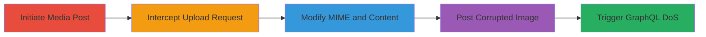

---
tags:
  - dos
  - file-upload
  - graphql
  - svg
  - type-confusion
  - reddit
type: attack_chain
tools:
  - '[[tools/Burp-Suite]]'
tactics:
  - '[[Execution]]'
  - '[[Impact]]'
verified: false
platforms:
  - Web
submitted: true
complexity: medium
created_at: '2023-10-01T00:00:00Z'
procedures:
  - '[[procedures/Initiate-Reddit-Media-Post-Upload]]'
  - '[[procedures/Intercept-and-Modify-Upload-Request-with-Burp-Suite]]'
  - '[[procedures/Replace-Image-Content-with-Malicious-SVG]]'
  - '[[procedures/Forward-Request-and-Post-to-Trigger-DoS]]'
step_count: 4
techniques:
  - '[[Exploit Public-Facing Application]]'
  - '[[Endpoint Denial of Service]]'
updated_at: '2025-12-14T17:25:59.828Z'
description: >-
  A multi-stage attack exploiting insufficient file validation in Reddit's image
  upload to store invalid 'None' URLs, causing persistent denial-of-service on
  affected pages via unhandled GraphQL exceptions.
skill_level: intermediate
impact_level: high
id: 523f19af-f1cb-4d75-a215-0a2e9d0135c9
validated: true
mitre_tactics:
  - '[[Execution]]'
  - '[[Impact]]'
mitre_techniques:
  - '[[Exploit Public-Facing Application]]'
  - '[[Endpoint Denial of Service]]'
---
# Reddit DoS via Corrupted SVG Image Upload and GraphQL Type Exception

Multi-stage attack chain demonstrating exploitation of Reddit's image upload vulnerability to cause persistent denial-of-service on homepages, profiles, and subreddits for affected users.

## Chain Metrics Dashboard

| Metric | Value |
|--------|-------|
| Chain Status | Unverified |
| Total Steps | 4 |
| Execution Time | ~10 minutes |
| Skill Level | Intermediate |
| Complexity | Medium |
| Impact Level | High |

## Attack Flow Visualization

## Prerequisites & Requirements

### Required Tools

- [[tools/Burp-Suite]]

### Target Environment

- Web platform (Reddit.com)
- Required services: Image upload endpoint (likely backed by S3)
- Tech stack: NodeJS frontend, GraphQL API
- Network access: Valid Reddit account with posting privileges

### Initial Access Requirements

- Logged-in Reddit user account
- Browser with proxy support (e.g., Firefox configured for Burp)
- No special credentials beyond standard user access

## Detailed Attack Procedures

### Step 1: Initiate Media Post
procedure: [[procedures/Initiate-Reddit-Media-Post-Upload]]

**Objective**: Start the media post creation process and upload a normal PNG to establish a valid upload slot.

**Instructions**: Navigate to Reddit's home screen, click 'Create Media Post', select your profile, add a title, and upload a legitimate PNG image. Then add a second image slot with another normal PNG.

**Expected Output**: Upload interface shows two images loaded, with the second ready for interception.

**Success Indicators**:
- Post creation screen active with title and first image uploaded
- Second image slot populated

### Step 2: Intercept Upload Request
procedure: [[procedures/Intercept-and-Modify-Upload-Request-with-Burp-Suite]]

**Objective**: Capture the HTTP POST request for the second image using Burp Suite to prepare for modification.

**Instructions**: Configure your browser to proxy through Burp Suite, then trigger the second image upload to intercept the request in Burp's Proxy tab.

**Expected Output**: Intercepted POST request to Reddit's media upload endpoint visible in Burp.

**Success Indicators**:
- Request captured with Content-Type: image/png
- Binary PNG data in request body

### Step 3: Modify MIME Type and Content
procedure: [[procedures/Replace-Image-Content-with-Malicious-SVG]]

**Objective**: Alter the request to disguise a corrupted SVG as a PNG, causing processing failure and 'None' URL storage.

**Instructions**: In Burp, change Content-Type from image/png to image/svg+xml, then replace the PNG binary with malicious SVG code (e.g., <svg><rect></rect></svg> for testing, but any invalid SVG triggers the issue).

**Expected Output**: Modified request ready for forwarding.

**Success Indicators**:
- MIME type updated in headers
- Request body contains SVG payload

### Step 4: Forward and Post to Trigger DoS
procedure: [[procedures/Forward-Request-and-Post-to-Trigger-DoS]]

**Objective**: Complete the upload and post, leading to infinite loading and GraphQL exceptions for viewers.

**Instructions**: Forward the modified request in Burp (expect 201 Created), then finalize and post the media. View the post from another account to observe DoS.

**Expected Output**: Post succeeds, but image shows 'processing...' indefinitely; affected pages crash with type errors.

**Success Indicators**:
- 201 response from upload
- DoS on homepage/profile for followers (e.g., blank pages, console errors like 'Unhandled None type in GraphQL')

## Attack Chain Summary

### Key Achievements

1. Bypassed file validation to upload corrupted SVG
2. Stored invalid 'None' URL in database
3. Triggered persistent DoS via unhandled GraphQL type exception
4. Affected multiple users without interaction

## Technique & Tactic Coverage

### MITRE ATT&CK Techniques

- [[Exploit Public-Facing Application]] Exploit Public-Facing Application
- [[Endpoint Denial of Service]] Endpoint Denial of Service

### MITRE ATT&CK Tactics

- [[Execution]] Execution
- [[Impact]] Impact

---

*Last updated: 2023-10-01T00:00:00Z*
