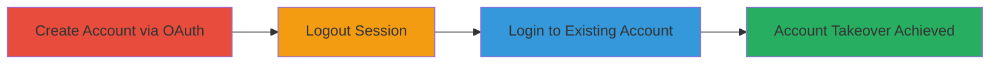

---

# Reddit OAuth Misconfiguration Leading to Account Takeover

Multi-stage attack chain demonstrating a complete attack workflow exploiting an OAuth email collision vulnerability on Reddit.

## Chain Metrics Dashboard

| Metric | Value |
|--------|-------|
| Chain Status | Unverified |
| Total Steps | 3 |
| Execution Time | ~2 minutes |
| Skill Level | Low |
| Complexity | Low |
| Impact Level | High |

## Attack Flow Visualization

## Prerequisites & Requirements

### Required Tools

- Web browser (e.g., Chrome)

### Target Environment

- Platform: Web (reddit.com)
- Required services/ports: HTTPS (443)
- Network access requirements: Internet access to reddit.com and Gmail

### Initial Access Requirements

- Victim's email address (e.g., Gmail)
- Access to the email provider's OAuth (e.g., Google account)
- No prior credentials for the target Reddit account needed

## Detailed Attack Procedures

### Step 1: Create Initial Account
procedure: [[procedures/Create-Reddit-Account-via-Gmail-OAuth]]

**Objective**: Establish an initial account linked to the target email via OAuth to set up the collision condition.

**Instructions**: Navigate to reddit.com and initiate the signup process using Gmail OAuth with the victim's email address. Complete the OAuth flow by authorizing with the Gmail account.

**Expected Output**: A new Reddit account is created and logged in, associated with the email.

**Success Indicators**:
- Successful login to a new account
- Account details confirm email linkage

### Step 2: Logout from Session
procedure: [[procedures/Logout-from-Reddit-Session]]

**Objective**: End the current session to allow re-authentication without session persistence interfering.

**Instructions**: From the Reddit interface, access the user menu and select the logout option to terminate the active session.

**Expected Output**: User is redirected to the login page, confirming session end.

**Success Indicators**:
- No active session; prompted to log in again
- Account remains associated with the email

### Step 3: Re-Authenticate via OAuth
procedure: [[procedures/Login-to-Existing-Reddit-Account-via-Gmail-OAuth]]

**Objective**: Exploit the misconfiguration by logging in with the same OAuth credentials, bypassing verification and gaining access to the original account.

**Instructions**: On the Reddit login page, select the Gmail OAuth option and use the same email and Google account to authenticate. The system grants access to the pre-existing account without additional checks.

**Expected Output**: Access to the victim's existing Reddit account, including all data and privileges.

**Success Indicators**:
- Logged in as the original account owner
- Access to account settings, posts, and private data

## Attack Chain Summary

### Key Achievements

1. Bypassed email verification during OAuth login
2. Achieved full account takeover with minimal prerequisites
3. Demonstrated high-impact unauthorized access via simple misconfiguration

## Technique & Tactic Coverage

### MITRE ATT&CK Techniques

- [[Valid Accounts]]

### MITRE ATT&CK Tactics

- [[Initial Access]]

---

*Last updated: 2024-10-01T00:00:00Z*
