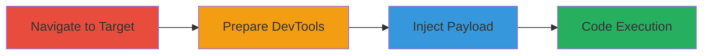

---
tags:
  - xss
  - javascript
  - reddit
  - eval
  - function-constructor
  - code-injection
type: attack_chain
tools:
  - '[[tools/Web-Browser]]'
  - '[[tools/Browser-DevTools]]'
tactics:
  - '[[Execution]]'
  - '[[Collection]]'
verified: false
platforms:
  - Web
submitted: true
complexity: medium
created_at: '2024-01-01T00:00:00Z'
procedures:
  - '[[procedures/Navigate-to-Vulnerable-Reddit-Page]]'
  - '[[procedures/Open-Browser-Developer-Tools]]'
  - '[[procedures/Inject-Reddit-XSS-Payload]]'
step_count: 3
techniques:
  - '[[JavaScript]]'
updated_at: '2025-12-14T03:46:26.522Z'
description: >-
  A multi-step attack chain exploiting an XSS vulnerability in old.reddit.com
  and reddit.com by injecting JavaScript payloads that use string concatenation
  to evade filters, leading to arbitrary code execution in users' browsers.
skill_level: intermediate
impact_level: high
id: 393707f9-53af-44cf-9922-ececc6b70b33
validated: true
mitre_tactics:
  - '[[Execution]]'
  - '[[Collection]]'
mitre_techniques:
  - '[[JavaScript]]'
---
# Reddit XSS via String Concatenation in Eval and Function Constructors

An XSS vulnerability in both old.reddit.com and reddit.com allows attackers to inject arbitrary JavaScript code into users' browsers. The exploit relies on manual testing to identify input fields or rendering contexts that fail to sanitize concatenated strings in eval and Function constructors, bypassing basic filters. Successful execution can lead to session hijacking, data theft, or full application control if the victim has elevated privileges. This chain demonstrates the discovery and exploitation process using standard browser tools.

## Chain Metrics Dashboard

| Metric | Value |
|--------|-------|
| Chain Status | Unverified |
| Total Steps | 3 |
| Execution Time | ~2 minutes |
| Skill Level | Intermediate |
| Complexity | Medium |
| Impact Level | High |

## Attack Flow Visualization



## Prerequisites & Requirements

### Required Tools

- [[tools/Web-Browser]]
- [[tools/Browser-DevTools]]

### Target Environment

- Web platform
- Access to old.reddit.com or reddit.com
- No specific ports or services required; public-facing web application

### Initial Access Requirements

- No credentials needed for public pages
- Direct network access to Reddit domains
- No prior access; assumes legitimate user navigation

## Detailed Attack Procedures

### Step 1: Navigate to Vulnerable Page
procedure: [[procedures/Navigate-to-Vulnerable-Reddit-Page]]

**Objective**: Access the target site to identify potential injection points in user-interactable areas like search fields, comments, or URL parameters.

**Instructions**: Launch a web browser and enter the URL for old.reddit.com or reddit.com. Interact with the page to locate an input field or context where user input is reflected without proper sanitization.

**Expected Output**: The target page loads, displaying interactive elements susceptible to XSS.

**Success Indicators**:
- Page loads successfully without errors
- Input fields or forms are available for testing

### Step 2: Open Developer Tools
procedure: [[procedures/Open-Browser-Developer-Tools]]

**Objective**: Prepare the browser environment for payload inspection and injection by accessing the console for direct script execution or element manipulation.

**Instructions**: Right-click on the page and select "Inspect" or press F12 to open the developer tools. Navigate to the Console tab to prepare for payload entry.

**Expected Output**: Developer tools panel opens with Console tab active and ready for input.

**Success Indicators**:
- Console is accessible and error-free
- Page elements can be inspected for reflection points

### Step 3: Inject XSS Payload
procedure: [[procedures/Inject-Reddit-XSS-Payload]]

**Objective**: Deliver the crafted JavaScript payload to trigger code execution, demonstrating the vulnerability by popping alerts.

**Instructions**: In the Console or a vulnerable input field, execute the payload using [[commands/reddit-xss-string-concatenation]]:

```javascript
eval('ale'+'rt(0)'); Function('ale'+'rt(1)')();
```
The payload concatenates strings to form 'alert(0)' and 'alert(1)', evading filters that block direct 'alert' usage.

**Expected Output**: Two browser alert dialogs appear, displaying '0' and '1', confirming arbitrary JavaScript execution without errors.

**Success Indicators**:
- Alert popups execute successfully
- No sanitization errors or blocks occur
- Console shows no syntax issues

## Attack Chain Summary

### Key Achievements

1. Identified XSS in Reddit's input handling by evading concatenation filters
2. Demonstrated code execution via eval and Function constructors
3. Highlighted potential for session compromise and data exfiltration

## Technique & Tactic Coverage

### MITRE ATT&CK Techniques

- [[JavaScript]]

### MITRE ATT&CK Tactics

- [[Execution]]
- [[Collection]]

---
*Last updated: 2024-01-01T00:00:00Z*
