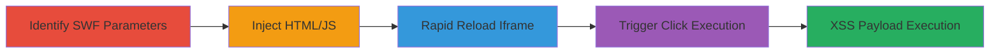

---
tags:
  - xss
  - flash
  - swf
  - reflected-xss
  - event-bypass
type: attack_chain
tactics:
  - '[[Execution]]'
  - '[[Initial Access]]'
verified: false
platforms:
  - Web
  - Flash (SWF)
submitted: true
complexity: medium
created_at: '2023-10-01T00:00:00Z'
procedures:
  - '[[procedures/Identify-Flash-SWF-Parameters-on-Target-Domain]]'
  - '[[procedures/Inject-HTML-JavaScript-into-buttonText-Parameter]]'
  - '[[procedures/Create-Rapid-Reloading-Page-to-Bypass-Event-Override]]'
  - '[[procedures/Trigger-XSS-Execution-via-Timed-Click-on-Injected-Element]]'
step_count: 4
techniques:
  - '[[JavaScript]]'
  - '[[Drive-by Compromise]]'
updated_at: '2025-12-14T03:47:18.440Z'
description: >-
  A multi-stage attack exploiting a reflected XSS vulnerability in Imgur's
  Flash-based swfupload.swf by injecting HTML into the buttonText parameter and
  using rapid iframe reloading to bypass the SWF's event override, enabling
  JavaScript execution on the imgur.com domain.
skill_level: advanced
impact_level: high
id: 8641bda8-7f1d-4801-9ae8-60c48c31bfc7
validated: true
mitre_tactics:
  - '[[Execution]]'
  - '[[Initial Access]]'
mitre_techniques:
  - '[[JavaScript]]'
  - '[[Drive-by Compromise]]'
---
# Reflected Flash XSS in Imgur swfupload.swf via Rapid Reloading to Bypass Event Override

Multi-stage attack chain demonstrating exploitation of a reflected XSS vulnerability in Imgur's Flash upload component, allowing arbitrary JavaScript execution on the main domain through HTML injection and a timing-based event bypass.

## Chain Metrics Dashboard

| Metric | Value |
|--------|-------|
| Chain Status | Unverified |
| Total Steps | 4 |
| Execution Time | ~5 minutes |
| Skill Level | Advanced |
| Complexity | Medium |
| Impact Level | High |

## Attack Flow Visualization

## Prerequisites & Requirements

### Required Tools

- Web browser with developer tools (e.g., Chrome)
- Local HTML file for hosting the exploit page

### Target Environment

- Web platform
- Flash-enabled browser (historical, as Flash is deprecated)
- Access to imgur.com domain

### Initial Access Requirements

- No credentials required
- Public network access to imgur.com
- No prior access needed

## Detailed Attack Procedures

### Step 1: Identify Flash SWF Parameters
procedure: [[procedures/Identify-Flash-SWF-Parameters-on-Target-Domain]]

**Objective**: Locate the vulnerable swfupload.swf file on the target domain and understand its customizable parameters for HTML insertion.

**Instructions**: Examine the Imgur upload page source or network requests to identify the SWF hosted at https://imgur.com/include/flash/swfupload.swf. Note parameters like buttonText that accept HTML without sanitization.

**Expected Output**: Confirmation of SWF URL and parameter details.

**Success Indicators**:
- SWF file identified
- Parameters such as buttonText confirmed as injectable

### Step 2: Inject HTML with JavaScript into buttonText Parameter
procedure: [[procedures/Inject-HTML-JavaScript-into-buttonText-Parameter]]

**Objective**: Craft a malicious URL with HTML/JS payload in the buttonText parameter to insert clickable elements into the SWF button.

**Instructions**: Construct the SWF URL with URL-encoded HTML in buttonText, e.g., %3Ca%20href="javascript:alert(document.domain)"%3ECLICKME%3C/a%3E, and additional styling parameters like buttonTextStyle=a{color:%23ff00ff}, buttonDisabled empty, buttonImageURL=/, buttonAction=-120, buttonCursor=-2.

**Expected Output**: Modified SWF URL ready for embedding.

**Success Indicators**:
- Payload encoded correctly
- HTML renders in SWF button when loaded statically

### Step 3: Create Rapid Reloading Page to Bypass Event Override
procedure: [[procedures/Create-Rapid-Reloading-Page-to-Bypass-Event-Override]]

**Objective**: Build an HTML page that embeds the malicious SWF in an iframe and reloads it every 300ms to disrupt the SWF's internal event handling.

**Instructions**: Create an HTML file with an iframe src set to the injected SWF URL, then use JavaScript setInterval to reload the iframe content every 300ms, causing flickering that allows the injected HTML's MouseClick event to fire occasionally.

**Expected Output**: Flickering iframe with intermittent visibility of injected 'CLICKME' text.

**Success Indicators**:
- Iframe reloads rapidly
- Injected text appears during reload cycles

### Step 4: Trigger XSS Execution via Timed Click on Injected Element
procedure: [[procedures/Trigger-XSS-Execution-via-Timed-Click-on-Injected-Element]]

**Objective**: Click the injected element during a reload window to execute the JavaScript payload, confirming XSS on the imgur.com domain.

**Instructions**: Load the exploit page in a browser, wait for the flickering, and click the 'CLICKME' link precisely when the MouseClick event is not overridden by the SWF button logic.

**Expected Output**: Alert box displaying 'imgur.com' from document.domain.

**Success Indicators**:
- JavaScript alert fires
- Potential for session hijacking or data theft demonstrated

## Attack Chain Summary

### Key Achievements

1. Identified unsanitized HTML insertion in Flash SWF parameters
2. Bypassed event override using rapid reloading technique
3. Achieved arbitrary JS execution on high-value domain
4. Highlighted risks of legacy Flash components

## Technique & Tactic Coverage

### MITRE ATT&CK Techniques

- [[JavaScript]]
- [[Drive-by Compromise]]

### MITRE ATT&CK Tactics

- [[Execution]]
- [[Initial Access]]

---

*Last updated: 2023-10-01T00:00:00Z*
