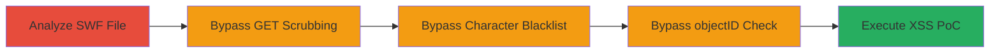

---
tags:
  - xss
  - wordpress
  - flash
  - swf
  - bypass
  - javascript-execution
type: attack_chain
tools: []
tactics:
  - '[[Initial Access]]'
  - '[[Execution]]'
verified: false
platforms:
  - Web
submitted: true
complexity: medium
created_at: '2023-10-01T00:00:00Z'
procedures:
  - '[[procedures/Analyze-WordPress-flashmediaelement-SWF-File]]'
  - '[[procedures/Bypass-GET-Parameter-Scrubbing-in-Flash]]'
  - '[[procedures/Bypass-Illegal-Character-Blacklist-with-ES6-Backticks]]'
  - '[[procedures/Bypass-ExternalInterface-objectID-Check-via-Direct-Access]]'
  - '[[procedures/Execute-Flash-XSS-PoC-in-WordPress]]'
step_count: 5
techniques:
  - '[[Exploit Public-Facing Application]]'
  - '[[JavaScript]]'
updated_at: '2025-12-13T23:52:55.648Z'
description: >-
  Multi-stage exploitation of a reflected XSS vulnerability in WordPress's
  flashmediaelement.swf file by bypassing GET parameter scrubbing, character
  blacklisting, and ExternalInterface checks to achieve arbitrary JavaScript
  execution.
skill_level: intermediate
impact_level: high
id: 204dd053-57cb-4436-8425-6a7eb89e902c
validated: true
mitre_tactics:
  - '[[Initial Access]]'
  - '[[Execution]]'
mitre_techniques:
  - '[[Exploit Public-Facing Application]]'
  - '[[JavaScript]]'
---
# Reflected Flash XSS in WordPress flashmediaelement.swf via Protection Bypasses

Multi-stage attack chain demonstrating exploitation of a reflected XSS vulnerability in WordPress's flashmediaelement.swf file, discovered in April 2016. The attack bypasses multiple protections in the SWF to inject and execute arbitrary JavaScript in the site's context, affecting nearly all WordPress instances allowing direct SWF access. This can lead to session hijacking, site defacement, or further compromise.

## Chain Metrics Dashboard

| Metric | Value |
|--------|-------|
| Chain Status | Unverified |
| Total Steps | 5 |
| Execution Time | ~5 minutes |
| Skill Level | Intermediate |
| Complexity | Medium |
| Impact Level | High |

## Attack Flow Visualization

## Prerequisites & Requirements

### Required Tools

- Browser with Flash support (e.g., Chrome for automatic embedding)
- URL encoding tool (built-in browser dev tools or manual)

### Target Environment

- WordPress site with MediaElement library
- Direct access to /wp-includes/js/mediaelement/flashmediaelement.swf enabled
- Web platform, no specific ports required beyond HTTP/HTTPS

### Initial Access Requirements

- Public access to the WordPress site
- No credentials needed
- Network position: External attacker

## Detailed Attack Procedures

### Step 1: Analyze SWF File
procedure: [[procedures/Analyze-WordPress-flashmediaelement-SWF-File]]

**Objective**: Examine the SWF file to understand parameter handling and identify bypass opportunities in protections like GET scrubbing, blacklisting, and ExternalInterface checks.

**Instructions**: Download and decompile the SWF file from the target WordPress site to review its ActionScript code for flashVars processing logic.

**Expected Output**: Insights into the three main protections: GET parameter deletion, character blacklisting in payloads, and ExternalInterface.objectID validation.

**Success Indicators**:
- SWF file downloaded successfully
- Code analysis reveals bypass vectors (e.g., invalid escapes, backticks, direct access)

### Step 2: Bypass GET Parameter Scrubbing
procedure: [[procedures/Bypass-GET-Parameter-Scrubbing-in-Flash]]

**Objective**: Craft a malicious GET parameter that evades scrubbing by exploiting Flash Player's URL parsing differences.

**Instructions**: Use invalid URL escapes in the parameter name, such as 'jsinitfunctio%gn', which Flash strips to 'jsinitfunction' while the scrubbing logic mismatches and fails to delete it from flashVars.

**Expected Output**: The parameter persists in flashVars for use in JavaScript calls.

**Success Indicators**:
- Parameter name mismatch confirmed via decompiled code or testing
- flashVars object contains the unsanitized parameter

### Step 3: Bypass Illegal Character Blacklist
procedure: [[procedures/Bypass-Illegal-Character-Blacklist-with-ES6-Backticks]]

**Objective**: Inject JavaScript payload that avoids detection by the blacklist checking for common operators and delimiters.

**Instructions**: Employ ES6 template literals with backticks in the payload value, e.g., 'alert`1`', which executes without using blacklisted characters like parentheses or braces.

**Expected Output**: Payload passes blacklist and is stored in flashVars for execution.

**Success Indicators**:
- Blacklist evasion verified by absence of forbidden characters
- Payload syntax confirmed valid in modern JavaScript environments

### Step 4: Bypass ExternalInterface.objectID Check
procedure: [[procedures/Bypass-ExternalInterface-objectID-Check-via-Direct-Access]]

**Objective**: Trick the SWF into believing it's properly embedded without manual embed code.

**Instructions**: Access the SWF URL directly in Chrome, which auto-generates an embed tag with an 'id' attribute, setting ExternalInterface.objectID and enabling calls.

**Expected Output**: SWF loads with objectID set, allowing ExternalInterface.call to the site's context.

**Success Indicators**:
- Direct URL loads SWF in browser without errors
- Dev tools show generated embed with id attribute

### Step 5: Execute XSS PoC
procedure: [[procedures/Execute-Flash-XSS-PoC-in-WordPress]]

**Objective**: Trigger arbitrary JavaScript execution by combining all bypasses in a single request.

**Instructions**: Request the crafted URL: https://example.com/wp-includes/js/mediaelement/flashmediaelement.swf?%#jsinitfunctio%gn=alert`1` (URL-encoded as ?%25#jsinitfunctio%25gn=alert%601%60). This loads the SWF with the malicious flashVar, executing via ExternalInterface.call.

**Expected Output**: Alert box or console log showing '1', confirming XSS in site context.

**Success Indicators**:
- JavaScript executes (e.g., alert pops)
- No browser XSS filters triggered due to Flash vector

## Attack Chain Summary

### Key Achievements

1. Bypassed three layers of protection in legacy Flash SWF
2. Achieved reflected XSS without traditional script tags
3. Enabled arbitrary JS execution for session theft or defacement on vulnerable WordPress sites

## Technique & Tactic Coverage

### MITRE ATT&CK Techniques

- [[Exploit Public-Facing Application]]
- [[JavaScript]]

### MITRE ATT&CK Tactics

- [[Initial Access]]
- [[Execution]]

---

*Last updated: 2023-10-01T00:00:00Z*
