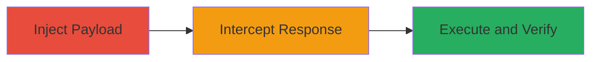

---
tags:
  - xss
  - reflected-xss
  - svg-payload
  - web
  - php
  - dod
type: attack_chain
tools:
  - '[[tools/Burp-Suite]]'
tactics:
  - '[[Execution]]'
  - '[[Collection]]'
verified: false
platforms:
  - Web
submitted: true
complexity: medium
created_at: '2023-10-01T00:00:00Z'
procedures:
  - '[[procedures/Inject-Malicious-SVG-Payload-into-ped-Parameter]]'
  - '[[procedures/Intercept-and-Modify-HTTP-Response-to-Remove-Redirect]]'
  - '[[procedures/Execute-and-Verify-XSS-Payload]]'
step_count: 3
techniques:
  - '[[JavaScript]]'
  - '[[Exploit Public-Facing Application]]'
updated_at: '2025-12-14T03:15:41.748Z'
description: >-
  A multi-step attack exploiting a reflected XSS vulnerability in a U.S.
  Department of Defense web application by injecting an SVG payload into the
  'ped' parameter, bypassing a response redirect using Burp Suite to execute
  JavaScript and confirm the vulnerability.
skill_level: intermediate
impact_level: high
id: ee7cdbe7-fe17-47da-86c7-d165ec5e68ec
validated: true
mitre_tactics:
  - '[[Execution]]'
  - '[[Collection]]'
mitre_techniques:
  - '[[JavaScript]]'
  - '[[Exploit Public-Facing Application]]'
---
# Reflected GET XSS in DoD Mission.php via SVG Payload After Auth Bypass

Multi-stage attack chain demonstrating a complete reflected XSS exploitation in a U.S. Department of Defense web application, leveraging a prior authorization bypass to access the vulnerable /mission.php endpoint and inject a malicious SVG payload into the 'ped' parameter. The attack uses Burp Suite to intercept and modify the response, removing a redirect to allow JavaScript execution, potentially leading to session hijacking, DOM manipulation, and access to sensitive browser APIs.

## Chain Metrics Dashboard

| Metric | Value |
|--------|-------|
| Chain Status | Unverified |
| Total Steps | 3 |
| Execution Time | ~5 minutes |
| Skill Level | Intermediate |
| Complexity | Medium |
| Impact Level | High |

## Attack Flow Visualization

## Prerequisites & Requirements

### Required Tools

- [[tools/Burp-Suite]]

### Target Environment

- Web application running PHP
- Access to /mission.php endpoint
- Prior authorization bypass to reach internal structure

### Initial Access Requirements

- Valid session via auth bypass (from previous vulnerability)
- Network access to the DoD application (e.g., https://██████████/mission.php)
- Burp Suite proxy configured in browser

## Detailed Attack Procedures

### Step 1: Inject Malicious SVG Payload
procedure: [[procedures/Inject-Malicious-SVG-Payload-into-ped-Parameter]]

**Objective**: Deliver the XSS payload to the vulnerable 'ped' parameter to trigger JavaScript execution upon reflection.

**Instructions**: Configure Burp Suite for interception and navigate to the target URL with the encoded payload in the 'ped' parameter.

**Expected Output**: Request intercepted in Burp Suite, ready for response modification.

**Success Indicators**:
- Payload successfully injected without errors
- Request appears in Burp Proxy-Intercept

### Step 2: Intercept and Modify HTTP Response
procedure: [[procedures/Intercept-and-Modify-HTTP-Response-to-Remove-Redirect]]

**Objective**: Prevent the page redirect to allow the reflected payload to execute in the browser.

**Instructions**: In Burp Suite, intercept the response and manually remove the redirection code from the body.

**Expected Output**: Modified response forwarded without redirect, payload ready to execute.

**Success Indicators**:
- Redirect code (e.g., meta refresh or JavaScript redirect) removed
- Response forwarded successfully

### Step 3: Execute and Verify XSS Payload
procedure: [[procedures/Execute-and-Verify-XSS-Payload]]

**Objective**: Confirm the XSS by observing the execution of the injected JavaScript alert.

**Instructions**: Forward the modified response and observe the browser for the alert popup.

**Expected Output**: Alert box displaying 'jarvis7' in the victim's browser.

**Success Indicators**:
- JavaScript alert executes
- No redirect occurs, confirming bypass

## Attack Chain Summary

### Key Achievements

1. Successful injection and reflection of SVG-based XSS payload in 'ped' parameter
2. Bypassed response redirect using response tampering
3. Verified execution with alert, demonstrating potential for cookie theft and API access

## Technique & Tactic Coverage

### MITRE ATT&CK Techniques

- [[JavaScript]]
- [[Exploit Public-Facing Application]]

### MITRE ATT&CK Tactics

- [[Execution]]
- [[Collection]]

---
*Last updated: 2023-10-01T00:00:00Z*
