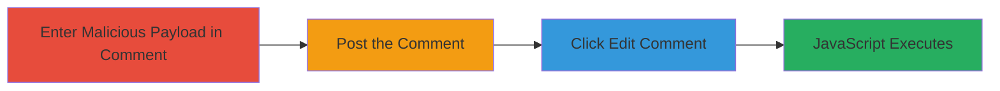

---
tags:
  - xss
  - self-xss
  - reflected-xss
  - nextcloud
type: attack_chain
tools: []
tactics:
  - '[[Execution]]'
commands: []
platforms:
  - Web
complexity: low
procedures:
  - '[[procedures/Trigger-Reflected-Self-XSS-in-Nextcloud-Comments]]'
step_count: 4
techniques:
  - '[[JavaScript]]'
description: >-
  This attack chain exploits a reflected self-XSS vulnerability in Nextcloud's
  file comment section by injecting a malicious payload, posting it, and
  triggering execution through the edit feature, leading to JavaScript execution
  in the authenticated user's browser.
skill_level: low
impact_level: low
id: 701d3939-5c07-48a9-b833-3d5fb423797f
created_at: '2025-12-14T03:15:31.363Z'
updated_at: '2025-12-14T03:15:31.363Z'
verified: false
validated: true
submitted: true
mitre_tactics:
  - '[[Execution]]'
mitre_techniques:
  - '[[JavaScript]]'
---
# Reflected Self-XSS Exploitation in Nextcloud File Comments via Edit Functionality

Multi-stage attack chain demonstrating a complete attack workflow for exploiting self-XSS in Nextcloud.

## Chain Metrics Dashboard

| Metric | Value |
|--------|-------|
| Chain Status | Unverified |
| Total Steps | 4 |
| Execution Time | ~1 minute |
| Skill Level | Low |
| Complexity | Low |
| Impact Level | Low |

## Attack Flow Visualization

## Prerequisites & Requirements

### Required Tools

- Web browser (e.g., Chrome, Firefox)

### Target Environment

- Nextcloud web application
- Authenticated user session with permission to view and comment on files

### Initial Access Requirements

- Valid Nextcloud user credentials
- Direct access to the web interface (no special network position required)

## Detailed Attack Procedures

### Step 1: Enter Malicious Payload
procedure: [[procedures/Trigger-Reflected-Self-XSS-in-Nextcloud-Comments]]

**Objective**: Inject an unsanitized JavaScript payload into the comment input field of a file in Nextcloud.

**Instructions**: Navigate to a file in the Nextcloud Files app, open the comments section, and enter a malicious payload in the comment box. Example payloads include:

- `</textarea>`
- `</textarea>">`
- `</textarea></img>`
- `</textarea><svg/onload=alert('XSS')>`
- `</textarea>foo`

**Expected Output**: The payload is accepted in the input field without immediate execution or error.

**Success Indicators**:
- Payload text appears in the comment input box
- No sanitization warning or rejection

### Step 2: Post the Comment
procedure: [[procedures/Trigger-Reflected-Self-XSS-in-Nextcloud-Comments]]

**Objective**: Submit the comment to store the payload in the system, where it will be reflected without proper sanitization.

**Instructions**: Click the 'Post' or 'Submit' button to save the comment containing the malicious payload.

**Expected Output**: The comment is posted and visible in the file's comment section, with the payload reflected in the display.

**Success Indicators**:
- Comment appears in the list without breaking the UI
- Payload is visible but not executed yet

### Step 3: Click Edit Comment
procedure: [[procedures/Trigger-Reflected-Self-XSS-in-Nextcloud-Comments]]

**Objective**: Access the edit functionality to re-render the payload, triggering the XSS vulnerability.

**Instructions**: Locate the posted comment, click the 'Edit' button or icon next to it to open the edit interface.

**Expected Output**: The edit modal or form opens, re-rendering the comment content and activating the injected JavaScript.

**Success Indicators**:
- Edit interface loads with the payload
- No errors in loading the edit view

### Step 4: Observe JavaScript Execution
procedure: [[procedures/Trigger-Reflected-Self-XSS-in-Nextcloud-Comments]]

**Objective**: Confirm the successful execution of arbitrary JavaScript in the browser context.

**Instructions**: Upon opening the edit view, the payload executes automatically. For example, an alert box pops up displaying '1', 'XSS', or a prompt.

**Expected Output**: JavaScript runs, such as an alert('1') or prompt('XSS'), confirming the XSS trigger.

**Success Indicators**:
- Alert, prompt, or other JS effect appears in the browser
- Console logs show script execution (if inspected)

## Attack Chain Summary

### Key Achievements

1. Successfully injected and posted a malicious payload in Nextcloud comments without sanitization.
2. Triggered XSS by accessing the edit functionality, exploiting improper escaping.
3. Achieved JavaScript execution in the authenticated user's browser context.

## Technique & Tactic Coverage

### MITRE ATT&CK Techniques

- [[JavaScript]]

### MITRE ATT&CK Tactics

- [[Execution]]

---

*Last updated: 2024-01-01*
