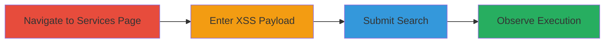

# Reflected Self-XSS in Slack Services Integration Page

Multi-stage attack chain demonstrating a complete attack workflow for exploiting a reflected self-XSS vulnerability in Slack's service integration page.

## Chain Metrics Dashboard

| Metric | Value |
|--------|-------|
| Chain Status | Unverified |
| Total Steps | 4 |
| Execution Time | ~1 minute |
| Skill Level | Beginner |
| Complexity | Low |
| Impact Level | Low |

## Attack Flow Visualization

## Prerequisites & Requirements

### Required Tools

- Web browser (e.g., Chrome, Firefox)

### Target Environment

- Slack web application
- Access to /services/new endpoint
- Authenticated user session in Slack

### Initial Access Requirements

- Valid Slack account credentials
- Direct network access to Slack domain (e.g., https://app.slack.com)
- No prior exploits needed; standard user access suffices

## Detailed Attack Procedures

### Step 1: Navigate to Services New Page

procedure: [[procedures/Exploit-Reflected-Self-XSS-in-Slack-Search]]

**Objective**: Access the vulnerable services integration page where the search functionality is exposed.

**Instructions**: Open a web browser and log in to your Slack workspace if not already authenticated. Then, navigate directly to the services integration page.

**Expected Output**: The page loads at https://(your-workspace).slack.com/services/new, displaying the search bar for integrating services.

**Success Indicators**:
- Page loads without errors
- Search bar is visible and interactive

### Step 2: Enter XSS Payload in Search Bar

procedure: [[procedures/Exploit-Reflected-Self-XSS-in-Slack-Search]]

**Objective**: Inject a malicious JavaScript payload into the unsanitized search input field.

**Instructions**: Locate the search input field on the page. Type the following XSS payload into it: ``. This payload uses an invalid image source to trigger an error event that executes JavaScript.

**Expected Output**: The payload is entered into the search field without immediate validation errors.

**Success Indicators**:
- Payload text appears in the input field
- No client-side blocking occurs

### Step 3: Submit the Search

procedure: [[procedures/Exploit-Reflected-Self-XSS-in-Slack-Search]]

**Objective**: Trigger the reflection of the user input by submitting the search query.

**Instructions**: Press Enter or click the search button to submit the query. This causes the application to process and reflect the input back in the response.

**Expected Output**: The search results page loads, reflecting the payload in the HTML without sanitization.

**Success Indicators**:
- Search submits successfully
- Page refreshes or updates with reflected input

### Step 4: Observe XSS Execution

procedure: [[procedures/Exploit-Reflected-Self-XSS-in-Slack-Search]]

**Objective**: Verify the execution of the injected JavaScript in the attacker's browser session.

**Instructions**: Upon submission, the payload should execute automatically. Watch for the alert dialog to confirm.

**Expected Output**: A browser alert popup displays the document domain (e.g., "app.slack.com"), confirming JavaScript execution.

**Success Indicators**:
- Alert box appears
- No errors in browser console related to blocking

## Attack Chain Summary

### Key Achievements

1. Successful navigation to the vulnerable endpoint
2. Injection and reflection of XSS payload
3. Execution of arbitrary JavaScript in the user's session
4. Demonstration of self-XSS impact, such as potential session token access in the same context

## Technique & Tactic Coverage

### MITRE ATT&CK Techniques

- [[JavaScript]]

### MITRE ATT&CK Tactics

- [[Execution]]

---
*Last updated: 2023-10-01T00:00:00Z*
