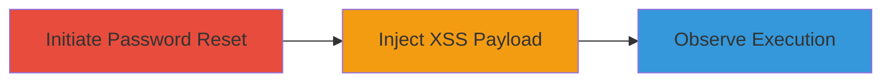

---
tags:
  - xss
  - self-xss
  - uber
  - password-reset
type: attack_chain
tools: []
tactics:
  - '[[Execution]]'
verified: false
platforms:
  - Web
submitted: true
complexity: low
procedures:
  - '[[procedures/Initiate-Uber-Password-Reset-Process]]'
  - '[[procedures/Inject-XSS-Payload-in-New-Password]]'
  - '[[procedures/Observe-Self-XSS-Execution]]'
step_count: 3
techniques:
  - '[[JavaScript]]'
description: >-
  A multi-step attack demonstrating reflected Self-XSS in the Uber partners
  password reset process, where unsanitized input in the new password field
  allows JavaScript execution limited to the attacker's browser.
skill_level: beginner
impact_level: low
id: 09f43f08-72af-4a4b-9d6e-f8030cd2ae25
created_at: '2025-12-14T03:15:26.601Z'
updated_at: '2025-12-14T03:15:26.601Z'
validated: true
mitre_tactics:
  - '[[Execution]]'
mitre_techniques:
  - '[[JavaScript]]'
---
# Reflected Self-XSS in Uber Password Reset Functionality

Multi-stage attack chain demonstrating a complete attack workflow for exploiting a reflected Self-XSS vulnerability in Uber's password reset functionality on partners.uber.com. The attack involves initiating a password reset, injecting a JavaScript payload into the new password field, and observing execution, which is confined to the attacker's own browser context due to the self-XSS nature.

## Chain Metrics Dashboard

| Metric | Value |
|--------|-------|
| Chain Status | Unverified |
| Total Steps | 3 |
| Execution Time | ~5 minutes |
| Skill Level | Beginner |
| Complexity | Low |
| Impact Level | Low |

## Attack Flow Visualization

## Prerequisites & Requirements

### Required Tools

- Web browser (e.g., Chrome, Firefox)

### Target Environment

- Web platform
- Access to https://login.uber.com and https://partners.uber.com
- Valid Uber account email for receiving reset link

### Initial Access Requirements

- Registered Uber account
- Email access to receive password reset link
- No special network privileges required; standard internet access

## Detailed Attack Procedures

### Step 1: Initiate Password Reset
procedure: [[procedures/Initiate-Uber-Password-Reset-Process]]

**Objective**: Start the password reset process to receive a reset link via email, redirecting to the vulnerable reset page.

**Instructions**: Open a web browser and navigate to the Uber login forgot password page. Enter your Uber account email and submit the request. Check your email for the reset link and click it to be redirected to the partners.uber.com reset page.

**Expected Output**: Redirected to https://partners.uber.com/reset-password with a form for entering a new password.

**Success Indicators**:
- Password reset email received
- Successfully redirected to the reset password form

### Step 2: Inject XSS Payload
procedure: [[procedures/Inject-XSS-Payload-in-New-Password]]

**Objective**: Enter a malicious JavaScript payload into the new password field to exploit the lack of input sanitization.

**Instructions**: On the reset password form, locate the new password input field. Enter the payload ">" (or a similar XSS string like ">") into the field. Optionally, enter a confirming password if required, then submit the form.

**Expected Output**: Form submission triggers the reflection of the payload in the page response.

**Success Indicators**:
- Form submits without validation errors
- Payload is accepted in the input field

### Step 3: Observe Execution
procedure: [[procedures/Observe-Self-XSS-Execution]]

**Objective**: Confirm the JavaScript execution in the browser, demonstrating the Self-XSS vulnerability.

**Instructions**: After submission, monitor the page for the execution of the injected payload. The onerror event in the img tag should trigger, displaying an alert or prompt with the document domain (e.g., partners.uber.com).

**Expected Output**: A browser alert or prompt box appears, confirming JavaScript execution.

**Success Indicators**:
- JavaScript alert/prompt executes
- No errors in browser console related to payload blocking

## Attack Chain Summary

### Key Achievements

1. Successfully initiated password reset and accessed the vulnerable form
2. Injected and reflected XSS payload without sanitization
3. Demonstrated Self-XSS execution, highlighting the need for input validation in password fields

## Technique & Tactic Coverage

### MITRE ATT&CK Techniques

- [[JavaScript]]

### MITRE ATT&CK Tactics

- [[Execution]]

---
*Last updated: 2023-10-01*
