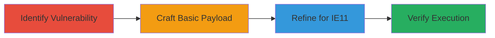

---
tags:
  - xss
  - reflected-xss
  - script-injection
  - browser-exploit
  - revive-adserver
type: attack_chain
tools:
  - '[[tools/curl]]'
tactics:
  - '[[Initial Access]]'
  - '[[Execution]]'
commands:
  - '[[commands/curl-reflected-xss-poc]]'
platforms:
  - Web
complexity: medium
procedures:
  - '[[procedures/Identify-Vulnerable-Endpoint-in-Revive-Adserver]]'
  - '[[procedures/Craft-Basic-XSS-Payload-with-curl]]'
  - '[[procedures/Refine-XSS-Payload-for-IE11-Compatibility]]'
  - '[[procedures/Verify-XSS-Exploitation-in-Internet-Explorer-11]]'
step_count: 4
techniques:
  - '[[Exploit Public-Facing Application]]'
  - '[[JavaScript]]'
description: >-
  Multi-stage attack exploiting a reflected XSS vulnerability in Revive
  Adserver's /www/delivery/afr.php endpoint by bypassing a previous fix through
  script tag closure and injection, enabling arbitrary JavaScript execution in
  older browsers like IE11.
skill_level: intermediate
impact_level: high
id: 0462acb9-2bd7-4885-a85f-418174fab95c
created_at: '2025-12-14T03:47:13.107Z'
updated_at: '2025-12-14T03:47:13.107Z'
verified: false
validated: true
submitted: true
mitre_tactics:
  - '[[Initial Access]]'
  - '[[Execution]]'
mitre_techniques:
  - '[[Exploit Public-Facing Application]]'
  - '[[JavaScript]]'
---
# Reflected XSS Bypass in Revive Adserver via Script Tag Injection

Multi-stage attack chain demonstrating exploitation of a reflected XSS vulnerability in Revive Adserver by bypassing a prior fix (report #775693) through closing an existing script tag and injecting a new one in the /www/delivery/afr.php endpoint. This allows arbitrary JavaScript execution, particularly in older browsers like Internet Explorer 11, leading to potential cookie theft or other client-side attacks.

## Chain Metrics Dashboard

| Metric | Value |
|--------|-------|
| Chain Status | Unverified |
| Total Steps | 4 |
| Execution Time | ~5 minutes |
| Skill Level | Intermediate |
| Complexity | Medium |
| Impact Level | High |

## Attack Flow Visualization



## Prerequisites & Requirements

### Required Tools

- [[tools/curl]]

### Target Environment

- Web platform running Revive Adserver (PHP-based)
- Accessible /www/delivery/afr.php endpoint
- No specific ports required beyond standard HTTP/HTTPS (80/443)

### Initial Access Requirements

- Network access to the Revive Adserver instance
- No credentials needed for public-facing endpoint
- Knowledge of prior vulnerability report #775693 for context

## Detailed Attack Procedures

### Step 1: Identify Vulnerable Endpoint
procedure: [[procedures/Identify-Vulnerable-Endpoint-in-Revive-Adserver]]

**Objective**: Review prior fixes to identify incomplete sanitization in the /www/delivery/afr.php endpoint where query parameters are inserted into JavaScript without full escaping.

**Instructions**: Analyze the previous report #775693 to understand the existing script tag in the response and how user input from parameters like 'refresh' is directly embedded.

**Expected Output**: Confirmation that query parameters are not fully escaped, allowing potential script tag manipulation.

**Success Indicators**:
- Identification of insertion point in JavaScript context
- Understanding of bypass opportunity via script tag closure

### Step 2: Craft Basic XSS Payload
procedure: [[procedures/Craft-Basic-XSS-Payload-with-curl]]

**Objective**: Test a simple payload to close the existing script tag and inject a new one, demonstrating the bypass.

**Instructions**: Use [[commands/curl-reflected-xss-poc]] to send the payload via the 'refresh' parameter:

```bash
curl "https://revive-instance/www/delivery/afr.php?refresh=10000&</script><script>alert(1)</script>"
```

Inspect the response for unescaped output in the script tag.

**Expected Output**: HTML response with the payload reflected, e.g., setTimeout('window.location.replace("https://revive-instance/www/delivery/afr.php?refresh=10000&</script><script>alert(1)</script>&loc=")', 10000000);

**Success Indicators**:
- Payload appears unescaped in the response
- Potential for JavaScript execution if loaded in a browser

### Step 3: Refine Payload for IE11
procedure: [[procedures/Refine-XSS-Payload-for-IE11-Compatibility]]

**Objective**: Enhance the payload to bypass IE11's XSS filter using null bytes and hash-based execution.

**Instructions**: Construct the advanced payload: '</script><script/%00%00v%00%00>document.location.href=location.hash.slice(1)</script>#javascript:alert(1)' and append it to the URL after the base parameters.

**Expected Output**: A URL ready for browser testing that exploits IE's handling of unencoded query parameters.

**Success Indicators**:
- Payload incorporates null bytes (%00) and hash fragment for evasion
- Compatible with IE11's lack of strict URL encoding

### Step 4: Verify Exploitation
procedure: [[procedures/Verify-XSS-Exploitation-in-Internet-Explorer-11]]

**Objective**: Confirm arbitrary JavaScript execution by triggering the payload in the target browser.

**Instructions**: Load the full refined URL into Internet Explorer 11 and observe the alert dialog.

**Expected Output**: alert(1) popup confirming XSS execution.

**Success Indicators**:
- JavaScript alert triggers
- Potential for further actions like cookie theft via document.cookie

## Attack Chain Summary

### Key Achievements

1. Bypassed previous XSS fix by closing and reopening script tags
2. Demonstrated exploitation in legacy browsers like IE11
3. Enabled arbitrary client-side JavaScript for data exfiltration

## Technique & Tactic Coverage

### MITRE ATT&CK Techniques

- [[Exploit Public-Facing Application]]
- [[JavaScript]]

### MITRE ATT&CK Tactics

- [[Initial Access]]
- [[Execution]]

---
*Last updated: 2024-01-01T00:00:00Z*
