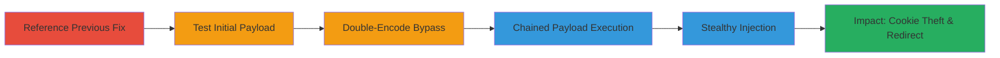

---
tags:
  - xss
  - reflected-xss
  - bypass
  - javascript-payload
  - open-redirect
  - phishing
type: attack_chain
tools: []
tactics:
  - '[[Initial Access]]'
  - '[[Execution]]'
  - '[[Collection]]'
commands: []
platforms:
  - Web
complexity: medium
procedures:
  - '[[procedures/Reference-Previous-Redirect-Fix]]'
  - '[[procedures/Test-Initial-XSS-Payload]]'
  - '[[procedures/Double-Encode-Newline-for-XSS-Bypass]]'
  - '[[procedures/Execute-Chained-XSS-Redirects]]'
  - '[[procedures/Inject-Stealthy-XSS-Payload]]'
step_count: 5
techniques:
  - '[[Exploit Public-Facing Application]]'
  - '[[JavaScript]]'
description: >-
  A multi-stage attack exploiting a reflected XSS vulnerability in Semrush's
  redirect endpoint by bypassing URL validation with double-encoded newlines,
  leading to JavaScript execution, cookie theft, and open redirects for
  phishing.
skill_level: intermediate
impact_level: high
id: b5cf6ca2-c464-4aa9-8cde-e5bb66176e9b
created_at: '2025-12-14T03:47:12.608Z'
updated_at: '2025-12-14T03:47:12.608Z'
verified: false
validated: true
submitted: true
mitre_tactics:
  - '[[Initial Access]]'
  - '[[Execution]]'
  - '[[Collection]]'
mitre_techniques:
  - '[[Exploit Public-Facing Application]]'
  - '[[JavaScript]]'
---
# Reflected XSS Bypass via Double-Encoded Newline in Semrush Redirect Endpoint

Multi-stage attack chain demonstrating a complete attack workflow exploiting a reflected XSS in Semrush's /redirect endpoint after a previous fix.

## Chain Metrics Dashboard

| Metric | Value |
|--------|-------|
| Chain Status | Unverified |
| Total Steps | 5 |
| Execution Time | ~5 minutes |
| Skill Level | Intermediate |
| Complexity | Medium |
| Impact Level | High |

## Attack Flow Visualization

## Prerequisites & Requirements

### Required Tools

- Web browser for testing payloads
- URL encoder tool (e.g., built-in browser dev tools)

### Target Environment

- Web application with redirect endpoint (/redirect?url=)
- No authentication required for public endpoint

### Initial Access Requirements

- Public access to the target URL (https://www.semrush.com/redirect?url=)
- No credentials needed
- Ability to craft and visit malicious URLs

## Detailed Attack Procedures

### Step 1: Reference Previous Redirect Fix
procedure: [[procedures/Reference-Previous-Redirect-Fix]]

**Objective**: Review prior vulnerability reports to identify potential bypasses in the fixed redirect functionality.

**Instructions**: Access the HackerOne report #311330, which was marked as duplicate, and note that the redirection URL validation was recently patched. Re-test the endpoint for any remaining weaknesses in URL sanitization.

**Expected Output**: Confirmation of the fix and motivation to probe for bypasses.

**Success Indicators**:
- Previous report details reviewed
- Endpoint identified for testing

### Step 2: Test Initial XSS Payload
procedure: [[procedures/Test-Initial-XSS-Payload]]

**Objective**: Attempt a standard XSS payload to verify if the fix blocks basic javascript: injections.

**Instructions**: Craft a basic payload by appending `javascript://%0aalert(document.cookie)` to the redirect URL: `https://www.semrush.com/redirect?url=javascript://%0aalert(document.cookie)`. Visit the URL in a browser and observe if JavaScript executes.

**Expected Output**: Payload blocked due to the fix; no alert triggered.

**Success Indicators**:
- Payload fails to execute
- Validation mechanism confirmed active

### Step 3: Double-Encode Newline for XSS Bypass
procedure: [[procedures/Double-Encode-Newline-for-XSS-Bypass]]

**Objective**: Bypass the URL validation by double-encoding the newline character to evade sanitization filters.

**Instructions**: Modify the payload by encoding `%0a` as `%250a`, resulting in `https://www.semrush.com/redirect?url=javascript://%250Aalert(document.cookie)`. Visit the crafted URL to trigger the XSS.

**Expected Output**: JavaScript alert displaying document cookies.

**Success Indicators**:
- Alert box appears with cookie data
- XSS confirmed exploitable

### Step 4: Execute Chained XSS Redirects
procedure: [[procedures/Execute-Chained-XSS-Redirects]]

**Objective**: Chain XSS execution with redirects to external sites for phishing or session hijacking.

**Instructions**: Test an advanced payload like `https://www.semrush.com/redirect?url=javascript://%250Aalert(document.location="https://google.com",document.location="https://www.facebook.com")`. Visit the URL to execute the alert and perform sequential redirects.

**Expected Output**: Alert triggered, followed by redirects to google.com and then facebook.com.

**Success Indicators**:
- Multiple actions executed (alert and redirects)
- Potential for phishing chain observed

### Step 5: Inject Stealthy XSS Payload
procedure: [[procedures/Inject-Stealthy-XSS-Payload]]

**Objective**: Deploy a non-alerting XSS payload to steal data without alerting the victim.

**Instructions**: Use a stealthy injection like `https://www.semrush.com/redirect?url=javascript://www.semrush.com/%250aalert(document.domain)`. Visit the URL; the domain appears in the URL bar while XSS executes silently.

**Expected Output**: Domain alerted without visible popup; URL bar shows benign domain.

**Success Indicators**:
- XSS executes without user notification
- Data exfiltration possible undetected

## Attack Chain Summary

### Key Achievements

1. Bypassed URL validation fix using double-encoding
2. Executed reflected XSS to steal cookies and domain info
3. Chained payloads for redirects enabling phishing attacks
4. Demonstrated stealthy injection to avoid detection

## Technique & Tactic Coverage

### MITRE ATT&CK Techniques

- [[Exploit Public-Facing Application]]
- [[JavaScript]]

### MITRE ATT&CK Tactics

- [[Initial Access]]
- [[Execution]]
- [[Collection]]

---
*Last updated: 2023-10-01*
