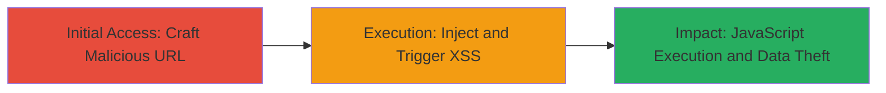

# Reflected XSS Bypass via Unsanitized URL Parameter on DoD Website

Multi-stage attack chain demonstrating a complete attack workflow for exploiting a reflected Cross-Site Scripting (XSS) vulnerability on a U.S. Department of Defense website. This serves as a bypass for a previously reported and mitigated issue (Report #1002977), allowing arbitrary JavaScript execution in the victim's browser to steal session cookies, perform unauthorized actions, or deface the page.

## Chain Metrics Dashboard

| Metric | Value |
|--------|-------|
| Chain Status | Unverified |
| Total Steps | 2 |
| Execution Time | ~1 minute |
| Skill Level | Beginner |
| Complexity | Low |
| Impact Level | High |

## Attack Flow Visualization

## Prerequisites & Requirements

### Required Tools

- Web browser (e.g., Chrome, Firefox)

### Target Environment

- Web platform
- Access to public-facing DoD website
- No specific ports or services required beyond standard HTTPS (443)

### Initial Access Requirements

- No credentials needed
- Direct network access to the target URL
- No prior access required; social engineering to trick victim into clicking the link

## Detailed Attack Procedures

### Step 1: Craft and Navigate to Vulnerable URL
procedure: [[procedures/Inject-Reflected-XSS-Payload-via-URL-Parameter]]

**Objective**: Access the target page and inject a malicious payload into the unsanitized URL parameter to reflect user input without escaping.

**Instructions**: Open a web browser and navigate to the vulnerable URL, appending a JavaScript payload to the reflected parameter. For example, use a URL like `https://████████████?param=` where `param` is the vulnerable parameter.

**Expected Output**: The page loads with the injected script reflected in the HTML, preparing for execution.

**Success Indicators**:
- Page loads without errors
- Reflected input visible in the page source (inspect element to confirm no sanitization)

### Step 2: Trigger and Verify XSS Execution
procedure: [[procedures/Inject-Reflected-XSS-Payload-via-URL-Parameter]]

**Objective**: Observe the execution of the injected JavaScript, confirming arbitrary code execution in the victim's browser context.

**Instructions**: Upon loading the page, the reflected payload executes automatically. Monitor for the alert popup or any other effects of the script (e.g., cookie theft via `document.cookie`).

**Expected Output**: An alert box pops up displaying 'XSS' or the payload executes, demonstrating control over the victim's session.

**Success Indicators**:
- Alert popup appears
- Browser console shows JavaScript execution errors or logs from the payload
- Potential for further actions like session hijacking if payload is modified

## Attack Chain Summary

### Key Achievements

1. Bypassed prior vulnerability mitigation (#1002977) via reflected input
2. Achieved arbitrary JavaScript execution in victim browser
3. Enabled potential session hijacking and unauthorized actions on DoD site

## Technique & Tactic Coverage

### MITRE ATT&CK Techniques

- [[JavaScript]]

### MITRE ATT&CK Tactics

- [[Execution]]
- [[Collection]]

---
*Last updated: 2023-10-01T12:00:00Z*
