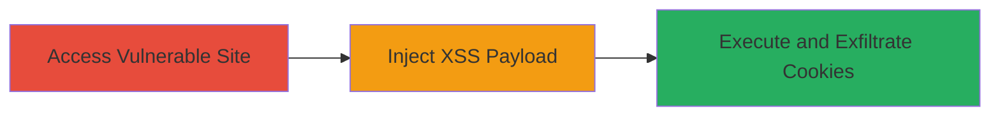

---
tags:
  - xss
  - reflected-xss
  - web
  - cookie-theft
  - session-hijacking
type: attack_chain
tactics:
  - '[[Initial Access]]'
  - '[[Execution]]'
  - '[[Collection]]'
verified: false
platforms:
  - Web
submitted: true
complexity: low
procedures:
  - '[[procedures/Access-Vulnerable-mil-Website]]'
  - '[[procedures/Inject-JavaScript-Payload-into-Search-Bar]]'
  - '[[procedures/Observe-XSS-Execution-and-Cookie-Theft]]'
step_count: 3
techniques:
  - '[[JavaScript]]'
  - '[[Steal Web Session Cookie]]'
description: >-
  Multi-stage attack chain exploiting a reflected Cross-Site Scripting (XSS)
  vulnerability in the search bar of a U.S. Department of Defense (.mil) website
  to inject and execute JavaScript, enabling theft of session cookies and
  potential session hijacking when combined with CORS misconfigurations.
skill_level: beginner
impact_level: high
id: e6f71044-c665-4a77-b560-4c2a0ea23013
created_at: '2025-12-14T00:11:09.359Z'
updated_at: '2025-12-14T00:11:09.359Z'
validated: true
mitre_tactics:
  - '[[Initial Access]]'
  - '[[Execution]]'
  - '[[Collection]]'
mitre_techniques:
  - '[[JavaScript]]'
  - '[[Steal Web Session Cookie]]'
---
# Reflected XSS Exploitation in .mil Website Search Bar for Cookie Theft

Multi-stage attack chain demonstrating exploitation of a reflected XSS vulnerability in a .mil domain website's search functionality, allowing arbitrary JavaScript execution in the victim's browser to steal authentication cookies and enable session hijacking, especially if paired with CORS issues.

## Chain Metrics Dashboard

| Metric | Value |
|--------|-------|
| Chain Status | Unverified |
| Total Steps | 3 |
| Execution Time | ~1 minute |
| Skill Level | Beginner |
| Complexity | Low |
| Impact Level | High |

## Attack Flow Visualization

## Prerequisites & Requirements

### Required Tools

- Web browser (e.g., Chrome, Firefox)

### Target Environment

- Web platform
- Publicly accessible .mil domain website with unsanitized search functionality
- No specific ports or services required beyond standard HTTP/HTTPS

### Initial Access Requirements

- Internet connectivity
- No credentials or prior access needed; targets public-facing application
- Victim must visit the malicious search URL (e.g., via phishing or direct link)

## Detailed Attack Procedures

### Step 1: Access Vulnerable Webpage
procedure: [[procedures/Access-Vulnerable-mil-Website]]

**Objective**: Locate and load the target website's search interface to prepare for payload injection.

**Instructions**: Launch a web browser and navigate directly to the vulnerable URL https://███████████████████.html. Verify the presence of the search bar on the page.

**Expected Output**: The webpage renders successfully, displaying the search input field without errors.

**Success Indicators**:
- Target URL loads in the browser
- Search bar input field is visible and functional

### Step 2: Inject the XSS Payload
procedure: [[procedures/Inject-JavaScript-Payload-into-Search-Bar]]

**Objective**: Deliver a malicious JavaScript payload through the unsanitized search input to trigger reflection and execution.

**Instructions**: Focus on the search bar and input the payload ``. Submit the search query by pressing Enter or clicking the search button. The server reflects the input back into the HTML response without sanitization.

**Expected Output**: The page reloads or updates with the reflected payload embedded in the response, causing immediate JavaScript execution.

**Success Indicators**:
- No sanitization errors or blocks occur
- Payload appears in the page source unescaped

### Step 3: Observe Payload Execution
procedure: [[procedures/Observe-XSS-Execution-and-Cookie-Theft]]

**Objective**: Confirm successful code execution and demonstrate the potential for stealing sensitive session data like cookies or tokens.

**Instructions**: Upon submission, monitor for the alert popup displaying the contents of `document.cookie`. In a real attack, modify the payload to exfiltrate data (e.g., send cookies to an attacker-controlled server via XMLHttpRequest). If CORS is misconfigured on other sites, this can capture cross-origin tokens.

**Expected Output**: An alert box pops up revealing cookie values, confirming arbitrary code execution in the browser context.

**Success Indicators**:
- JavaScript alert executes and displays cookies
- Browser console shows no errors; DOM access is granted
- Potential for data exfiltration validated

## Attack Chain Summary

### Key Achievements

1. Accessed a public-facing .mil website with vulnerable search functionality
2. Injected and reflected unsanitized JavaScript payload for arbitrary execution
3. Demonstrated cookie theft capability, enabling session hijacking or unauthorized access on the domain or cross-origin if CORS is weak

## Technique & Tactic Coverage

### MITRE ATT&CK Techniques

- [[JavaScript]] JavaScript
- [[Steal Web Session Cookie]] Steal Web Session Cookie

### MITRE ATT&CK Tactics

- [[Initial Access]] Initial Access
- [[Execution]] Execution
- [[Collection]] Collection

---
*Last updated: 2023-10-05*
