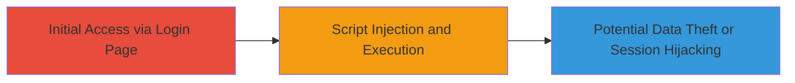

---
tags:
  - xss
  - reflected-xss
  - web-vulnerability
  - script-injection
type: attack_chain
tools: []
tactics:
  - '[[Execution]]'
  - '[[Collection]]'
verified: false
platforms:
  - Web
submitted: true
complexity: medium
created_at: '2023-10-01T00:00:00Z'
procedures:
  - '[[procedures/Inject-Malicious-Script-via-Login-Form]]'
step_count: 1
techniques:
  - '[[JavaScript]]'
updated_at: '2025-12-14T03:16:36.998Z'
description: >-
  A single-stage attack exploiting a reflected XSS vulnerability in the login
  page of the 8x8 ContactNow application, allowing injection of malicious
  scripts to execute in users' browsers.
skill_level: intermediate
impact_level: medium
id: 1b7cc656-9f27-4e0f-8bd9-35f530da790f
validated: true
mitre_tactics:
  - '[[Execution]]'
  - '[[Collection]]'
mitre_techniques:
  - '[[JavaScript]]'
---
# Reflected XSS Exploitation in 8x8 ContactNow Login Page

Multi-stage attack chain demonstrating a complete attack workflow.

## Chain Metrics Dashboard

| Metric | Value |
|--------|-------|
| Chain Status | Unverified |
| Total Steps | 1 |
| Execution Time | ~5 minutes |
| Skill Level | Intermediate |
| Complexity | Medium |
| Impact Level | Medium |

## Attack Flow Visualization

## Prerequisites & Requirements

### Required Tools

- Browser developer tools for payload testing

### Target Environment

- Web application: 8x8 ContactNow (older version)
- URL: http://axa.dxi.eu/ login page
- No specific ports or services beyond standard HTTP/HTTPS

### Initial Access Requirements

- Public access to the login page
- No credentials required for reflected XSS testing
- Network position: External attacker

## Detailed Attack Procedures

### Step 1: Inject and Execute Malicious Script
procedure: [[procedures/Inject-Malicious-Script-via-Login-Form]]

**Objective**: Exploit the reflected XSS vulnerability by injecting a malicious script into the login form input fields, causing it to execute in the victim's browser upon submission.

**Instructions**: Navigate to the login page at http://axa.dxi.eu/. Use the browser's developer console or manually enter a payload in the username or password field. Submit the form to reflect the input without proper encoding, triggering script execution.

**Expected Output**: The injected script executes, such as displaying an alert box or stealing session data if escalated.

**Success Indicators**:
- Malicious script (e.g., alert) pops up in the browser
- Reflected input appears unencoded in the page source
- Potential for further payload to capture cookies or redirect

## Attack Chain Summary

### Key Achievements

1. Successful injection of JavaScript payload via login form
2. Execution of arbitrary code in the context of the user's browser
3. Demonstration of medium-severity risks like session hijacking

## Technique & Tactic Coverage

### MITRE ATT&CK Techniques

- [[JavaScript]]

### MITRE ATT&CK Tactics

- [[Execution]]
- [[Collection]]

---
*Last updated: 2023-10-01T00:00:00Z*
