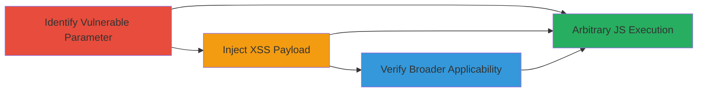

# Reflected XSS Exploitation in Acronis Cyber Protect Trial via SFDCCampaignID

Multi-stage attack chain demonstrating the exploitation of a reflected Cross-Site Scripting (XSS) vulnerability on the Acronis website, specifically targeting the 'SFDCCampaignID' parameter in the Cyber Protect trial page. This allows attackers to inject and execute arbitrary JavaScript in a victim's browser, potentially leading to data theft or phishing attacks. The chain covers identification, injection, and verification across different locations and pathnames.

## Chain Metrics Dashboard

| Metric | Value |
|--------|-------|
| Chain Status | Unverified |
| Total Steps | 3 |
| Execution Time | ~5 minutes |
| Skill Level | Intermediate |
| Complexity | Medium |
| Impact Level | High |

## Attack Flow Visualization

## Prerequisites & Requirements

### Required Tools

- [[tools/VPN]]

### Target Environment

- Web platform
- Access to public-facing Acronis website (https://www.acronis.com/)
- No specific ports or services required beyond standard HTTPS (port 443)

### Initial Access Requirements

- Public internet access
- No credentials needed
- Ability to craft and send malicious URLs to victims (e.g., via phishing)

## Detailed Attack Procedures

### Step 1: Identify Vulnerable URL Parameter
procedure: [[procedures/Identify-Vulnerable-URL-Parameter]]

**Objective**: Examine the target URL to identify injectable query parameters that reflect user input without sanitization.

**Instructions**: Navigate to the Acronis Cyber Protect trial page at https://www.acronis.com/products/cyber-protect/trial/ and inspect the URL structure, focusing on query parameters like 'SFDCCampaignID'. Test for reflection by appending benign inputs (e.g., ?SFDCCampaignID=test) and checking if they appear unsanitized in the page source or output.

**Expected Output**: Confirmation that the parameter value is reflected back in the HTML without encoding, indicating potential for XSS.

**Success Indicators**:
- Parameter value visible in page source
- No output encoding observed

### Step 2: Inject XSS Payload Using VPN
procedure: [[procedures/Inject-XSS-Payload-Using-VPN]]

**Objective**: Deliver a JavaScript payload via the vulnerable parameter to execute code in the browser, simulating access from restricted locations.

**Instructions**: Construct a malicious URL by appending an XSS payload to the parameter, such as https://www.acronis.com/products/cyber-protect/trial/?SFDCCampaignID=zz`(alert)();//'. Use [[tools/VPN]] to route traffic from a non-USA IP (e.g., Europe or Asia) where the payload executes. Load the URL in a browser and observe the alert box popping up.

**Expected Output**: JavaScript alert box displaying 'alert' upon page load, confirming execution.

**Success Indicators**:
- Alert box appears in browser
- Payload executes only from non-USA locations (USA may block or sanitize)

### Step 3: Verify XSS in Multiple Pathnames
procedure: [[procedures/Verify-XSS-in-Multiple-Pathnames]]

**Objective**: Confirm the vulnerability extends beyond the specific trial page to other site pathnames via general query parameters.

**Instructions**: Test the payload on different URLs, such as https://www.acronis.com/?tomblorg`(alert)();//'. Append similar payloads to arbitrary query parameters and load the pages using [[tools/VPN]] from non-USA locations. Inspect for execution in each case.

**Expected Output**: Consistent alert box execution across tested pathnames, indicating site-wide reflected XSS risk.

**Success Indicators**:
- Payload triggers alerts on multiple pages
- Vulnerability confirmed in general query handling

## Attack Chain Summary

### Key Achievements

1. Identified and exploited reflected XSS in 'SFDCCampaignID' parameter on Acronis trial page.
2. Demonstrated location-based execution using VPN to bypass potential geo-restrictions.
3. Verified broader site impact, allowing arbitrary JS in any pathname's query parameters.

## Technique & Tactic Coverage

### MITRE ATT&CK Techniques

- [[JavaScript]]

### MITRE ATT&CK Tactics

- [[Initial Access]]
- [[Execution]]
- [[Collection]]

---

*Last updated: 2023-10-01T00:00:00Z*
