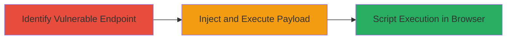

# Reflected XSS Exploitation in Acronis Verify Endpoint

Multi-stage attack chain demonstrating the exploitation of a reflected cross-site scripting (XSS) vulnerability in the 'version' parameter of the http://www.grouplogic.com/files/glidownload/verify.asp endpoint on an Acronis-managed website. The attack allows injection of malicious JavaScript, leading to potential session hijacking or client-side data theft.

## Chain Metrics Dashboard

| Metric | Value |
|--------|-------|
| Chain Status | Unverified |
| Total Steps | 2 |
| Execution Time | ~5 minutes |
| Skill Level | Beginner |
| Complexity | Low |
| Impact Level | Medium |

## Attack Flow Visualization

## Prerequisites & Requirements

### Required Tools

- Web browser (e.g., Chrome, Firefox)
- URL encoding tool (built-in browser dev tools or online encoder)

### Target Environment

- Web platform
- Accessible public-facing web application at http://www.grouplogic.com/files/glidownload/verify.asp
- No authentication required

### Initial Access Requirements

- Internet access to the target URL
- No prior credentials or network position needed; attack is remote and unauthenticated

## Detailed Attack Procedures

### Step 1: Identify Vulnerable Endpoint
procedure: [[procedures/Identify-Reflected-XSS-in-Version-Parameter]]

**Objective**: Locate and confirm the reflected XSS vulnerability in the 'version' parameter by testing for unsanitized input reflection.

**Instructions**: Navigate to the base endpoint http://www.grouplogic.com/files/glidownload/verify.asp and append a test value to the 'version' parameter, such as ?version=test. Observe if the input is reflected back in the response without sanitization, indicating potential for HTML/JavaScript injection.

**Expected Output**: The response page echoes the 'version' value directly, e.g., displaying "AC12test" if the default is AC12.

**Success Indicators**:
- User input appears unaltered in the HTML response
- No encoding or stripping of special characters like < > " '

### Step 2: Inject and Execute Payload
procedure: [[procedures/Inject-Malicious-Payload-for-XSS-Execution]]

**Objective**: Craft a malicious payload, URL-encode it, and inject it to trigger JavaScript execution in the victim's browser context.

**Instructions**: URL-encode a JavaScript payload, such as , which becomes %3Cimg%20src=v%20onerror=alert(document.domain)%3E. Append it to the endpoint after closing the expected value, e.g., ?version=AC12'%3E%3Cimg%20src=v%20onerror=alert(document.domain)%3E. Load the full URL in a browser to execute the script.

**Expected Output**: An alert box pops up displaying the document domain, confirming arbitrary JavaScript execution.

**Success Indicators**:
- JavaScript alert or other payload executes
- No errors in browser console related to sanitization

## Attack Chain Summary

### Key Achievements

1. Identified unsanitized reflection in the 'version' parameter
2. Successfully injected and executed JavaScript payload
3. Demonstrated potential for session hijacking or data theft via client-side script execution

## Technique & Tactic Coverage

### MITRE ATT&CK Techniques

- [[Exploit Public-Facing Application]] Exploit Public-Facing Application
- [[JavaScript]] JavaScript

### MITRE ATT&CK Tactics

- [[Initial Access]] Initial Access
- [[Execution]] Execution

---
*Last updated: 2023-10-01T00:00:00Z*
