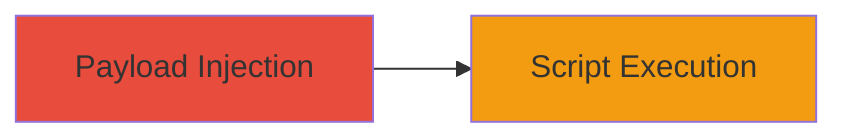

---

# Reflected XSS Exploitation in Adobe Experience Manager Childlist Selector

Multi-stage attack chain demonstrating a complete attack workflow.

## Chain Metrics Dashboard

| Metric | Value |
|--------|-------|
| Chain Status | Unverified |
| Total Steps | 1 |
| Execution Time | ~1 minutes |
| Skill Level | Novice |
| Complexity | Low |
| Impact Level | Low |

## Attack Flow Visualization



## Prerequisites & Requirements

### Required Tools

- Browser developer tools or proxy like Burp Suite

### Target Environment

- Web platform
- Adobe Experience Manager (AEM) instance
- Access to staging domain like cbconnection-stage.adobe.com
- No specific ports required beyond standard HTTP/HTTPS (80/443)

### Initial Access Requirements

- Valid user session or public access to the Childlist selector feature
- No prior credentials needed if publicly accessible
- Network access to the target domain

## Detailed Attack Procedures

### Step 1: Inject Malicious Payload
procedure: [[procedures/Exploit-Reflected-XSS-in-AEM-Childlist-Selector]]

**Objective**: Inject a malicious JavaScript payload into the Childlist selector input to trigger reflected XSS execution in the victim's browser.

**Instructions**: Navigate to the vulnerable Childlist selector endpoint on the AEM instance (e.g., cbconnection-stage.adobe.com). Identify the input field or parameter (likely a query string or form input) that reflects user input without sanitization. Craft a payload such as `<script>alert('XSS')</script>` and submit it via the browser or a tool like curl. For testing, use a simple curl command to send the payload:

```bash
curl "https://cbconnection-stage.adobe.com/path/to/childlist?param=<script>alert('XSS')</script>"
```

Observe the response in the browser to confirm reflection and execution.

**Expected Output**: The payload is reflected in the page source, and upon loading, a JavaScript alert or other executed code appears in the victim's browser.

**Success Indicators**:
- Payload appears unsanitized in the HTML response
- JavaScript executes (e.g., alert box pops up)
- No server-side errors blocking the injection

## Attack Chain Summary

### Key Achievements

1. Successful injection of arbitrary JavaScript via reflected XSS
2. Execution in the context of the user's browser session
3. Potential for low-impact actions like session hijacking or data theft if escalated

## Technique & Tactic Coverage

### MITRE ATT&CK Techniques

- [[JavaScript]]

### MITRE ATT&CK Tactics

- [[Execution]]

---

*Last updated: 2023-10-01T12:00:00Z*
