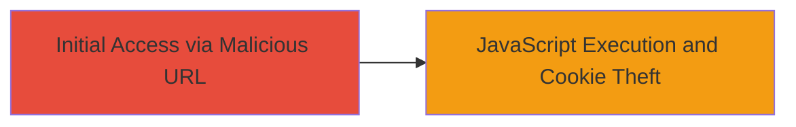

# Reflected XSS Exploitation in Adobe Login Page via puser Parameter

Multi-stage attack chain demonstrating a complete attack workflow.

## Chain Metrics Dashboard

| Metric | Value |
|--------|-------|
| Chain Status | Unverified |
| Total Steps | 1 |
| Execution Time | ~1 minute |
| Skill Level | Beginner |
| Complexity | Low |
| Impact Level | High |

## Attack Flow Visualization



## Prerequisites & Requirements

### Required Tools

- Web browser (e.g., Chrome, Firefox)

### Target Environment

- Web platform
- Access to Adobe login page: https://adobeid-na1.services.adobe.com/renga-idprovider/pages/login
- No specific services or ports required beyond standard HTTPS (443)

### Initial Access Requirements

- No credentials needed
- Public network access to the target URL
- No prior access required; the attack relies on tricking a victim into visiting the crafted URL

## Detailed Attack Procedures

### Step 1: Craft and Deliver Malicious URL
procedure: [[procedures/Exploit-Reflected-XSS-in-puser-Parameter]]

**Objective**: Inject a malicious payload into the 'puser' parameter to reflect unsanitized JavaScript back into the victim's browser, enabling arbitrary code execution such as cookie theft.

**Instructions**: Construct a URL with the malicious payload in the 'puser' parameter. The base URL is the Adobe login page, and the payload should break out of any HTML context and inject a script tag. For example, use the payload `1"><script>alert(document.cookie)</script><h1>Defaced!</h1>` URL-encoded as `1%22%3E%3Cscript%3Ealert(document.cookie)%3C/script%3E%3Ch1%3EDefaced!%3C/h1%3E`.

The full PoC URL example:

```url
https://adobeid-na1.services.adobe.com/renga-idprovider/pages/login?...&puser=1%22%3E%3Cscript%3Ealert(document.cookie)%3C/script%3E%3Ch1%3EDefaced!%3C/h1%3E&...
```

Deliver this URL to the victim via phishing email, social engineering, or a shortened link. When accessed, the browser will execute the injected JavaScript.

**Expected Output**: An alert box displaying the victim's cookies, along with page defacement (e.g., "Defaced!" heading). In a real attack, replace `alert(document.cookie)` with code to exfiltrate data to an attacker-controlled server.

**Success Indicators**:
- JavaScript alert triggers with cookie contents
- Page shows injected HTML elements like the defacement heading
- Network requests (if exfiltration is added) to attacker server

## Attack Chain Summary

### Key Achievements

1. Successful injection and reflection of malicious JavaScript via the 'puser' parameter
2. Execution of arbitrary code in the victim's browser context
3. Potential for cookie theft, session hijacking, or phishing escalation

## Technique & Tactic Coverage

### MITRE ATT&CK Techniques

- [[JavaScript]]

### MITRE ATT&CK Tactics

- [[Execution]]
- [[Collection]]

---
*Last updated: 2023-10-01T00:00:00Z*
