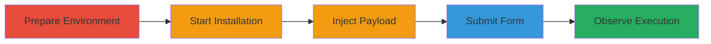

# Reflected XSS Exploitation in Concrete CMS Database Name Field During Installation

Multi-stage attack chain demonstrating a complete attack workflow exploiting a reflected XSS vulnerability during Concrete CMS setup.

## Chain Metrics Dashboard

| Metric | Value |
|--------|-------|
| Chain Status | Unverified |
| Total Steps | 5 |
| Execution Time | ~5 minutes |
| Skill Level | Beginner |
| Complexity | Low |
| Impact Level | Medium |

## Attack Flow Visualization

## Prerequisites & Requirements

### Required Tools

- Web browser (e.g., Firefox or Chrome)
- Local web server (e.g., Apache with PHP support)
- MySQL database server

### Target Environment

- Web platform with PHP 5.6+ and Apache 2.4+
- MySQL 5.5+ service running
- Access to Concrete CMS 8.2.1 archive

### Initial Access Requirements

- Local machine with internet access to download CMS
- No prior credentials needed; targets installation phase
- Network access to local web server (e.g., http://localhost)

## Detailed Attack Procedures

### Step 1: Prepare Concrete CMS Installation Environment
procedure: [[procedures/Prepare-Concrete-CMS-Installation-Environment]]

**Objective**: Set up the local environment by downloading and extracting the Concrete CMS archive to simulate the installation process.

**Instructions**: Download the Concrete CMS 8.2.1 archive from the official website and unzip it into a web-accessible directory on your local Apache server.

**Expected Output**: Extracted files ready in the web root, accessible via browser at http://localhost/concrete/.

**Success Indicators**:
- Archive downloaded successfully
- Files extracted without errors
- Local web server serving the directory

### Step 2: Start the Installation Process
procedure: [[procedures/Prepare-Concrete-CMS-Installation-Environment]]

**Objective**: Initiate the web-based installer to reach the database configuration screen.

**Instructions**: Navigate to the installation URL in your browser (e.g., http://localhost/concrete/index.php/tools/install/) and follow the initial prompts to proceed to the database setup page.

**Expected Output**: Database configuration form loaded in the browser.

**Success Indicators**:
- Installer starts without errors
- Database config screen appears

### Step 3: Inject XSS Payload in Database Name Field
procedure: [[procedures/Inject-XSS-Payload-in-Database-Name]]

**Objective**: Enter a malicious JavaScript payload into the Database Name field while providing valid details for other fields.

**Instructions**: On the database configuration screen, input valid values for Database Host (e.g., localhost), Username (e.g., root), Password (valid MySQL password), and set Database Name to ''.

**Expected Output**: Form fields populated with the payload in the Database Name input.

**Success Indicators**:
- Payload entered without form rejection
- Other fields validated as correct

### Step 4: Submit the Installation Form
procedure: [[procedures/Trigger-XSS-Execution-via-Install-Submission]]

**Objective**: Submit the form to trigger the reflection of the payload.

**Instructions**: Click the 'Install' or 'Continue' button to submit the database configuration.

**Expected Output**: Form submission processes, and the payload is reflected in the response.

**Success Indicators**:
- Form submits successfully
- Page loads with reflected input

### Step 5: Observe XSS Payload Execution
procedure: [[procedures/Trigger-XSS-Execution-via-Install-Submission]]

**Objective**: Verify the execution of arbitrary JavaScript by observing the alert dialog.

**Instructions**: Upon submission, watch for the JavaScript alert to pop up, confirming execution.

**Expected Output**: Browser displays an alert box with '1' or the payload effect.

**Success Indicators**:
- Alert window appears
- No installation errors blocking execution

## Attack Chain Summary

### Key Achievements

1. Successful setup of Concrete CMS installation environment
2. Injection and reflection of XSS payload in a critical configuration field
3. Demonstration of arbitrary JavaScript execution during the setup phase, enabling potential session hijacking or data theft

## Technique & Tactic Coverage

### MITRE ATT&CK Techniques

- [[Exploit Public-Facing Application]]
- [[JavaScript]]

### MITRE ATT&CK Tactics

- [[Initial Access]]
- [[Execution]]

---
*Last updated: 2023-10-01T00:00:00Z*
